# WE GO

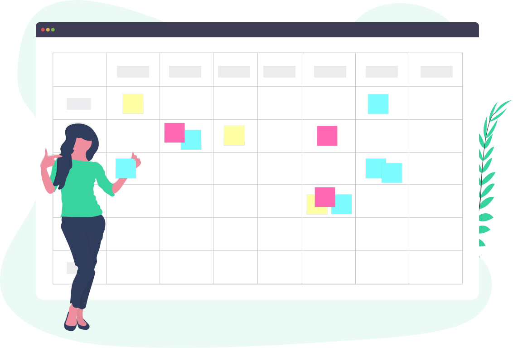

### Documentation Utilisateur

## 1. Créer un profil

Cliquer sur `Inscription`.

Pour créer son compte faut remplir les champs et ensuite cliquer sur le bouton `INSCRIPTION`.

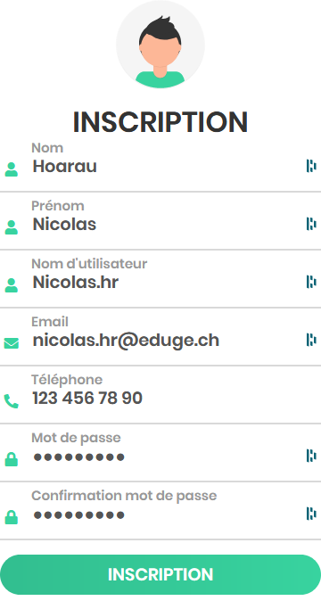

## 2. Se connecter à son profil

Cliquer sur `Connexion`.

Vous pouvez utilsier votre adresse mail :

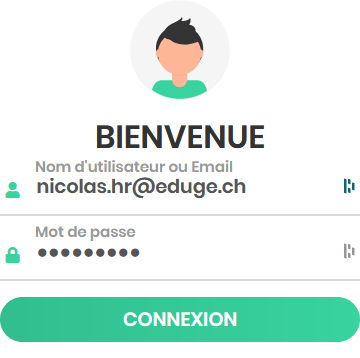

 

ou votre pseudo :

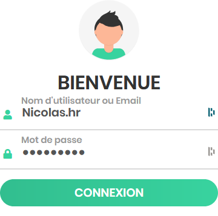

pour vous connecter ensuite cliquer sur le bouton `CONNEXION`.

 

Ensuite un message de validation apparaît.

 

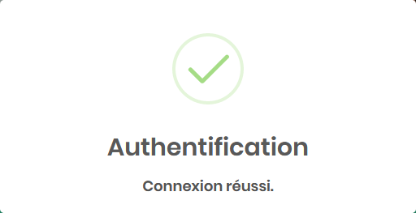

## 3. Page d'accueil

Quand vous n'êtes pas connecté vous pouvez accéder à la page d'accueil sur laquelle on peut voir les événements à venir.

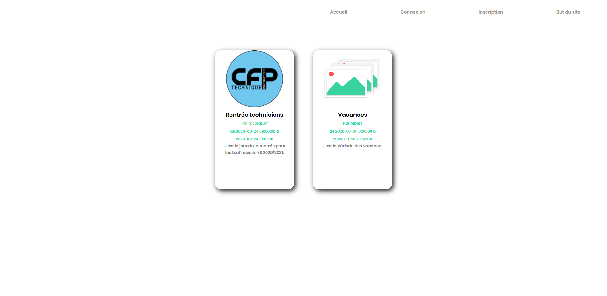

Quand vous êtes connecté vous pouvez accéder à la page d'accueil sur laquelle on peut voir les événements à venir et s'y inscrire.

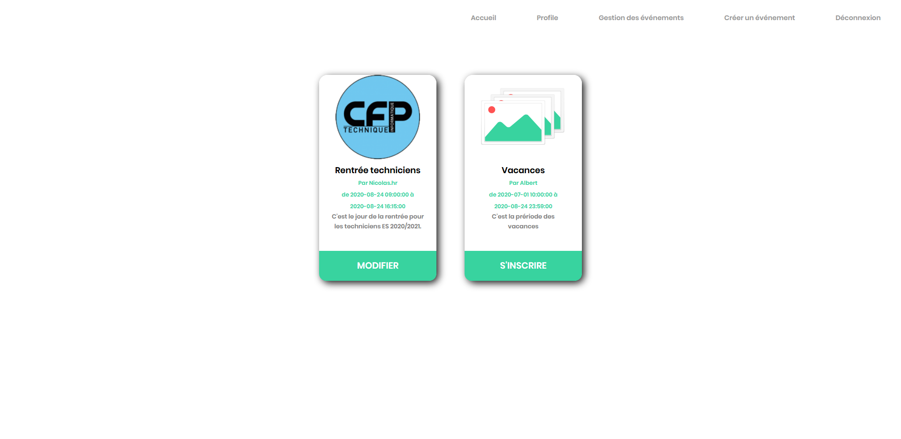

## 4. Participer à un événement

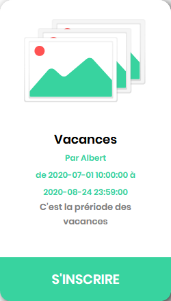

 

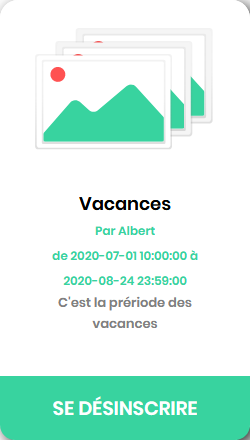

## 5. Créer un événement publique

Cliquer sur `Créer un événement`.

Pour créer un événement publique faut remplir les champs et sélectionner `Publique` ensuite appuyer sur le bouton `CRÉER UN ÉVÉNEMENT`.

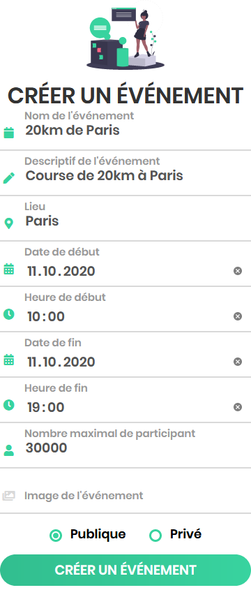

Ensuite un message de validation apparaît.

## 6. Créer un événement privé

Cliquer sur `Créer un événement`.

Pour créer un événement publique faut remplir les champs et sélectionner `Privé` ensuite appuyer sur le bouton `CRÉER UN ÉVÉNEMENT`.

Une fenêtre apparaît avec les utilisateurs qui pourraient être invité.

Une fois les invités choisis il faut appuyer sur le bouton `Valider`.

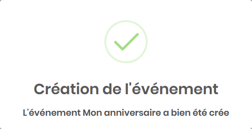
