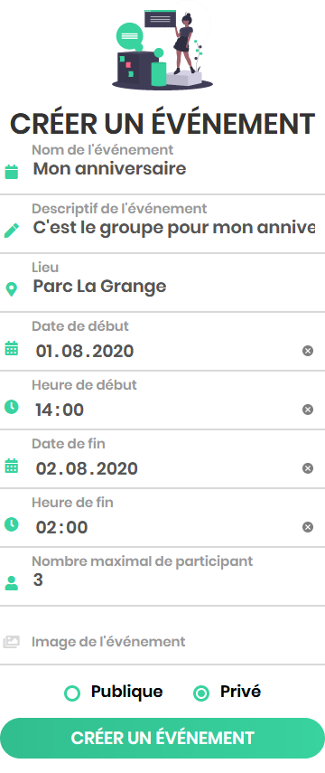
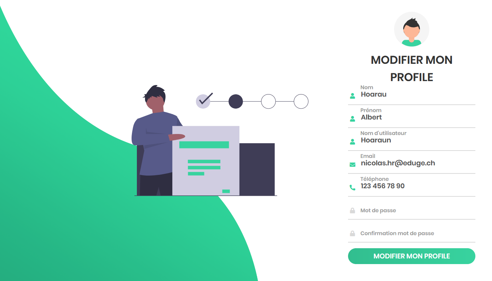

### Documentation Utilisateur

### Travail pratique individuel (TPI)

### Hoarau Nicolas

#### 09.06.2020

## 1. Créer un profil

Cliquer sur `Inscription`.

Pour créer son compte, faut remplir les champs et ensuite cliquer sur le bouton `INSCRIPTION`.

## 2. Se connecter à son profil

Cliquer sur `Connexion`.

Vous pouvez utiliser votre adresse mail :

 

Ou votre pseudo :

Pour vous connecter ensuite, cliquez sur le bouton `CONNEXION`.

 

Ensuite, un message de validation apparaît.

 

## 3. Page d'accueil

Que vous soyez connecté ou non, vous pouvez accéder à la page d'accueil sur laquelle on peut voir les événements à venir.

## 4. Participer à un événement

Pour vous inscrire à un événement, cliquez sur `Gérer mes événements` dans la barre de navigation.

Pour vous inscrire vous devez cliquer sur le bouton `S'INSCRIRE`.

Et un message de validation apparaît.

 

Et le bouton `S'INSCRIRE` devient le bouton `SE DÉSINSCRIRE`.

Sinon vous pouvez vous inscrire en cliquant sur un événement au choix.

## 5. Créer un événement public

Cliquer sur `Créer un événement`.

Pour créer un événement publique faut remplir les champs et sélectionner `Publique` ensuite appuyer sur le bouton `CRÉER UN ÉVÉNEMENT`.

Ensuite un message de validation apparaît.

## 6. Créer un événement privé

Cliquer sur `Créer un événement`.

Pour créer un événement publique faut remplir les champs et sélectionner `Privé` ensuite appuyer sur le bouton `CRÉER UN ÉVÉNEMENT`.

Une fenêtre apparaît avec les utilisateurs qui pourraient être invités.

Une fois les invités choisis il faut appuyer sur le bouton `Valider`.

## 7. Modifier un événement

Pour modifier un événement, il faut cliquer sur `Gérer mes événements` dans la barre de navigation.

En bas de la page, il y a une zone qui s'appelle `Événement créé`.

Ensuite, cliquez sur l'événement que vous voulez modifier et vous atterrirez sur la page de l'événement.

Ensuite cliquez sur le bouton `MODIFIER`, vous allez atterrir sur la page `Modifier mon événement`.

Ensuite modifiez les données que vous voulez modifier et appuyez sur le bouton `MODIFIER L'ÉVÉNEMENT` et un message de validation va apparaître.

## 8. Supprimer un événement

Pour supprimer un événement, il faut cliquer sur `Gérer mes événements` dans la barre de navigation.

En bas de la page il y a une zone qui s'appelle `Événement créé`.

Ensuite, cliquez sur l'événement que vous voulez modifier et vous atterrirez sur la page de l'événement.

Ensuite, cliquez sur le bouton `SUPPRIMER` une fenêtre va apparaître et demander si on veut réellement supprimer l'événement.

Appuyer sur le bouton `Valider` et un message de validation apparaît.

## 9. Voir son profile

Cliquer sur `Mon profile` dans la barre de navigation.

Et vous allez atterrir sur la page de votre profile.

## 10. Modifier son profile

Pour modifier votre profile cliquez sur `Mon profile` dans la barre de navigation.

Vous allez atterrir sur la page de votre profile.

Ensuite appuyez sur le bouton `MODIFIER` et vous allez atterrir sur la page `Modifier mon profile`.

Ensuite modifiez les données que vous voulez modifier et appuyez sur le bouton `MODIFIER MON PROFILE` et un message de validation va apparaître.

## 11. Supprimer son profile

Pour modifier votre profile cliquez sur `Mon profile` dans la barre de navigation.

Vous allez atterrir sur la page de votre profile.

Ensuite appuyez sur le bouton `SUPPRIMER` une fenêtre va apparaître et demander si on veut réellement supprimer le profile.

Appuyer sur le bouton `Valider` et un message de validation apparaît.

