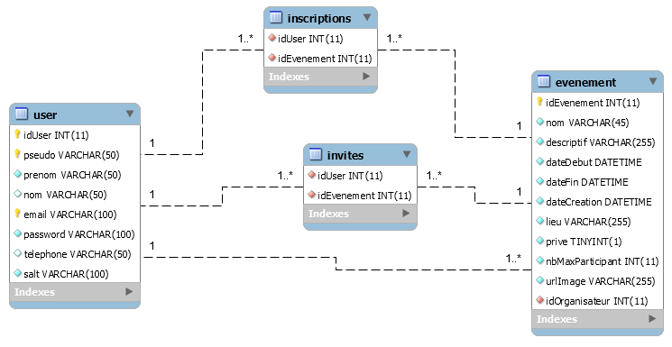
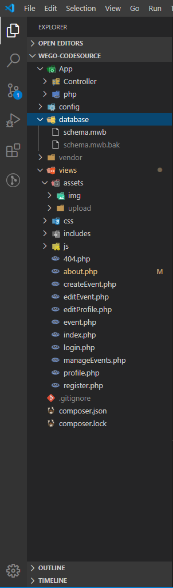

### Rapport TPI et documentation technique

### Travail pratique individuel (TPI)

### Hoarau Nicolas

#### 09.06.2020

## Table des matières

[Table des versions](#tables-des-versions) . . . . . . . . . . . . . . . . . . . . . . . . . . . . . . . . . . . . . . . . . . . . . . . . . . . . . . . . . . . . . . . . . . . . . . . . . . . . . . . . . . . . . . . . . . . . . . . . . . . 2
[Introduction](#introduction) . . . . . . . . . . . . . . . . . . . . . . . . . . . . . . . . . . . . . . . . . . . . . . . . . . . . . . . . . . . . . . . . . . . . . . . . . . . . . . . . . . . . . . . . . . . . . . . . . . . . . . . . . . 2
[Organisation](#organisation) . . . . . . . . . . . . . . . . . . . . . . . . . . . . . . . . . . . . . . . . . . . . . . . . . . . . . . . . . . . . . . . . . . . . . . . . . . . . . . . . . . . . . . . . . . . . . . . . . . . . . . . . 2
[Livrables](#livrables) . . . . . . . . . . . . . . . . . . . . . . . . . . . . . . . . . . . . . . . . . . . . . . . . . . . . . . . . . . . . . . . . . . . . . . . . . . . . . . . . . . . . . . . . . . . . . . . . . . . . . . . . . . . . . 2
[Matériels et logiciels nécessaires](#materiels-et-logiciels-necessaires) . . . . . . . . . . . . . . . . . . . . . . . . . . . . . . . . . . . . . . . . . . . . . . . . . . . . . . . . . . . . . . . . . . . . . . . . . . . . . . . . 2
[Description de l'application](#description-de-l'application) . . . . . . . . . . . . . . . . . . . . . . . . . . . . . . . . . . . . . . . . . . . . . . . . . . . . . . . . . . . . . . . . . . . . . . . . . . . . . . . . . . . . . . . 2
[Gestion de projet](#gestion-de-projet) . . . . . . . . . . . . . . . . . . . . . . . . . . . . . . . . . . . . . . . . . . . . . . . . . . . . . . . . . . . . . . . . . . . . . . . . . . . . . . . . . . . . . . . . . . . . . . . . . . . 3
[Méthodologie](#méthodologie) . . . . . . . . . . . . . . . . . . . . . . . . . . . . . . . . . . . . . . . . . . . . . . . . . . . . . . . . . . . . . . . . . . . . . . . . . . . . . . . . . . . . . . . . . . . . . . . . . . . . . . . . . 3
[Backlog](#backlog) . . . . . . . . . . . . . . . . . . . . . . . . . . . . . . . . . . . . . . . . . . . . . . . . . . . . . . . . . . . . . . . . . . . . . . . . . . . . . . . . . . . . . . . . . . . . . . . . . . . . . . . . . . . . . . . . 4
[Planification](#planification) . . . . . . . . . . . . . . . . . . . . . . . . . . . . . . . . . . . . . . . . . . . . . . . . . . . . . . . . . . . . . . . . . . . . . . . . . . . . . . . . . . . . . . . . . . . . . . . . . . . . . . . . . . 5
[Planning prévisionnel](#planning-prévisionnel) . . . . . . . . . . . . . . . . . . . . . . . . . . . . . . . . . . . . . . . . . . . . . . . . . . . . . . . . . . . . . . . . . . . . . . . . . . . . . . . . . . . . . . . . . . . . . . . 5
[Planning effectif](#planning-effectif) . . . . . . . . . . . . . . . . . . . . . . . . . . . . . . . . . . . . . . . . . . . . . . . . . . . . . . . . . . . . . . . . . . . . . . . . . . . . . . . . . . . . . . . . . . . . . . . . . . . . . 5
[Généralités concernant l'implémentation](#généralités-concernant-l'implémentation) . . . . . . . . . . . . . . . . . . . . . . . . . . . . . . . . . . . . . . . . . . . . . . . . . . . . . . . . . . . . . . . . . . . . . . . . 6
[Base de données](#base-de-données) . . . . . . . . . . . . . . . . . . . . . . . . . . . . . . . . . . . . . . . . . . . . . . . . . . . . . . . . . . . . . . . . . . . . . . . . . . . . . . . . . . . . . . . . . . . . . . . . . . . . 6
[Dictionnaire de données](#dictionnaire-des-donnees) . . . . . . . . . . . . . . . . . . . . . . . . . . . . . . . . . . . . . . . . . . . . . . . . . . . . . . . . . . . . . . . . . . . . . . . . . . . . . . . . . . . . . . . . . . . . 6
[Structure](#structure) . . . . . . . . . . . . . . . . . . . . . . . . . . . . . . . . . . . . . . . . . . . . . . . . . . . . . . . . . . . . . . . . . . . . . . . . . . . . . . . . . . . . . . . . . . . . . . . . . . . . . . . . . . . . 6
[Classes](#classes) (ou fichiers de code) . . . . . . . . . . . . . . . . . . . . . . . . . . . . . . . . . . . . . . . . . . . . . . . . . . . . . . . . . . . . . . . . . . . . . . . . . . . . . . . . . . . . . . 6
[Librairies et outils externes](#librairies-et-outils-externes) . . . . . . . . . . . . . . . . . . . . . . . . . . . . . . . . . . . . . . . . . . . . . . . . . . . . . . . . . . . . . . . . . . . . . . . . . . . . . . . . . . . . . . . . . 7
[Font Awesome](#font-awesome) . . . . . . . . . . . . . . . . . . . . . . . . . . . . . . . . . . . . . . . . . . . . . . . . . . . . . . . . . . . . . . . . . . . . . . . . . . . . . . . . . . . . . . . . . . . . . . . . . . . . . . 7
[Google Fonts](#google-fonts) . . . . . . . . . . . . . . . . . . . . . . . . . . . . . . . . . . . . . . . . . . . . . . . . . . . . . . . . . . . . . . . . . . . . . . . . . . . . . . . . . . . . . . . . . . . . . . . . . . . . . . . . 7
[JQuery](#jquery) . . . . . . . . . . . . . . . . . . . . . . . . . . . . . . . . . . . . . . . . . . . . . . . . . . . . . . . . . . . . . . . . . . . . . . . . . . . . . . . . . . . . . . . . . . . . . . . . . . . . . . . . . . . . . . . . 7
[Ajax](#ajax) . . . . . . . . . . . . . . . . . . . . . . . . . . . . . . . . . . . . . . . . . . . . . . . . . . . . . . . . . . . . . . . . . . . . . . . . . . . . . . . . . . . . . . . . . . . . . . . . . . . . . . . . . . . . . . . . . . . 7
[SweetAlert2](#sweetalert2) . . . . . . . . . . . . . . . . . . . . . . . . . . . . . . . . . . . . . . . . . . . . . . . . . . . . . . . . . . . . . . . . . . . . . . . . . . . . . . . . . . . . . . . . . . . . . . . . . . . . . . . . . . 7
[unDraw](#undraw) . . . . . . . . . . . . . . . . . . . . . . . . . . . . . . . . . . . . . . . . . . . . . . . . . . . . . . . . . . . . . . . . . . . . . . . . . . . . . . . . . . . . . . . . . . . . . . . . . . . . . . . . . . . . . . . 7
[Adobe Illustrator](#adobe-illustrator) . . . . . . . . . . . . . . . . . . . . . . . . . . . . . . . . . . . . . . . . . . . . . . . . . . . . . . . . . . . . . . . . . . . . . . . . . . . . . . . . . . . . . . . . . . . . . . . . . . . . . 7
[Composer](#Composer) . . . . . . . . . . . . . . . . . . . . . . . . . . . . . . . . . . . . . . . . . . . . . . . . . . . . . . . . . . . . . . . . . . . . . . . . . . . . . . . . . . . . . . . . . . . . . . . . . . . . . . . . . . . . 7
[Git](#git) . . . . . . . . . . . . . . . . . . . . . . . . . . . . . . . . . . . . . . . . . . . . . . . . . . . . . . . . . . . . . . . . . . . . . . . . . . . . . . . . . . . . . . . . . . . . . . . . . . . . . . . . . . . . . . . . . . . . 7
[Analyse des fonctionnalités majeures](#analyse-des-fonctionnalités-majeures) . . . . . . . . . . . . . . . . . . . . . . . . . . . . . . . . . . . . . . . . . . . . . . . . . . . . . . . . . . . . . . . . . . . . . . . . . . . . 8
(Critères et fonctionnalités de CdC)
[Plan de test et tests](#plan-de-tests-et-tests) . . . . . . . . . . . . . . . . . . . . . . . . . . . . . . . . . . . . . . . . . . . . . . . . . . . . . . . . . . . . . . . . . . . . . . . . . . . . . . . . . . . . . . . . . . . . . . . . . . 9
[Périmètre des tests](#périmètre-des-tests) . . . . . . . . . . . . . . . . . . . . . . . . . . . . . . . . . . . . . . . . . . . . . . . . . . . . . . . . . . . . . . . . . . . . . . . . . . . . . . . . . . . . . . . . . . . . . . . . . . 8
[Environnement](#environnement) . . . . . . . . . . . . . . . . . . . . . . . . . . . . . . . . . . . . . . . . . . . . . . . . . . . . . . . . . . . . . . . . . . . . . . . . . . . . . . . . . . . . . . . . . . . . . . . . . . . . . . 8
[Scénarios](#scénarios) . . . . . . . . . . . . . . . . . . . . . . . . . . . . . . . . . . . . . . . . . . . . . . . . . . . . . . . . . . . . . . . . . . . . . . . . . . . . . . . . . . . . . . . . . . . . . . . . . . . . . . . . . . . . . 8
[Suivis journaliers des tests](#suivis-journaliers-des-tests) . . . . . . . . . . . . . . . . . . . . . . . . . . . . . . . . . . . . . . . . . . . . . . . . . . . . . . . . . . . . . . . . . . . . . . . . . . . . . . . . . . . . . . . . . . 9
[Conclusion](#conclusion) . . . . . . . . . . . . . . . . . . . . . . . . . . . . . . . . . . . . . . . . . . . . . . . . . . . . . . . . . . . . . . . . . . . . . . . . . . . . . . . . . . . . . . . . . . . . . . . . . . . . . . . . . . . . 11
Difficultés rencontrées
Variantes de solutions et choix
Améliorations possibles
Bilan personnel
Remerciements
[Annexes](#annexes) . . . . . . . . . . . . . . . . . . . . . . . . . . . . . . . . . . . . . . . . . . . . . . . . . . . . . . . . . . . . . . . . . . . . . . . . . . . . . . . . . . . . . . . . . . . . . . . . . . . . . . . . . . . . . . 12
[Glossaire](#glossaire) . . . . . . . . . . . . . . . . . . . . . . . . . . . . . . . . . . . . . . . . . . . . . . . . . . . . . . . . . . . . . . . . . . . . . . . . . . . . . . . . . . . . . . . . . . . . . . . . . . . . . . . . . . . . . 12
[Sources](#sources) . . . . . . . . . . . . . . . . . . . . . . . . . . . . . . . . . . . . . . . . . . . . . . . . . . . . . . . . . . . . . . . . . . . . . . . . . . . . . . . . . . . . . . . . . . . . . . . . . . . . . . . . . . . . . . . 12
[Résumé TPI](#resume-TPI) . . . . . . . . . . . . . . . . . . . . . . . . . . . . . . . . . . . . . . . . . . . . . . . . . . . . . . . . . . . . . . . . . . . . . . . . . . . . . . . . . . . . . . . . . . . . . . . . . . . . . . . . . . . 12
[Manuel utilisateur](#manuel-utilisateur) . . . . . . . . . . . . . . . . . . . . . . . . . . . . . . . . . . . . . . . . . . . . . . . . . . . . . . . . . . . . . . . . . . . . . . . . . . . . . . . . . . . . . . . . . . . . . . . . . . . 12
[Énoncé](#enonce) . . . . . . . . . . . . . . . . . . . . . . . . . . . . . . . . . . . . . . . . . . . . . . . . . . . . . . . . . . . . . . . . . . . . . . . . . . . . . . . . . . . . . . . . . . . . . . . . . . . . . . . . . . . . . . . . 12
[Journal de bord](#journal-de-bord) . . . . . . . . . . . . . . . . . . . . . . . . . . . . . . . . . . . . . . . . . . . . . . . . . . . . . . . . . . . . . . . . . . . . . . . . . . . . . . . . . . . . . . . . . . . . . . . . . . . . . . 12
[Code source](#code-source) . . . . . . . . . . . . . . . . . . . . . . . . . . . . . . . . . . . . . . . . . . . . . . . . . . . . . . . . . . . . . . . . . . . . . . . . . . . . . . . . . . . . . . . . . . . . . . . . . . . . . . . . . 12

## Tables des versions

| Version | Date       | Auteur                                   | Changement apporté   |
| ------- | ---------- | ---------------------------------------- | -------------------- |
| 1.0     | 25.05.2020 | Hoarau Nicolas  <nicolas.hr@eduge.ch> | Création du document |

## Introduction

Ce document a pour but d'expliquer le fonctionnement du projet ainsi que le déroulement de sa conception. Ce projet a été réalisé dans le cadre du _Travail Pratique Individuel_ lors de la session de mai/juin 2020 afin de valider ma formation d'informaticien. **WE GO** est une application WEB qui permet aux utilisateurs enregistrés de créer et de s’inscrire à des événements ouverts ou privés.

#### Organisation

| Élève                                     | Maître d'apprentissage                                    | Experts                                                                                                         |
| ----------------------------------------- | --------------------------------------------------------- | --------------------------------------------------------------------------------------------------------------- |
| Nicolas Hoarau   <nicolas.hr@eduge.ch> | Katia Mota Stroppolo   <katia.motastroppolo@edu.ge.ch> | Olivier Maillefer   <olivier.maillefer@ville-ge.ch>   Gilles Mouchet   <gilles.mouchet@ville-ge.ch> |

#### Livrables

Pour les experts et la formatrice :

- La documentation technique du projet avec le code source à l'intérieur
- La documentation utilisateur
- Le journal de bord

Pour la formatrice :

- L'accès au git

#### Matériels et logiciels nécessaires

- Ordinateur personnel avec Windows 10
- Un serveur WEB avec un système de gestion de base de données
  - Apache 2.4.41 (Win64)
  - PHP 7.4.0
  - MySQL 8.0.18
  - MySQL Workbench 8.0
- Visual Studio Code 1.45.1

#### Description de l'application

**WE GO** est une application WEB qui permet aux utilisateurs enregistrés de créer et de s’inscrire à des événements de type ouverts ou privés
L’application prévoit 3 types d’utilisateurs: l’anonyme, le membre et l’administrateur.
Les fonctionnalités et droits à implémenter sont :
**Un utilisateur anonyme a le droit de**

- Afficher une page accueil présentant
  - Le nom et une image des événements ouverts à venir(heure du chargement de la page+ 1 heure)
    - Si l’événement a une image, l’image s’affiche. Si non, une image par défaut s’affiche
  - Un descriptif court du but et du fonctionnement du site
  - Une zone lui permettant de créer un compte
  - Une zone de connexion

Contraintes et règles de gestion

- Seuls les événements de type «ouvert»et à venir sont affichés sur la page d’accueil du site

**Un utilisateur authentifié a tous les droits d’un utilisateur anonyme et en plus le droit de**

- Se déconnecter et revenir à la page d’accueil
- Afficher une page personnelle permettant de gérer son propre profil (lire, modifier, supprimer).
  Un profil contient les informations suivantes:
  - un pseudo(obligatoire, unique au sein de l’application)
  - un prénom(obligatoire)
  - un nom(peut être vide)
  - un email(obligatoire, unique au sein de l’application)
  - un mot de passe (obligatoire)
  - un numéro de téléphone (peut être vide)

Contraintes et règles de gestion:

- Lors de la suppression d’un profil
  - Il est impossible de supprimer un profil si celui-ci est l’organisateur d’un événement à venir où des personnes sont inscrites (la gestion des désinscriptions groupées d’autres participants que l’organisateur lui-même est hors périmètre de cette application).
  - La suppression d’un profil entraine la suppression des inscriptions de l’utilisateur.
  - Le mot de passe doit contenir au moins 9 caractères dont au moins 1 chiffre et 1 caractère spécial
- Afficher une page lui permettant de créer un événement. Un événement contient les informations suivantes:

  - nom(obligatoire)
  - un court descriptif(obligatoire)
  - une Date&Time de début(obligatoire)
  - une Date&Time de fin(obligatoire)
  - une Date&Time de création(obligatoire, date système)
  - un lieu(obligatoire)
  - un type: privé ou ouvert(obligatoire)
  - un nombre maximum de participants(obligatoire)
  - une image
    - l’image n’est pas obligatoire.
      - Si l’organisateur ne fournit pas d’image, une image par défaut lui est attribuée

Contraintes et règles de gestion:

- Seul l’organisateur de l’événement peut le modifier ou le supprimer
  - Un événement ne peut pas être supprimé s’il contient des inscrits
    - la gestion des désinscriptions d’autres participants que l’organisateur lui-même est faite hors périmètre de l’application.
  - Seuls les événements de type «ouvert» sont affichés dans la page d’accueil du site
  - L’organisateur de l’événement est inscrit d’office à l’événement.
  - Les événements de type privé
    - Lors de la création d’un événement privé, l’utilisateur (l’hôte), doit remplir une liste des personnes invitées parmi les parmi les utilisateurs de l’application
      - Seuls les utilisateurs faisant partie de cette liste d’invités peuvent s’inscrire à un événement privé

* Afficher une page lui permettant de visualiser les détails d’un événement qu’il organise et de les modifier ou de supprimer l’événement affiché. Cette page affiche les détails suivants:
  - le nom
  - le descriptif
  - la Date&Time de début
  - la Date&Time de fin
  - la Date&Time de création
  - le lieu
  - le type: ouvert ou privé
  - le nombre maximum de participants
  - l’image de l’événement
  - la liste d’utilisateurs inscrits

Contraintes et règles de gestion

- Seul l’organisateur de l’événement peut le modifier ou le supprimer
  - Un événement ne peut pas être supprimé s’il contient des inscrits
    - la gestion des désinscriptions d’autres participants que l’organisateur lui-même est faite hors périmètre de l’application.

* Afficher une page lui permettant de gérer ses inscriptions à un événement.

Cette page contient trois zones d’affichage:

- Une zone contenant tous les événements ouverts à venir
- Une zone contenant tous les événement privés à venir pour lesquels l’utilisateur a été invité (cf. fait partie de la liste d’invités de l’événement privé)
- Une zone contenant la liste de tous les événements pour lesquels l’utilisateur est inscrit
  - un bouton sur chaque événement de cette zone permet à l’utilisateur de se désinscrire.
    - Suite à la désinscription, l’événement n’est plus affiché dans cette zone
- Lorsqu’un utilisateur s’inscrit à un événement une confirmation par mail lui est envoyée au mail enregistré dans la base de données.
- Un utilisateur inscrit à un événement reçoit un mail de rappel un jour avant.

Contraintes et règles de gestion

- Seul un utilisateur connecté sur le site peut s’inscrire aux événements.
- Les inscriptions ne peuvent être enregistrées que jusqu’au nombre maximum saisi par l’hôte lors de la création de l’événement.
  - Lorsque ce nombre d’inscription est atteint, l’événement affiche l’information «complet» et plus aucune inscription ne peut être effectuée
- Un utilisateur ne peut s’inscrire un événement de type «privé» que s’il fait partie de la liste des invités crée par l’organisateur lors de la création de l’événement.

**Un administrateur a, en plus des droits ci-dessus, les droits de :**

- Gérer la base de données au travers de l’interface d’administration de la base donnée avec un rôle administrateur (pas de fonctionnalité d’administration à implémenter dans l’application web, le rôle BD suffit)
- Maintenir le code source de l’application (pas de fonctionnalité de développement à implémenter dans l’application web, les informations techniques permettant de modifier le code source suffisent)

## Gestion de projet

#### Méthodologie

Afin de planifier mon TPI, j'ai choisi d'utiliser la **méthode en 6 étapes** que j'ai vu lors des cours de ma formation.

**1. S'informer**
C'est lors de cette étape que l'on prend connaissance de notre projet et que l'on analyse le cahier des charges afin de bien comprendre chaque fonctionnalité.

**2. Planifier**
Durant cette étape, un planning est créé afin d'avoir un ordre pour effectuer les tâches à faire. Pour ce projet, les tâches ont été rédigées sous le format d'_user stories_. Les _user stories_ se rédige sous le point de vue de l'utilisateur final.

Pour chaque _story_ du projet, la méthode MoSCoW a été utilisé afin de définir un ordre de priorité afin d'aider à identifier les tâches importantes. Les niveaux de priorités sont ❗❗ **Must :** Indispensable, ❗ **Should :** Critique.

_Exemple de story :_

> | Nom             | S.1 Inscription                                                     |
> | --------------- | ------------------------------------------------------------------- |
> | **Description** | **En tant qu'utilisateur** non inscrit, je peux m'inscrire au site. |
> | **Test(s)**     | Les tests 1.1 à 1.3                                                 |
> | **Priorité**    | ❗❗: Indispensable                                                 |

Toutes les _stories_ ont été gardées dans un _product backlog_. Cette manière de procéder est inspirée de la méthodologie _Scrum_.

Un _diagramme de Gantt_ a été créé afin de visualiser plus facilement l'avancée du projet et permet de voir la différence entre le planning prévisionnel et le planning effectif.

**3. Décider**
C'est lors de cette étape que les choix pour l'application sont faits. Durant cette étape, le pour et le contre sur le fait d'utiliser une technologie sont pesés.

**4. Réaliser**
C'est à cette étape que l'implémentation des fonctionnalités et la documentation sont faites.

**5. Contrôler**
Après avoir développé une nouvelle fonctionnalité, celle-ci était testée plusieurs fois et de différentes manières afin d'être sûr que dans aucun cas on puisse faire de manipulation imprévue par le système. Chaque test a été documenté dans un rapport de test. Aussi à chaque fonctionnalité ajoutée, les anciennes fonctionnalités ont aussi été testées afin d'être sûr de ne pas avoir régressé dans le projet. Une fois le projet terminé toutes les fonctionnalités de l'application ont été testées à nouveau.

**6. Évaluer**
C'est lors de cette dernière étape que le bilan de la journée ou celui l'élaboration du projet est effectuée. Dans cette étape, on cherche aussi ce que l'on pourrait améliorer dans l'application.

#### Backlog

| Nom             | S.1 Inscription (A15)                                                                                                                                                                                                                                                                                                                                              |
| --------------- | ------------------------------------------------------------------------------------------------------------------------------------------------------------------------------------------------------------------------------------------------------------------------------------------------------------------------------------------------------------------ |
| **Description** | **En tant qu'utilisateur** anonyme, je peux m'inscrire au site. Pour m'inscrire je dois entrer les informations suivantes :   _ un pseudo (obligatoire, unique)  _ un prénom (obligatoire)   _ un nom (pas obligatoire)   _ une adresse email (obligatoire, unique)  _ un mot de passe (obligatoire)  _ un numéro de téléphone (pas obligatoire) |
| **Test(s)**     | Les tests 1.1 à 1.6                                                                                                                                                                                                                                                                                                                                                |
| **Priorité**    | ❗❗: Indispensable                                                                                                                                                                                                                                                                                                                                                |

| Nom             | S.2 Connexion (A15)                                               |
| --------------- | ----------------------------------------------------------------- |
| **Description** | **En tant qu'utilisateur** inscrit, je peux me connecter au site. |
| **Test(s)**     | Les tests 2.1 à 2.3                                               |
| **Priorité**    | ❗❗: Indispensable                                               |

| Nom             | S.3 Création d'un événement (A17+A18)                                                                                                                                                                                                                                                                                                                                                                                              |
| --------------- | ---------------------------------------------------------------------------------------------------------------------------------------------------------------------------------------------------------------------------------------------------------------------------------------------------------------------------------------------------------------------------------------------------------------------------------- |
| **Description** | **En tant qu'utilisateur** connecté, je peux créer un événement qui contient :   _ un nom (obligatoire)  _ une description (obligatoire)  _ un lieu (obligatoire)  _ un nombre maximal de participants (obligatoire)  _ une image (non obligatoire)   _ une date de début (obligatoire)  _ une date de fin (obligatoire)  _ la date de création \* choisir si l'événement public ou privé (obligatoire) |
| **Test(s)**     | Les tests 3.1 à 3.6                                                                                                                                                                                                                                                                                                                                                                                                                |
| **Priorité**    | ❗❗: Indispensable                                                                                                                                                                                                                                                                                                                                                                                                                |

| Nom             | S.4 Création de la liste des invités pour un événement privé (A18)                                     |
| --------------- | ------------------------------------------------------------------------------------------------------ |
| **Description** | **En tant qu'utilisateur** connecté, je peux créer une liste de participants pour mon événement privé. |
| **Test(s)**     | Les tests 4.1 à 4.3                                                                                    |
| **Priorité**    | ❗❗: Indispensable                                                                                    |

| Nom             | S.5 Inscription à un événement ouvert (A19)                                                                       |
| --------------- | ----------------------------------------------------------------------------------------------------------------- |
| **Description** | **En tant qu'utilisateur** connecté, je peux m'Inscrire à un événement ouvert pour autant qu'il reste des places. |
| **Test(s)**     | Les tests 5.1 à 5.3                                                                                               |
| **Priorité**    | ❗❗: Indispensable                                                                                               |

| Nom             | S.6 Inscription à un événement privé (A19)                                                                   |
| --------------- | ------------------------------------------------------------------------------------------------------------ |
| **Description** | **En tant qu'utilisateur** connecté, je peux m'inscrire à un événement privé pour autant que je sois invité. |
| **Test(s)**     | Les tests 6.1 à 6.3                                                                                          |
| **Priorité**    | ❗❗: Indispensable                                                                                          |

| Nom             | S.7 Validation participation à un événement (A19)                                                                                           |
| --------------- | ------------------------------------------------------------------------------------------------------------------------------------------- |
| **Description** | **En tant qu'utilisateur** connecté et participant à un événement ouvert ou privé, je reçois un mail de confirmation pour ma participation. |
| **Test(s)**     | Les tests 7.1                                                                                                                               |
| **Priorité**    | ❗❗: Indispensable                                                                                                                         |

| Nom             | S.8 Rappel participation à un événement (A19)                                                                                                |
| --------------- | -------------------------------------------------------------------------------------------------------------------------------------------- |
| **Description** | **En tant qu'utilisateur** connecté et participant à un événement, je reçois un mail de rappel la veille de l'événement auquel je participe. |
| **Test(s)**     | Les tests 8.1                                                                                                                                |
| **Priorité**    | ❗❗: Indispensable                                                                                                                          |

| Nom             | S.9 Invitation à un événement privé (A20)                                                                                                                                  |
| --------------- | -------------------------------------------------------------------------------------------------------------------------------------------------------------------------- |
| **Description** | **En tant qu'utilisateur** connecté et invité à un événement privé, je vois l'événement dans la zone contenant tous les événements privés à venir auxquels je suis invité. |
| **Test(s)**     | Les tests 9.1 à 9.2                                                                                                                                                        |
| **Priorité**    | ❗❗: Indispensable                                                                                                                                                        |

| Nom             | S.10 Modification d'un événement                                                                                                                                                                                                                                    |
| --------------- | ------------------------------------------------------------------------------------------------------------------------------------------------------------------------------------------------------------------------------------------------------------------- |
| **Description** | **En tant qu'utilisateur** connecté, je peux modifier un événement que j'ai créé :   _ son nom   _ sa description   _ son lieu   _ son nombre maximal de participants   _ son image (non obligatoire)   _ sa date de début   \* sa date de fin |
| **Test(s)**     | Les tests 10.1 à 10.3                                                                                                                                                                                                                                               |
| **Priorité**    | ❗: Critique                                                                                                                                                                                                                                                        |

| Nom             | S.11 Suppression d'un événement                                                                                    |
| --------------- | ------------------------------------------------------------------------------------------------------------------ |
| **Description** | **En tant qu'utilisateur** connecté, je peux supprimer les événements que j'ai créés s'il n'y a aucun participant. |
| **Test(s)**     | Les tests 11.1                                                                                                     |
| **Priorité**    | ❗: Critique                                                                                                       |

| Nom             | S.12 Affichage des événements                                                                                  |
| --------------- | -------------------------------------------------------------------------------------------------------------- |
| **Description** | **En tant qu'utilisateur** connecté, je peux voir sur la page d'accueil tous les événements qui ont été créés. |
| **Test(s)**     | Le test 7.1 à 7.3                                                                                              |
| **Priorité**    | ❗: Critique                                                                                                   |

| Nom             | S.13 À propos de l'événement                                                                                                                                                              |
| --------------- | ----------------------------------------------------------------------------------------------------------------------------------------------------------------------------------------- |
| **Description** | **En tant qu'utilisateur** connecté, je peux voir le nom, le pseudo du créateur, le nombre maximal de personne invité, le lieu et la date de début ainsi que celle de fin de l'événement. |
| **Test(s)**     | Le test 8.1                                                                                                                                                                               |
| **Priorité**    | ❗: Critique                                                                                                                                                                              |

| Nom             | S.14 Affichage de la page profil                                                                               |
| --------------- | -------------------------------------------------------------------------------------------------------------- |
| **Description** | **En tant qu'utilisateur** connecté, je peux avoir accès à ma page profil avec les informations de mon compte. |
| **Test(s)**     | Le test 14.1                                                                                                   |
| **Priorité**    | ❗: Critique                                                                                                   |

| Nom             | S.15 Modification de la page profil (A16)                                                                                                                                                                           |
| --------------- | ------------------------------------------------------------------------------------------------------------------------------------------------------------------------------------------------------------------- |
| **Description** | **En tant qu'utilisateur** connecté, je peux modifier :   _ mon pseudo   _ mon prénom   _ mon nom   _ mon adresse email   _ mon mot de passe   _ mon numéro de téléphone   de ma page profile. |
| **Test(s)**     | Les tests 15.1 à 15.6                                                                                                                                                                                               |
| **Priorité**    | ❗❗: Indispensable                                                                                                                                                                                                 |

| Nom             | S.16 Suppression du profil (A16)                                                                                                 |
| --------------- | -------------------------------------------------------------------------------------------------------------------------------- |
| **Description** | **En tant qu'utilisateur** connecté, je peux supprimer mon profil que s'il n'y a aucun participant aux événements que j'ai créé. |
| **Test(s)**     | Les tests 16.1 à 16.6                                                                                                            |
| **Priorité**    | ❗❗: Indispensable                                                                                                              |

| Nom             | S.17 Gestion des événements                                                                                                                                                                                                                                                                        |
| --------------- | -------------------------------------------------------------------------------------------------------------------------------------------------------------------------------------------------------------------------------------------------------------------------------------------------- |
| **Description** | **En tant qu'utilisateur** connecté, j'ai accès à une page sur laquelle je peux voir les événements ouverts à venir et les événements privés auxquels je suis invité **afin** de pouvoir m'y inscrire. **Et** je peux aussi voir les événements auxquels je participe, **afin** de me désinscrire. |
| **Test(s)**     | Le test 17.1                                                                                                                                                                                                                                                                                       |
| **Priorité**    | ❗: Critique                                                                                                                                                                                                                                                                                       |

| Nom             | S.18 Gestion des accès (A14)                                 |
| --------------- | ------------------------------------------------------------ |
| **Description** | **En tant qu'utilisateur** non connecté, je peux voir que les événements publics et la barre de navigation m'affiche que les liens pour aller à l'accueil, voir le descriptif du site, me connecter et m'inscrire. |
| **Test(s)**     | Le test 6.1                                                  |
| **Priorité**    | ❗❗: Indispensable                                            |

| Nom                       | S.19 Création du dépôt Git                                                                                                                                          |
| ------------------------- | ------------------------------------------------------------------------------------------------------------------------------------------------------------------- |
| **Description**           | **En tant que développeur**, je peux utiliser Git sur le code source du projet. Je peux également accéder au dépôt sur GitHub.                                      |
| **Critère de validation** | Un dépôt Git est configuré dans le dossier du projet. Le code source est disponible depuis le site <https://github.com> à l'adresse indiquée dans la documentation. |
| **Priorité**              | ❗❗: Indispensable                                                                                                                                                 |

| Nom                       | S.20 Implémentation de la base de données                                                                            |
| ------------------------- | -------------------------------------------------------------------------------------------------------------------- |
| **Description**           | **En tant que développeur**, je peux utiliser une base de données MySQL qui respecte le schéma donné dans l'énoncé.  |
| **Critère de validation** | La base de données WEGO a été créé et contient les tables user, inscription, invites, evenement et sont utilisables. |
| **Priorité**              | ❗❗: Indispensable                                                                                                  |

| Nom                       | S.21 Utilisation de Composer                                                                           |
| ------------------------- | ------------------------------------------------------------------------------------------------------ |
| **Description**           | **En tant que développeur**, je peux utiliser Composer afin d'installer des dépendances PHP au projet. |
| **Critère de validation** | Le projet contient un fichier `composer.json` qui permet à Composer de fonctionner.                    |
| **Priorité**              | ❗❗: Indispensable                                                                                    |

## Planification

La couleur #3993fa a été utilisé afin de marquer les jalons du projet.

- Le premier jalon est pour la fin de l'implémentation de la base de données.
- Le deuxième jalon est pour la fin du développement en lien avec les événements.
- Le troisième jalon est pour la fin de la phase d'implémentation.
- Le quatrième jalon est pour la fin du projet.

#### Planning prévisionnel

<table style="font-size: 12px;">
  <tr style="text-align: center;">
    <th>Jour</th>
    <th colspan="2">J1
25.05.2020
</th>
    <th colspan="2">J2
26.05.2020
</th>
    <th colspan="2">J3
27.05.2020
</th>
    <th colspan="2">J4
28.05.2020
</th>
    <th colspan="2">J5
29.05.2020
</th>
    <th colspan="2">J6
02.06.2020
</th>
    <th colspan="2">J7
03.06.2020
</th>
    <th colspan="2">J8
04.06.2020
</th>
    <th colspan="2">J9
05.06.2020
</th>
    <th colspan="2">J10
08.06.2020
</th>
    <th colspan="2">J11
09.06.2020
</th>
  </tr>
  <tr>
    <td>Lecture de l'énoncé</td>
    <td style="background-color: #ffde7a;"></td>
    <td></td>
    <td></td>
    <td></td>
    <td></td>
    <td></td>
    <td></td>
    <td></td>
    <td></td>
    <td></td>
    <td></td>
    <td></td>
    <td></td>
    <td></td>
    <td></td>
    <td></td>
    <td></td>
    <td></td>
    <td></td>
    <td></td>
    <td></td>
    <td></td>
  </tr>
  <tr>
    <td>Rédaction du backlog</td>
    <td style="background-color: #ffde7a;"></td>
    <td></td>
    <td></td>
    <td></td>
    <td></td>
    <td></td>
    <td></td>
    <td></td>
    <td></td>
    <td></td>
    <td></td>
    <td></td>
    <td></td>
    <td></td>
    <td></td>
    <td></td>
    <td></td>
    <td></td>
    <td></td>
    <td></td>
    <td></td>
    <td></td>
  </tr>
  <tr>
    <td>Rédaction des scénarios</td>
    <td></td>
    <td style="background-color: #ffde7a;"></td>
    <td></td>
    <td></td>
    <td></td>
    <td></td>
    <td></td>
    <td></td>
    <td></td>
    <td></td>
    <td></td>
    <td></td>
    <td></td>
    <td></td>
    <td></td>
    <td></td>
    <td></td>
    <td></td>
    <td></td>
    <td></td>
    <td></td>
    <td></td>
  </tr>
  <tr>
    <td>Planification des tâches</td>
    <td></td>
    <td style="background-color: #ffde7a;"></td>
    <td></td>
    <td></td>
    <td></td>
    <td></td>
    <td></td>
    <td></td>
    <td></td>
    <td></td>
    <td></td>
    <td></td>
    <td></td>
    <td></td>
    <td></td>
    <td></td>
    <td></td>
    <td></td>
    <td></td>
    <td></td>
    <td></td>
    <td></td>
  </tr>
  <tr>
    <td><b>S.19</b> Création du dépôt Git</td>
    <td></td>
    <td></td>
    <td style="background-color: #ffde7a;"></td>
    <td></td>
    <td></td>
    <td></td>
    <td></td>
    <td></td>
    <td></td>
    <td></td>
    <td></td>
    <td></td>
    <td></td>
    <td></td>
    <td></td>
    <td></td>
    <td></td>
    <td></td>
    <td></td>
    <td></td>
    <td></td>
    <td></td>
  </tr>
  <tr>
    <td><b>S.21</b> Utilisation de Composer</td>
    <td></td>
    <td></td>
    <td style="background-color: #ffde7a;"></td>
    <td></td>
    <td></td>
    <td></td>
    <td></td>
    <td></td>
    <td></td>
    <td></td>
    <td></td>
    <td></td>
    <td></td>
    <td></td>
    <td></td>
    <td></td>
    <td></td>
    <td></td>
    <td></td>
    <td></td>
    <td></td>
    <td></td>
  </tr>
  <tr>
    <td><b>S.20</b> Mise en place de la base de données</td>
    <td></td>
    <td></td>
    <td style="background-color: #3993fa;"></td>
    <td></td>
    <td></td>
    <td></td>
    <td></td>
    <td></td>
    <td></td>
    <td></td>
    <td></td>
    <td></td>
    <td></td>
    <td></td>
    <td></td>
    <td></td>
    <td></td>
    <td></td>
    <td></td>
    <td></td>
    <td></td>
    <td></td>
  </tr>
  <tr>
  <td><b>S.18</b> Gestion des accès</td>
  <td></td>
  <td></td>
  <td></td>
    <td style="background-color: #ffde7a;"></td>
  <td></td>
  <td></td>
  <td></td>
  <td></td>
  <td></td>
  <td></td>
  <td></td>
  <td></td>
  <td></td>
  <td></td>
  <td></td>
  <td></td>
  <td></td>
  <td></td>
  <td></td>
  <td></td>
  <td></td>
  <td></td>
  </tr>
  <tr>
    <td><b>S1.</b> Inscription</td>
    <td></td>
    <td></td>
    <td></td>
    <td style="background-color: #ffde7a;"></td>
    <td></td>
    <td></td>
    <td></td>
    <td></td>
    <td></td>
    <td></td>
    <td></td>
    <td></td>
    <td></td>
    <td></td>
    <td></td>
    <td></td>
    <td></td>
    <td></td>
    <td></td>
    <td></td>
    <td></td>
    <td></td>
  </tr>
  <tr>
    <td><b>S.2</b> Connexion</td>
    <td></td>
    <td></td>
    <td></td>
    <td style="background-color: #ffde7a;"></td>
    <td></td>
    <td></td>
    <td></td>
    <td></td>
    <td></td>
    <td></td>
    <td></td>
    <td></td>
    <td></td>
    <td></td>
    <td></td>
    <td></td>
    <td></td>
    <td></td>
    <td></td>
    <td></td>
    <td></td>
    <td></td>
  </tr>
  <tr>
    <td><b>S.3</b> Création d'un événement</td>
    <td></td>
    <td></td>
    <td></td>
    <td></td>
    <td style="background-color: #ffde7a;"></td>
    <td></td>
    <td></td>
    <td></td>
    <td></td>
    <td></td>
    <td></td>
    <td></td>
    <td></td>
    <td></td>
    <td></td>
    <td></td>
    <td></td>
    <td></td>
    <td></td>
    <td></td>
    <td></td>
    <td></td>
  </tr>
  <tr>
  <td><b>S.4</b> Création de la liste des invités pour un événement privé</td>
  <td></td>
  <td></td>
  <td></td>
  <td></td>
    <td style="background-color: #ffde7a;"></td>
  <td></td>
  <td></td>
  <td></td>
  <td></td>
  <td></td>
  <td></td>
  <td></td>
  <td></td>
  <td></td>
  <td></td>
  <td></td>
  <td></td>
  <td></td>
  <td></td>
  <td></td>
  <td></td>
  <td></td>
  </tr>
      <tr>
    <td><b>S.12</b> Affichage des événements</td>
    <td></td>
    <td></td>
    <td></td>
    <td></td>
    <td></td>
    <td style="background-color: #ffde7a;"></td>
    <td></td>
    <td></td>
    <td></td>
    <td></td>
    <td></td>
    <td></td>
    <td></td>
    <td></td>
    <td></td>
    <td></td>
    <td></td>
    <td></td>
    <td></td>
    <td></td>
    <td></td>
    <td></td>
  </tr>
</table>

<table style="font-size: 12px;">
    <tr style="text-align: center;">
    <th>Jour</th>
    <th colspan="2">J1
25.05.2020
</th>
    <th colspan="2">J2
26.05.2020
</th>
    <th colspan="2">J3
27.05.2020
</th>
    <th colspan="2">J4
28.05.2020
</th>
    <th colspan="2">J5
29.05.2020
</th>
    <th colspan="2">J6
02.06.2020
</th>
    <th colspan="2">J7
03.06.2020
</th>
    <th colspan="2">J8
04.06.2020
</th>
    <th colspan="2">J9
05.06.2020
</th>
    <th colspan="2">J10
08.06.2020
</th>
    <th colspan="2">J11
09.06.2020
</th>
  </tr>
  <tr>
  <td><b>S.13</b> À propos de l'événement</td>
  <td></td>
  <td></td>
  <td></td>
  <td></td>
  <td></td>
    <td style="background-color: #ffde7a;"></td>
  <td></td>
  <td></td>
  <td></td>
  <td></td>
  <td></td>
  <td></td>
  <td></td>
  <td></td>
  <td></td>
  <td></td>
  <td></td>
  <td></td>
  <td></td>
  <td></td>
  <td></td>
  <td></td>
  </tr>
    <tr>
    <td><b>S.5</b> Inscription à un événement ouvert</td>
    <td></td>
    <td></td>
    <td></td>
    <td></td>
    <td></td>
    <td></td>
    <td style="background-color: #ffde7a;"></td>
    <td></td>
    <td></td>
    <td></td>
    <td></td>
    <td></td>
    <td></td>
    <td></td>
    <td></td>
    <td></td>
    <td></td>
    <td></td>
    <td></td>
    <td></td>
    <td></td>
    <td></td>
  </tr>
  <tr>
  <td><b>S.6</b> Inscription à un événement privé</td>
  <td></td>
  <td></td>
  <td></td>
  <td></td>
  <td></td>
  <td></td>
    <td style="background-color: #ffde7a;"></td>
  <td></td>
  <td></td>
  <td></td>
  <td></td>
  <td></td>
  <td></td>
  <td></td>
  <td></td>
  <td></td>
  <td></td>
  <td></td>
  <td></td>
  <td></td>
  <td></td>
  <td></td>
  </tr>
  <tr>
    <td><b>S.7</b> Validation participation à un événement</td>
    <td></td>
    <td></td>
    <td></td>
    <td></td>
    <td></td>
    <td></td>
    <td></td>
    <td style="background-color: #ffde7a;"></td>
    <td></td>
    <td></td>
    <td></td>
    <td></td>
    <td></td>
    <td></td>
    <td></td>
    <td></td>
    <td></td>
    <td></td>
    <td></td>
    <td></td>
    <td></td>
    <td></td>
  </tr>
    <tr>
    <td><b>S.8</b> Rapppel participation à un événement</td>
    <td></td>
    <td></td>
    <td></td>
    <td></td>
    <td></td>
    <td></td>
    <td></td>
    <td style="background-color: #ffde7a;"></td>
    <td></td>
    <td></td>
    <td></td>
    <td></td>
    <td></td>
    <td></td>
    <td></td>
    <td></td>
    <td></td>
    <td></td>
    <td></td>
    <td></td>
    <td></td>
    <td></td>
  </tr>
  <tr>
  <td><b>S.11</b> Suppression d'un événement</td>
  <td></td>
  <td></td>
  <td></td>
  <td></td>
  <td></td>
  <td></td>
  <td></td>
  <td></td>
    <td style="background-color: #ffde7a;"></td>
  <td></td>
  <td></td>
  <td></td>
  <td></td>
  <td></td>
  <td></td>
  <td></td>
  <td></td>
  <td></td>
  <td></td>
  <td></td>
  <td></td>
  <td></td>
  </tr>
  <tr>
  <td><b>S.10</b> Modification d'un événement</td>
  <td></td>
  <td></td>
  <td></td>
  <td></td>
  <td></td>
  <td></td>
  <td></td>
  <td></td>
  <td></td>
  <td style="background-color: #3993fa;"></td>
  <td></td>
  <td></td>
  <td></td>
  <td></td>
  <td></td>
  <td></td>
  <td></td>
  <td></td>
  <td></td>
  <td></td>
  <td></td>
  <td></td>
  </tr>
  <tr>
    <td><b>S.14</b> Affichage de la page de profil</td>
    <td></td>
    <td></td>
    <td></td>
    <td></td>
    <td></td>
    <td></td>
    <td></td>
    <td></td>
    <td></td>
    <td style="background-color: #ffde7a;"></td>
    <td></td>
    <td></td>
    <td></td>
    <td></td>
    <td></td>
    <td></td>
    <td></td>
    <td></td>
    <td></td>
    <td></td>
    <td></td>
    <td></td>
  </tr>
  <tr>
    <td><b>S.16</b> Suppression du profil</td>
    <td></td>
    <td></td>
    <td></td>
    <td></td>
    <td></td>
    <td></td>
    <td></td>
    <td></td>
    <td></td>
    <td></td>
    <td style="background-color: #ffde7a;"></td>
    <td></td>
    <td></td>
    <td></td>
    <td></td>
    <td></td>
    <td></td>
    <td></td>
    <td></td>
    <td></td>
    <td></td>
    <td></td>
  </tr>
  <tr>
  <td><b>S.15</b> Modification de la page profil</td>
  <td></td>
  <td></td>
  <td></td>
  <td></td>
  <td></td>
  <td></td>
  <td></td>
  <td></td>
  <td></td>
  <td></td>
  <td></td>
    <td style="background-color: #ffde7a;"></td>
  <td></td>
  <td></td>
  <td></td>
  <td></td>
  <td></td>
  <td></td>
  <td></td>
  <td></td>
  <td></td>
  <td></td>
  </tr>
  <tr>
  <td><b>S.17</b> Gestion des événements</td>
  <td></td>
  <td></td>
  <td></td>
  <td></td>
  <td></td>
  <td></td>
  <td></td>
  <td></td>
  <td></td>
  <td></td>
  <td></td>
    <td style="background-color: #ffde7a;"></td>
  <td></td>
  <td></td>
  <td></td>
  <td></td>
  <td></td>
  <td></td>
  <td></td>
  <td></td>
  <td></td>
  <td></td>
  </tr>
  <tr>
  <td><b>S.9</b> Invitation à un événement privé</td>
  <td></td>
  <td></td>
  <td></td>
  <td></td>
  <td></td>
  <td></td>
  <td></td>
  <td></td>
  <td></td>
  <td></td>
  <td></td>
  <td></td>
    <td style="background-color: #3993fa;"></td>
  <td></td>
  <td></td>
  <td></td>
  <td></td>
  <td></td>
  <td></td>
  <td></td>
  <td></td>
  <td></td>
  </tr>
  <tr>
    <td>Tests de toute l'application et correction des bugs</td>
    <td></td>
    <td></td>
    <td></td>
    <td></td>
    <td></td>
    <td></td>
    <td></td>
    <td></td>
    <td></td>
    <td></td>
    <td></td>
    <td></td>
    <td></td>
    <td style="background-color: #ffde7a;"></td>
    <td style="background-color: #ffde7a;"></td>
    <td style="background-color: #ffde7a;"></td>
    <td style="background-color: #ffde7a;"></td>
    <td style="background-color: #ffde7a;"></td>
    <td style="background-color: #ffde7a;"></td>
    <td style="background-color: #ffde7a;"></td>
    <td style="background-color: #ffde7a;"></td>
    <td style="background-color: #3993fa;"></td>
  </tr>
  <tr>
    <td>Rédaction de la documentation</td>
    <td style="background-color: #ffde7a;"></td>
    <td style="background-color: #ffde7a;"></td>
    <td style="background-color: #ffde7a;"></td>
    <td style="background-color: #ffde7a;"></td>
    <td style="background-color: #ffde7a;"></td>
    <td style="background-color: #ffde7a;"></td>
    <td style="background-color: #ffde7a;"></td>
    <td style="background-color: #ffde7a;"></td>
    <td style="background-color: #ffde7a;"></td>
    <td style="background-color: #ffde7a;"></td>
    <td style="background-color: #ffde7a;"></td>
    <td style="background-color: #ffde7a;"></td>
    <td style="background-color: #ffde7a;"></td>
    <td style="background-color: #ffde7a;"></td>
    <td style="background-color: #ffde7a;"></td>
    <td style="background-color: #ffde7a;"></td>
    <td style="background-color: #ffde7a;"></td>
    <td style="background-color: #ffde7a;"></td>
    <td style="background-color: #ffde7a;"></td>
    <td style="background-color: #ffde7a;"></td>
    <td style="background-color: #ffde7a;"></td>
    <td style="background-color: #3993fa;"></td>
  </tr>
  <tr>
    <td>Rédaction du journal de bord</td>
    <td style="background-color: #ffde7a;"></td>
    <td style="background-color: #ffde7a;"></td>
    <td style="background-color: #ffde7a;"></td>
    <td style="background-color: #ffde7a;"></td>
    <td style="background-color: #ffde7a;"></td>
    <td style="background-color: #ffde7a;"></td>
    <td style="background-color: #ffde7a;"></td>
    <td style="background-color: #ffde7a;"></td>
    <td style="background-color: #ffde7a;"></td>
    <td style="background-color: #ffde7a;"></td>
    <td style="background-color: #ffde7a;"></td>
    <td style="background-color: #ffde7a;"></td>
    <td style="background-color: #ffde7a;"></td>
    <td style="background-color: #ffde7a;"></td>
    <td style="background-color: #ffde7a;"></td>
    <td style="background-color: #ffde7a;"></td>
    <td style="background-color: #ffde7a;"></td>
    <td style="background-color: #ffde7a;"></td>
    <td style="background-color: #ffde7a;"></td>
    <td style="background-color: #ffde7a;"></td>
    <td style="background-color: #ffde7a;"></td>
    <td style="background-color: #3993fa;"></td>
  </tr>
</table>

#### Planning effectif

<table style="font-size: 12px;">
  <tr style="text-align: center;">
    <th>Jour</th>
    <th colspan="2">J1
25.05.2020
</th>
    <th colspan="2">J2
26.05.2020
</th>
    <th colspan="2">J3
27.05.2020
</th>
    <th colspan="2">J4
28.05.2020
</th>
    <th colspan="2">J5
29.05.2020
</th>
    <th colspan="2">J6
02.06.2020
</th>
    <th colspan="2">J7
03.06.2020
</th>
    <th colspan="2">J8
04.06.2020
</th>
    <th colspan="2">J9
05.06.2020
</th>
    <th colspan="2">J10
08.06.2020
</th>
    <th colspan="2">J11
09.06.2020
</th>
  </tr>
  <tr>
    <td>Lecture de l'énoncé</td>
    <td style="background-color: #85db53;"></td>
    <td></td>
    <td></td>
    <td></td>
    <td></td>
    <td></td>
    <td></td>
    <td></td>
    <td></td>
    <td></td>
    <td></td>
    <td></td>
    <td></td>
    <td></td>
    <td></td>
    <td></td>
    <td></td>
    <td></td>
    <td></td>
    <td></td>
    <td></td>
    <td></td>
  </tr>
  <tr>
    <td>Rédaction du backlog</td>
    <td style="background-color: #85db53;"></td>
    <td style="background-color: #85db53;"></td>
    <td></td>
    <td></td>
    <td></td>
    <td></td>
    <td></td>
    <td></td>
    <td></td>
    <td></td>
    <td></td>
    <td></td>
    <td></td>
    <td></td>
    <td></td>
    <td></td>
    <td></td>
    <td></td>
    <td></td>
    <td></td>
    <td></td>
    <td></td>
  </tr>
  <tr>
    <td>Planification des tâches</td>
    <td style="background-color: #85db53;"></td>
    <td style="background-color: #85db53;"></td>
    <td></td>
    <td></td>
    <td></td>
    <td></td>
    <td></td>
    <td></td>
    <td></td>
    <td></td>
    <td></td>
    <td></td>
    <td></td>
    <td></td>
    <td></td>
    <td></td>
    <td></td>
    <td></td>
    <td></td>
    <td></td>
    <td></td>
    <td></td>
  </tr>
    <tr>
    <td>Rédaction des scénarios</td>
    <td></td>
    <td style="background-color: #85db53;"></td>
    <td style="background-color: #85db53;"></td>
    <td style="background-color: #85db53;"></td>
    <td style="background-color: #85db53;"></td>
    <td></td>
    <td></td>
    <td></td>
    <td></td>
    <td></td>
    <td></td>
    <td style="background-color: #85db53;"></td>
    <td style="background-color: #85db53;"></td>
    <td style="background-color: #85db53;"></td>
    <td style="background-color: #85db53;"></td>
    <td style="background-color: #85db53;"></td>
    <td style="background-color: #85db53;"></td>
    <td></td>
    <td></td>
    <td></td>
    <td></td>
    <td></td>
  </tr>
  <tr>
    <td><b>S.21</b> Utilisation de Composer</td>
    <td></td>
    <td></td>
    <td style="background-color: #85db53;"></td>
    <td></td>
    <td></td>
    <td></td>
    <td></td>
    <td></td>
    <td></td>
    <td></td>
    <td></td>
    <td></td>
    <td></td>
    <td></td>
    <td></td>
    <td></td>
    <td></td>
    <td></td>
    <td></td>
    <td></td>
    <td></td>
    <td></td>
  </tr>
  <tr>
    <td><b>S.20</b> Mise en place de la base de données</td>
    <td></td>
    <td></td>
    <td style="background-color: #3993fa;"></td>
    <td></td>
    <td></td>
    <td></td>
    <td></td>
    <td></td>
    <td></td>
    <td></td>
    <td></td>
    <td></td>
    <td></td>
    <td></td>
    <td></td>
    <td></td>
    <td></td>
    <td></td>
    <td></td>
    <td></td>
    <td></td>
    <td></td>
  </tr>
    <tr>
    <td><b>S.19</b> Création du dépôt Git</td>
    <td></td>
    <td></td>
    <td style="background-color: #85db53;"></td>
    <td style="background-color: #85db53;"></td>
    <td></td>
    <td></td>
    <td></td>
    <td></td>
    <td></td>
    <td></td>
    <td></td>
    <td></td>
    <td></td>
    <td></td>
    <td></td>
    <td></td>
    <td></td>
    <td></td>
    <td></td>
    <td></td>
    <td></td>
    <td></td>
  </tr>
  <tr>
    <td><b>S1.</b> Inscription</td>
    <td></td>
    <td></td>
    <td></td>
    <td style="background-color: #85db53;"></td>
    <td></td>
    <td style="background-color: #85db53;"></td>
    <td></td>
    <td></td>
    <td></td>
    <td></td>
    <td></td>
    <td></td>
    <td></td>
    <td></td>
    <td></td>
    <td></td>
    <td></td>
    <td></td>
    <td></td>
    <td></td>
    <td></td>
    <td></td>
  </tr>
  <tr>
    <td><b>S.2</b> Connexion</td>
    <td></td>
    <td></td>
    <td></td>
    <td style="background-color: #85db53;"></td>
    <td></td>
    <td style="background-color: #85db53;"></td>
    <td></td>
    <td></td>
    <td></td>
    <td></td>
    <td></td>
    <td></td>
    <td></td>
    <td></td>
    <td></td>
    <td></td>
    <td></td>
    <td></td>
    <td></td>
    <td></td>
    <td></td>
    <td></td>
  </tr>
    <tr>
  <td><b>S.18</b> Gestion des accès</td>
  <td></td>
  <td></td>
  <td></td>
  <td></td>
    <td style="background-color: #85db53;"></td>
  <td></td>
  <td></td>
  <td></td>
  <td></td>
  <td></td>
  <td></td>
  <td></td>
  <td></td>
  <td></td>
  <td></td>
  <td></td>
  <td></td>
  <td></td>
  <td></td>
  <td></td>
  <td></td>
  <td></td>
  </tr>
  <tr>
    <td><b>S.3</b> Création d'un événement</td>
    <td></td>
    <td></td>
    <td></td>
    <td></td>
    <td style="background-color: #85db53;"></td>
    <td style="background-color: #85db53;"></td>
    <td></td>
    <td></td>
    <td></td>
    <td></td>
    <td></td>
    <td></td>
    <td></td>
    <td></td>
    <td></td>
    <td></td>
    <td></td>
    <td></td>
    <td></td>
    <td></td>
    <td></td>
    <td></td>
  </tr>
  <tr>
  <td><b>S.4</b> Création de la liste des invités pour un événement privé</td>
  <td></td>
  <td></td>
  <td></td>
  <td></td>
  <td></td>
  <td style="background-color: #85db53;"></td>
  <td style="background-color: #85db53;"></td>
  <td></td>
  <td></td>
  <td></td>
  <td></td>
  <td></td>
  <td></td>
  <td></td>
  <td></td>
  <td></td>
  <td></td>
  <td></td>
  <td></td>
  <td></td>
  <td></td>
  <td></td>
  </tr>
  <tr>
    <td><b>S.12</b> Affichage des événements</td>
    <td></td>
    <td></td>
    <td></td>
    <td></td>
    <td></td>
    <td></td>
    <td style="background-color: #85db53;"></td>
    <td></td>
    <td></td>
    <td></td>
    <td></td>
    <td></td>
    <td></td>
    <td></td>
    <td></td>
    <td></td>
    <td></td>
    <td></td>
    <td></td>
    <td></td>
    <td></td>
    <td></td>
  </tr>
  <tr>
    <td><b>S.5</b> Inscription à un événement ouvert</td>
    <td></td>
    <td></td>
    <td></td>
    <td></td>
    <td></td>
    <td></td>
    <td></td>
    <td style="background-color: #85db53;"></td>
    <td style="background-color: #85db53;"></td>
    <td></td>
    <td></td>
    <td></td>
    <td></td>
    <td></td>
    <td></td>
    <td></td>
    <td></td>
    <td></td>
    <td></td>
    <td></td>
    <td></td>
    <td></td>
  </tr>
    <tr>
  <td><b>S.6</b> Inscription à un événement privé</td>
  <td></td>
  <td></td>
  <td></td>
  <td></td>
  <td></td>
  <td></td>
  <td></td>
    <td style="background-color: #85db53;"></td>
    <td style="background-color: #85db53;"></td>
  <td></td>
  <td></td>
  <td></td>
  <td></td>
  <td></td>
  <td></td>
  <td></td>
  <td></td>
  <td></td>
  <td></td>
  <td></td>
  <td></td>
  <td></td>
  </tr>
</table>

<table style="font-size: 12px;">
  <tr style="text-align: center;">
    <th>Jour</th>
    <th colspan="2">J1
25.05.2020
</th>
    <th colspan="2">J2
26.05.2020
</th>
    <th colspan="2">J3
27.05.2020
</th>
    <th colspan="2">J4
28.05.2020
</th>
    <th colspan="2">J5
29.05.2020
</th>
    <th colspan="2">J6
02.06.2020
</th>
    <th colspan="2">J7
03.06.2020
</th>
    <th colspan="2">J8
04.06.2020
</th>
    <th colspan="2">J9
05.06.2020
</th>
    <th colspan="2">J10
08.06.2020
</th>
    <th colspan="2">J11
09.06.2020
</th>
  </tr>
    <tr>
    <td><b>S.17</b> Gestion des événements</td>
    <td></td>
    <td></td>
    <td></td>
    <td></td>
    <td></td>
    <td></td>
    <td></td>
    <td></td>
    <td></td>
    <td style="background-color: #85db53;"></td>
    <td></td>
    <td></td>
    <td></td>
    <td></td>
    <td></td>
    <td></td>
    <td></td>
    <td></td>
    <td></td>
    <td></td>
    <td></td>
    <td></td>
  </tr>
  <tr>
    <td><b>S.9</b> Invitation à un événement privé</td>
    <td></td>
    <td></td>
    <td></td>
    <td></td>
    <td></td>
    <td></td>
    <td></td>
    <td></td>
    <td></td>
    <td style="background-color: #3993fa;"></td>
    <td></td>
    <td></td>
    <td></td>
    <td></td>
    <td></td>
    <td></td>
    <td></td>
    <td></td>
    <td></td>
    <td></td>
    <td></td>
    <td></td>
  </tr>
    <tr>
  <td><b>S.13</b> À propos de l'événement</td>
    <td></td>
    <td></td>
    <td></td>
    <td></td>
    <td></td>
    <td></td>
    <td></td>
    <td></td>
    <td></td>
    <td></td>
    <td style="background-color: #85db53;"></td>
    <td style="background-color: #85db53;"></td>
    <td></td>
    <td></td>
    <td></td>
    <td></td>
    <td></td>
    <td></td>
    <td></td>
    <td></td>
    <td></td>
    <td></td>
  </tr>
  <tr>
    <td><b>S.7</b> Validation participation à un événement</td>
    <td></td>
    <td></td>
    <td></td>
    <td></td>
    <td></td>
    <td></td>
    <td></td>
    <td></td>
    <td></td>
    <td></td>
    <td></td>
    <td style="background-color: #85db53;"></td>
    <td></td>
    <td></td>
    <td></td>
    <td></td>
    <td></td>
    <td></td>
    <td></td>
    <td></td>
    <td></td>
    <td></td>
  </tr>
    <tr>
    <td><b>S.14</b> Affichage de la page de profil</td>
    <td></td>
    <td></td>
    <td></td>
    <td></td>
    <td></td>
    <td></td>
    <td></td>
    <td></td>
    <td></td>
    <td></td>
    <td></td>
    <td style="background-color: #85db53;"></td>
    <td></td>
    <td></td>
    <td></td>
    <td></td>
    <td></td>
    <td></td>
    <td></td>
    <td></td>
    <td></td>
    <td></td>
  </tr>
    <tr>
    <td><b>S.8</b> Rapppel participation à un événement</td>
    <td></td>
    <td></td>
    <td></td>
    <td></td>
    <td></td>
    <td></td>
    <td></td>
    <td></td>
    <td></td>
    <td></td>
    <td></td>
    <td></td>
    <td style="background-color: #85db53;"></td>
    <td></td>
    <td></td>
    <td></td>
    <td></td>
    <td></td>
    <td></td>
    <td></td>
    <td></td>
    <td></td>
  </tr>
  <tr>
  <td><b>S.11</b> Suppression d'un événement</td>
  <td></td>
  <td></td>
  <td></td>
  <td></td>
  <td></td>
  <td></td>
  <td></td>
  <td></td>
  <td></td>
  <td></td>
  <td></td>
  <td></td>
  <td></td>
    <td style="background-color: #85db53;"></td>
  <td></td>
  <td></td>
  <td></td>
  <td></td>
  <td></td>
  <td></td>
  <td></td>
  <td></td>
  </tr>
  <tr>
  <td><b>S.10</b> Modification d'un événement</td>
  <td></td>
  <td></td>
  <td></td>
  <td></td>
  <td></td>
  <td></td>
  <td></td>
  <td></td>
  <td></td>
  <td></td>
  <td></td>
  <td></td>
  <td></td>
    <td style="background-color: #85db53;"></td>
    <td style="background-color: #85db53;"></td>
    <td style="background-color: #85db53;"></td>
  <td></td>
    <td style="background-color: #3993fa;"></td>
  <td></td>
  <td></td>
  <td></td>
  <td></td>
  </tr>
  <tr>
    <td><b>S.16</b> Suppression du profil</td>
    <td></td>
    <td></td>
    <td></td>
    <td></td>
    <td></td>
    <td></td>
    <td></td>
    <td></td>
    <td></td>
    <td></td>
    <td></td>
    <td></td>
    <td></td>
    <td></td>
    <td></td>
    <td style="background-color: #85db53;"></td>
    <td style="background-color: #85db53;"></td>
    <td></td>
    <td></td>
    <td></td>
    <td></td>
    <td></td>
  </tr>
  <tr>
  <td><b>S.15</b> Modification de la page profil</td>
  <td></td>
  <td></td>
  <td></td>
  <td></td>
  <td></td>
  <td></td>
  <td></td>
  <td></td>
  <td></td>
  <td></td>
  <td></td>
  <td></td>
  <td></td>
  <td></td>
  <td></td>
  <td></td>
    <td style="background-color: #85db53;"></td>
    <td style="background-color: #85db53;"></td>
  <td></td>
  <td></td>
  <td></td>
  <td></td>
  </tr>
  <tr>
    <td>Tests de toute l'application et correction des bugs</td>
    <td></td>
    <td></td>
    <td></td>
    <td></td>
    <td></td>
    <td></td>
    <td></td>
    <td></td>
    <td></td>
    <td></td>
    <td></td>
    <td></td>
    <td></td>
    <td></td>
    <td></td>
    <td></td>
    <td></td>
    <td></td>
    <td style="background-color: #85db53;"></td>
    <td></td>
    <td></td>
    <td></td>
  </tr>
  <tr>
    <td>Rédaction de la documentation</td>
    <td style="background-color: #85db53;"></td>
    <td style="background-color: #85db53;"></td>
    <td style="background-color: #85db53;"></td>
    <td style="background-color: #85db53;"></td>
    <td style="background-color: #85db53;"></td>
    <td style="background-color: #85db53;"></td>
    <td></td>
    <td></td>
    <td style="background-color: #85db53;"></td>
    <td></td>
    <td></td>
    <td style="background-color: #85db53;"></td>
    <td style="background-color: #85db53;"></td>
    <td style="background-color: #85db53;"></td>
    <td style="background-color: #85db53;"></td>
    <td style="background-color: #85db53;"></td>
    <td style="background-color: #85db53;"></td>
    <td></td>
    <td style="background-color: #85db53;"></td>
    <td style="background-color: #85db53;"></td>
    <td style="background-color: #85db53;"></td>
    <td style="background-color: #85db53;"></td>
    </tr>
  <tr>
    <td>Rédaction du journal de bord</td>
    <td style="background-color: #85db53;"></td>
    <td style="background-color: #85db53;"></td>
    <td style="background-color: #85db53;"></td>
    <td style="background-color: #85db53;"></td>
    <td style="background-color: #85db53;"></td>
    <td style="background-color: #85db53;"></td>
    <td style="background-color: #85db53;"></td>
    <td style="background-color: #85db53;"></td>
    <td style="background-color: #85db53;"></td>
    <td style="background-color: #85db53;"></td>
    <td style="background-color: #85db53;"></td>
    <td style="background-color: #85db53;"></td>
    <td style="background-color: #85db53;"></td>
    <td style="background-color: #85db53;"></td>
    <td style="background-color: #85db53;"></td>
    <td style="background-color: #85db53;"></td>
    <td style="background-color: #85db53;"></td>
    <td style="background-color: #85db53;"></td>
    <td style="background-color: #85db53;"></td>
    <td style="background-color: #85db53;"></td>
    <td style="background-color: #85db53;"></td>
    <td style="background-color: #85db53;"></td>
  </tr>
</table>

## Généralités concernant l'implémentation

#### Base de données

WEGO utilise une base de données MySQL afin de stocker les utilisateurs ainsi que les événements, le événements auxquels ils participent ou sont invités. La version utilisé est MySQL 8.0.18. J'ai utilisé InnoDB comme moteur de stockage et _utf8_bin_ comme interclassement.

Le modèle utilisé est différent de celui dans l'énoncé car j'ai rajouté la colonne `salt` dans la table _user_ afin d'avoir une meilleure sécurité pour les mots de passe.

  

  <em >Le modèle de la base données modifié</em>

#### Dictionnaire de données

**user**

| Colonne   | Type         | Null | Défaut |
| --------- | ------------ | ---- | ------ |
| idUser    | int(11)      | Non  |        |
| pseudo    | varchar(50)  | Non  |        |
| prenom    | varchar(50)  | Non  |        |
| nom       | varchar(50)  | Oui  | NULL   |
| email     | varchar(100) | Non  |        |
| password  | varchar(100) | Non  |        |
| telephone | varchar(50)  | Oui  | NULL   |
| salt      | varchar(100) | Non  |        |

**evenement**

| Colonne          | Type         | Null | Défaut |
| ---------------- | ------------ | ---- | ------ |
| idEvenement      | int(11)      | Non  |        |
| nom              | varchar(50)  | Non  |        |
| descriptif       | varchar(255) | Non  |        |
| dateDebut        | datetime     | Non  |        |
| dateFin          | datetime     | Non  |        |
| dateCreation     | datetime     | Non  |        |
| lieu             | varchar(255) | Non  |        |
| prive            | tinyint(1)   | Non  |        |
| nbMaxParticipant | int(11)      | Non  |        |
| urlImage         | varchar(255) | Non  |        |
| idOrganisateur   | int(11)      | Non  |        |

**inscriptions**

| Colonne     | Type    | Null | Défaut |
| ----------- | ------- | ---- | ------ |
| idUser      | int(11) | Non  |        |
| idEvenement | int(11) | Non  |        |

**invites**

| Colonne     | Type    | Null | Défaut |
| ----------- | ------- | ---- | ------ |
| idUser      | int(11) | Non  |        |
| idEvenement | int(11) | Non  |        |

#### Structure

La structure utilisé pour le développement du projet est l'architecture trois tiers:

- **/App/** Dossier qui contient les dossiers qui font la logique de l'application.
  - **/App/Controller/** Dossier qui contient les classes du projets.
  - **/App/php/** Dossier qui contient tous le traitement des données de l'application
- **/config/** Dossier qui contient le fichier qui contient les constantes de connexion à la base de données et les constantes pour la connexion à l'adresse mail du mailer.
- **/database/** Dossier qui contient le schéma de la base de données.
- _/vendor/_ Dossier qui contient toutes les dépendances PHP qui sont géré par Composer.
- **/view/** Dossier qui contient tout l'affichage de l'application. Les fichiers dans ce dossier sont les pages que l'utilisateur peut voir.
- **/view/assets/** Dossier qui contient toutes les images du site
- **/view/assets/img/** Dossier qui contient les images du site.
- **view/assets/upload/** Dossier qui contient les images des utilisateurs choisis pour leur événement.
- **/view/css/** Dossier qui style du style.
- **/view/includes/** Dossier qui contient les fichiers qui sont inclus toutes les pages visibles par l'utilisateur.
- **/view/js/** Dossier qui contient les fichiers JavaScript

  <b>Les dossiers en gras sont les plus importants.</b> 
  <i>Le dossier en italique contient des fichiers générés automatiquement.</i>

#### Classes

**WE GO\App\Controller\DatabaseController.php**
Cette classe me permet de déclarer ma base de données _MySQL_ en _Singleton_.

**WE GO\public\App\Controller\ExtendedPdo.php**
Cette classe me permet de faire des transactions en parallèles.

## Librairies et outils externes

#### Font Awesome

FontAwesome est un outil d'icônes et une police d'écriture qui est basé sur le CSS, SASS et LESS. Ceci a été créé par Dave Grandy afin de l'utiliser avec Bootstrap. FontAwesome détient 38% des parts du marché des sites qui utilisent des scripts de polices tiers sur leur plateforme [1](https://www.wappalyzer.com/technologies/font-scripts). Cet outil a été utilisé pour les icônes.

#### Google Fonts

Google Fonts est une librairie de police libre de droits. La première version a été lancée en 2010 par le groupe Google. Google Fonts détient 57% des parts du marché des sites qui utilisent des scripts de polices tiers, ce qui les met en première place devant FonteAwesome [1](https://www.wappalyzer.com/technologies/font-scripts). Cette librairie a été utilisée pour les polices qu'elle me met à disposition.

#### JQuery

JQuery est une librairie JavaScript qui facilite l'écriture du script. La première version de la librairie date de 2006 par _John Resig_. Cette librairie a été créée afin d'utiliser Ajax et d'alléger le JavaScript.

#### Ajax

Ajax (_Asynchronous JavaScript and XML_) permet de faire des mises à jour de la page web sans que celle-ci se recharge. On peut l'utiliser grâce à la librairie JQuery. Cette technologie a été utilisée afin de ne pas avoir à rafraîchir la page WEB à chaque action effectuée.

#### SweetAlert2

SweetAlert2 est une librairie qui permet d'avoir un meilleur design pour les messages popup. Cette librairie est [Limon Monte](https://github.com/limonte/). Cette librairie a été utilisée afin d'avoir des alertes avec un joli design.

#### unDraw

UnDraw est une librairie illustration libre de droits, qui a été créée par Katerina Limpitsouni en 2017. Cette librairie est utilisée par de grands noms comme Google, Microsoft, Facebook, Harvard Business School. Cette librairie a été utilisée, car il y a une grande diversité d'illustration à disposition et de plus on peut choisir la couleur de notre illustration.

#### Adobe Illustrator

Adobe Illustrator est un logiciel d'édition d'image vectoriel crée le 19 mars 1987 et développé par Adobe Inc. Ce logiciel a été utilisé afin de créer un schéma de la méthode en 6 étapes.

 

#### Composer

Composer est un gestionnaire de dépendances PHP qui a été développé par Nils Adermann et Jordi Boggiano le 1er mars 2012. Il permet d'utiliser des dépendances comme _PHPMailer_, ce qui nous permet de faciliter le développement et d'utiliser facilement des librairies externes à jours.

 

#### PHPMailer

PHPMailer est une API PHP qui permet d'envoyer des mails depuis du code PHP qui a été développé par Brent R. Matzelle en 2001.

#### Git

Git est un logiciel de gestion de versions que j'ai utilisé pendant toute l'élaboration mon TPI afin d'avoir un historique de mon projet.
Le code source de mon projet est disponible à l'adresse suivante : <https://github.com/Nicolas-hr/WEGO-CodeSource>.
La documentation de mon projet est disponible à l'adresse suivante : <https://github.com/Nicolas-hr/WEGO-Documentation>.

## Analyse des fonctionnalités majeures

#### Affichage des événement publique sur la page d'accueil

Lorsqu'un utilisateur non connectée arrive sur la page d'accueil de WEGO, il peut voir les événements publiques qui commence dans une heure au plus tôt. Les événements sont affichés via un call Ajax. Les événements sont affiché sous formes de cartes qui contiennent les informations majeures de celui-ci.

#### Inscription et connexion d'un utilisateur

Un utilisateur anonyme peut créer un compte se connecter à celui-ci autant de fois qu'il le souhaite.

#### Suppression du profile

Un utilisateur peut supprimer son profile à condition qu'il n'y ait aucun participant aux événement qu'il a crée.

#### Création d'un événement publique

Un utilisateur authentifié peut crée un événement publique qui contient un nom, un court descriptif, un lieu, une date de début, une heure de début, une date de fin, heure de fin, un nombre maximal de participants et une image qui n'est pas obligatoire.

#### Création d'un événement privé

Un utilisateur authentifié peut crée un événement publique qui contient un nom, un court descriptif, un lieu, une date de début, une heure de début, une date de fin, heure de fin, un nombre maximal de participants, une image qui n'est pas obligatoire et une liste d'invités.

#### Inscription à un événement publique

Un utilisateur authentifié peut participer à un événement publique tant qu'il y a de la place.

#### Inscription à un événement privé

Un utilisateur authentifié peut participer à un événement privé à condition qu'il soit invité.

## Plan de tests et tests

#### Périmètre des tests

Pour **WE GO**, j'ai mis en place un protocole de test afin qu'un utilisateur utilisant soit Google Chrome, Mozilla Firefox ou Microsoft Edge puisse naviguer convenablement sur le site.

#### Environnement

Lors des tests du projet, j'ai utilisé les navigateurs :

- Mozilla Firefox 76.0.1 (64bits) sur Windows 10 Éducation, Version 1909
- Google Chrome 81.0.4044.128 (64bits) sur Windows 10 Éducation, Version 1909
- Microsoft Edge 81.0.416.72 (64bits) sur Windows 10 Éducation, Version 1909

#### Scénarios

Les scénarios des tests sont détaillés afin que n'importe quelle personne puisse les exécuter. Pour rédiger mes scénarios, j'ai utilisé la **syntaxe de Gherkin**.

|         Nom         | 1.1 Création d'un nouveau compte (toutes les données, données valides)                                                                                                                                                                                                                                                                                                                                                                                                                                                                                                                               |
| :-----------------: | --------------------------------------------------------------------------------------------------------------------------------------------------------------------------------------------------------------------------------------------------------------------------------------------------------------------------------------------------------------------------------------------------------------------------------------------------------------------------------------------------------------------------------------------------------------------------------------------------------------------------------------- |
|   **User Story**    | S.1 Inscription                                                                                                                                                                                                                                                                                                                                                                                                                                                                                                                                                                                                                         |
|    **Situation**    | **Étant donné que** je suis un utilisateur anonyme _et_ que je ne possède pas de compte **quand** j'arrive sur la page d'accueil du site _et_ que j'ouvre la page d'inscription _et_ que je rentre mon pseudo `Nicolas.hr` _et_ que je rentre mon prénom `Nicolas` _et_ que je rentre mon nom `Hoarau` _et_ que je rentre mon email `nicolas.hr@eduge.ch` _et_ que je rentre mon mot de passe `Super2012` _et_ que je rentre la confirmation de mon mot de passe `Super2012` _et_ je rentre mon numéro de téléphone `123 456 78 90` _et_ que je clique sur le bouton `INSCRIPTION` **alors** je suis redirigé vers la page `Connexion`. |
| **Résultat obtenu** | Un message de confirmation apparaît au centre de la page avec le texte `Le compte a bien été crée.` _et_ je suis redirigé sur la page `Connexion`.                                                                                                                                                                                                                                                                                                                                                                                                                                                                                      |
|     **Statut**      | ✔ OK                                                                                                                                                                                                                                                                                                                                                                                                                                                                                                                                                                                                                                    |

|         Nom         | 1.2 Création d'un nouveau compte (données obligatoire, données valides)                                                                                                                                                                                                                                                                                                                                                                                                                                   |
| :-----------------: | -------------------------------------------------------------------------------------------------------------------------------------------------------------------------------------------------------------------------------------------------------------------------------------------------------------------------------------------------------------------------------------------------------------------------------------------------------------------------------------------------------------------------------------------- |
|   **User Story**    | S.1 Inscription                                                                                                                                                                                                                                                                                                                                                                                                                                                                                                                              |
|    **Situation**    | **Étant donné que** je suis un utilisateur anonyme _et_ que je ne possède pas de compte **quand** j'arrive sur la page d'accueil du site _et_ que j'ouvre la page d'inscription _et_ que je rentre mon pseudo `Nicolas.hr` _et_ que je rentre mon prénom `Nicolas` _et_ que je rentre mon email `nicolas.hr@eduge.ch` _et_ que je rentre mon mot de passe `Super2012` _et_ que je rentre la confirmation de mon mot de passe `Super2012` _et_ que je clique sur le bouton `INSCRIPTION` **alors** je suis redirigé vers la page `Connexion`. |
| **Résultat obtenu** | Un message de confirmation apparaît au centre de la page avec le texte `Le compte a bien été crée.` _et_ je suis redirigé sur la page `Connexion`.                                                                                                                                                                                                                                                                                                                                                                                           |
|     **Statut**      | ✔ OK                                                                                                                                                                                                                                                                                                                                                                                                                                                                                                                                         |

|         Nom         | 1.3 Création d'un nouveau compte (mots de passes différents, données invalides)                                                                                                                                                                                                                                                                                                                                                                                                             |
| :-----------------: | ------------------------------------------------------------------------------------------------------------------------------------------------------------------------------------------------------------------------------------------------------------------------------------------------------------------------------------------------------------------------------------------------------------------------------------------------------------------------------------------------------------------------------- |
|   **User Story**    | S.1 Inscription                                                                                                                                                                                                                                                                                                                                                                                                                                                                                                                 |
|    **Situation**    | **Étant donné que** je suis un utilisateur anonyme _et_ que je ne possède pas de compte **quand** j'arrive sur la page d'accueil du site _et_ que j'ouvre la page d'inscription _et_ que je rentre mon pseudo `Nicolas.hr` _et_ que je rentre mon prénom `Nicolas` _et_ que je rentre mon email `nicolas.hr@eduge.ch` _et_ que je rentre mon mot de passe `Super2012` _et_ que je rentre la confirmation de mon mot de passe `test` _et_ que je clique sur le bouton `INSCRIPTION` **alors** je reste sur la page `Inscription` |
| **Résultat obtenu** | Un message erreur apparaît au centre de la page avec le texte `Les deux mots de passe donnés ne sont pas les mêmes.` _et_ je reste sur la page `Inscription`.                                                                                                                                                                                                                                                                                                                                                                   |
|     **Statut**      | ✔ OK                                                                                                                                                                                                                                                                                                                                                                                                                                                                                                                            |

|         Nom         | 1.4 Création d'un nouveau compte (mots de passes ne correspondant pas à la règle, données invalides)                                                                                                                                                                                                                                                                                                                                                                                   |
| :-----------------: | -------------------------------------------------------------------------------------------------------------------------------------------------------------------------------------------------------------------------------------------------------------------------------------------------------------------------------------------------------------------------------------------------------------------------------------------------------------------------------------------------------------------------- |
|   **User Story**    | S.1 Inscription                                                                                                                                                                                                                                                                                                                                                                                                                                                                                                            |
|    **Situation**    | **Étant donné que** je suis un utilisateur anonyme _et_ que je ne possède pas de compte **quand** j'arrive sur la page d'accueil du site _et_ que j'ouvre la page d'inscription _et_ que je rentre mon pseudo `Nicolas.hr` _et_ que je rentre mon prénom `Nicolas` _et_ que je rentre mon email `nicolas.hr@eduge.ch` _et_ que je rentre mon mot de passe `test` _et_ que je rentre la confirmation de mon mot de passe `test` _et_ que je clique sur le bouton `INSCRIPTION` **alors** je reste sur la page `Inscription` |
| **Résultat obtenu** | Un message erreur apparaît au centre de la page avec le texte `Le mot de passe doit faire au moins 8 caractères et doit contenir au moins une majuscule et un chiffre.` _et_ je reste sur la page `Inscription`.                                                                                                                                                                                                                                                                                                           |
|     **Statut**      | ✔ OK                                                                                                                                                                                                                                                                                                                                                                                                                                                                                                                       |

|         Nom         | 1.5 Création d'un nouveau compte (pseudo déjà utilisé, données invalides)                                                                                                                                                                                                                                                                                                                                                                                                                                                               |
| :-----------------: | --------------------------------------------------------------------------------------------------------------------------------------------------------------------------------------------------------------------------------------------------------------------------------------------------------------------------------------------------------------------------------------------------------------------------------------------------------------------------------------------------------------------------------------------------------------------------- |
|   **User Story**    | S.1 Inscription                                                                                                                                                                                                                                                                                                                                                                                                                                                                                                                                                             |
|    **Situation**    | **Étant donné que** je suis un utilisateur anonyme _et_ que je ne possède pas de compte **quand** j'arrive sur la page d'accueil du site _et_ que j'ouvre la page d'inscription _et_ que je rentre mon pseudo `Nicolas.hr` alors qu'il est déjà utilisé sur le site _et_ que je rentre mon prénom `Nicolas` _et_ que je rentre mon email `nicolas@gmail.com` _et_ que je rentre mon mot de passe `Super2012` _et_ que je rentre la confirmation de mon mot de passe `Super2012` _et_ que je clique sur le bouton `INSCRIPTION` **alors** je reste sur la page `Inscription` |
| **Résultat obtenu** | Un message erreur apparaît au centre de la page avec le texte `Ce pseudo est déjà utilisé.` _et_ je reste sur la page `Inscription`.                                                                                                                                                                                                                                                                                                                                                                                                                                        |
|     **Statut**      | ✔ OK                                                                                                                                                                                                                                                                                                                                                                                                                                                                                                                                                                        |

|         Nom         | 1.6 Création d'un nouveau compte (email déjà utilisé, données invalides)                                                                                                                                                                                                                                                                                                                                                                                                                                                                               |
| :-----------------: | ------------------------------------------------------------------------------------------------------------------------------------------------------------------------------------------------------------------------------------------------------------------------------------------------------------------------------------------------------------------------------------------------------------------------------------------------------------------------------------------------------------------------------------------------------------------------------------------ |
|   **User Story**    | S.1 Inscription                                                                                                                                                                                                                                                                                                                                                                                                                                                                                                                                                                            |
|    **Situation**    | **Étant donné que** je suis un utilisateur anonyme _et_ que je ne possède pas de compte **quand** j'arrive sur la page d'accueil du site _et_ que j'ouvre la page d'inscription _et_ que je rentre mon pseudo `Nicolas.hr` _et_ que je rentre mon prénom `Nicolas` _et_ que je rentre mon email `nicolas.hr@eduge.ch` alors que cette adresse est déjà utilisée sur le site _et_ que je rentre mon mot de passe `Super2012` _et_ que je rentre la confirmation de mon mot de passe `Super2012` _et_ que je clique sur le bouton `INSCRIPTION` **alors** je reste sur la page `Inscription` |
| **Résultat obtenu** | Un message erreur apparaît au centre de la page avec le texte `Cette adresse mail est déjà utilisé.` _et_ je reste sur la page `Inscription`.                                                                                                                                                                                                                                                                                                                                                                                                                                              |
|     **Statut**      | ✔ OK                                                                                                                                                                                                                                                                                                                                                                                                                                                                                                                                                                                       |

|         Nom         | 2.1 Connexion à son compte (connexion avec adresse mail, données valides)                                                                                                                                                                                                                                                              |
| :-----------------: | ------------------------------------------------------------------------------------------------------------------------------------------------------------------------------------------------------------------------------------------------------------------------------------------------------------------------------------------------------------------------- |
|   **User Story**    | S.2 Connexion                                                                                                                                                                                                                                                                                                                                                             |
|    **Situation**    | **Étant donné que** je suis un utilisateur anonyme _et_ que je possède un compte **quand** j'arrive sur la page d'accueil du site _et_ que j'ouvre la page de connexion _et_ que je rentre mon email `nicolas.hr@eduge.ch` _et_ que je rentre mon mot de passe `Super2012` _et_ que je clique sur le bouton `CONNEXION` **alors** je suis redirigé sur la page `Accueil`. |
| **Résultat obtenu** | Un message de confirmation apparaît au centre de la page avec le texte `Connexion réussi.` _et_ je suis redirigé sur la page `Accueil`.                                                                                                                                                                                                                                   |
|     **Statut**      | ✔ OK                                                                                                                                                                                                                                                                                                                                                                      |

|         Nom         | 2.2 Connexion à son compte (connexion avec pseudo, données valides)                                                                                                                                                                                                                                                            |
| :-----------------: | ----------------------------------------------------------------------------------------------------------------------------------------------------------------------------------------------------------------------------------------------------------------------------------------------------------------------------------------------------------------- |
|   **User Story**    | S.2 Connexion                                                                                                                                                                                                                                                                                                                                                     |
|    **Situation**    | **Étant donné que** je suis un utilisateur anonyme _et_ que je possède un compte **quand** j'arrive sur la page d'accueil du site _et_ que j'ouvre la page de connexion _et_ que je rentre mon pseudo `Nicolas.hr` _et_ que je rentre mon mot de passe `Super2012` _et_ que je clique sur le bouton `CONNEXION` **alors** je suis redirigé sur la page `Accueil`. |
| **Résultat obtenu** | Un message de confirmation apparaît au centre de la page avec le texte `Connexion réussi.` _et_ je suis redirigé sur la page `Accueil`.                                                                                                                                                                                                                           |
|     **Statut**      | ✔ OK                                                                                                                                                                                                                                                                                                                                                              |

|         Nom         | 2.3 Connexion à son compte (connexion avec adresse mail ou pseudo, données invalides)                                                                                                                                                                                                                                                                                              |
| :-----------------: | --------------------------------------------------------------------------------------------------------------------------------------------------------------------------------------------------------------------------------------------------------------------------------------------------------------------------------------------------------------------------------------------------------------------- |
|   **User Story**    | S.2 Connexion                                                                                                                                                                                                                                                                                                                                                                                                         |
|    **Situation**    | **Étant donné que** je suis un utilisateur anonyme _et_ que je possède un compte **quand** j'arrive sur la page d'accueil du site _et_ que j'ouvre la page de connexion _et_ que je rentre mon email `nicolas.hr@eduge.ch` ou mon pseudo `Nicolas.hr` _et_ que je rentre mon mot de passe `Spuer2012` au lieu de `Super2012` _et_ que je clique sur le bouton `CONNEXION` **alors** je reste sur la page `Connexion`. |
| **Résultat obtenu** | Un message de confirmation apparaît au centre de la page avec le texte `L'identifiant de connexion ou le mot de passe est faux.` _et_ je reste sur la page `Connexion`.                                                                                                                                                                                                                                               |
|     **Statut**      | ✔ OK                                                                                                                                                                                                                                                                                                                                                                                                                  |

|         Nom         | 3.1 Création d'un événement (événement public, données valides)                                                                                                                                                                                                                                                                                                                                                                                                                                                                                                                                                                                                                                                                                                                                                                                                                                                |
| :-----------------: | ------------------------------------------------------------------------------------------------------------------------------------------------------------------------------------------------------------------------------------------------------------------------------------------------------------------------------------------------------------------------------------------------------------------------------------------------------------------------------------------------------------------------------------------------------------------------------------------------------------------------------------------------------------------------------------------------------------------------------------------------------------------------------------------------------------------------------------------------------------------------------------------------------------------------------------------------- |
|   **User Story**    | S.3 Création d'un événement                                                                                                                                                                                                                                                                                                                                                                                                                                                                                                                                                                                                                                                                                                                                                                                                                                                                                                                       |
|    **Situation**    | **Etant donné que** je suis un utilisateur connecté _et_ que l'événement que je veux crée n'existe pas encore **quand** j'arrive sur la page de création d'événement _et_ que je rentre le nom de l'événement `Rentrée techniciens` _et_ que je rentre un descriptif `C'est le jour de la rentrée pour les technicien ES 2020/2021.` _et_ que je rentre la localisation `10,Ch. Gérard de Ternier, 1213 Petit-Lancy` _et_ que je rentre une date de début `24.08.2020` _et_ que rentre `9:00` en heure de début je _et_ que je rentre une date de fin `24.08.2020` _et_ que je choisis `16:15` en heure de fin _et_ que je choisi de mettre l'événement en `public` _et_ que je choisis un maximum de `12` participants et que je choisis une image qu'il y a sur mon ordinateur _et_ que je clique sur le bouton `CRÉER UN ÉVÉNEMENT` **alors** mon événement se créé avec les informations données _et_ je suis redirigé sur la page `Accueil`. |
| **Résultat obtenu** | Un message de confirmation apparaît au centre de la page avec le texte `L'événement "Rentrée techniciens" a bien été créé.` _et_ je suis redirigé sur la page sur la page `Accueil`.                                                                                                                                                                                                                                                                                                                                                                                                                                                                                                                                                                                                                                                                                                                                                              |
|     **Statut**      | ✔ OK                                                                                                                                                                                                                                                                                                                                                                                                                                                                                                                                                                                                                                                                                                                                                                                                                                                                                                                                              |

|         Nom         | 3.2 Création d'un événement (événement public sans image, données valides)                                                                                                                                                                                                                                                                                                                                                                                                                                                                                                                                                                                                                                                                                                                                                                                                    |
| :-----------------: | ---------------------------------------------------------------------------------------------------------------------------------------------------------------------------------------------------------------------------------------------------------------------------------------------------------------------------------------------------------------------------------------------------------------------------------------------------------------------------------------------------------------------------------------------------------------------------------------------------------------------------------------------------------------------------------------------------------------------------------------------------------------------------------------------------------------------------------------------------------------------------------------------------------------- |
|   **User Story**    | S.3 Création d'un événement                                                                                                                                                                                                                                                                                                                                                                                                                                                                                                                                                                                                                                                                                                                                                                                                                                                                                      |
|    **Situation**    | **Etant donné que** je suis un utilisateur connecté _et_ que l'événement que je veux crée n'existe pas encore **quand** j'arrive sur la page de création d'événement _et_ que je rentre le nom de l'événement `Rentrée techniciens` _et_ que je rentre un descriptif `C'est le jour de la rentrée pour les technicien ES 2020/2021.` _et_ que je rentre la localisation `10,Ch. Gérard de Ternier, 1213 Petit-Lancy` _et_ que je rentre une date de début `24.08.2020` _et_ que rentre `9:00` en heure de début _et_ que je rentre une date de fin `24.08.2020` _et_ que je choisis `16:15` en heure de fin _et_ que je choisi de mettre l'événement en `public` _et_ que je choisis un maximum de `12` invités _et_ que je ne choisis pas d'image _et_ que je clique sur le bouton `CRÉER UN ÉVÉNEMENT` **alors** mon événement est créé avec une image par défaut _et_ je suis redirigé sur la page `Accueil`. |
| **Résultat obtenu** | Un message de confirmation apparaît au centre de la page avec le texte `L'événement "Rentrée techniciens" a bien été créé.` _et_ je suis redirigé sur la page sur la page `Accueil`.                                                                                                                                                                                                                                                                                                                                                                                                                                                                                                                                                                                                                                                                                                                             |
|     **Statut**      | ✔ OK                                                                                                                                                                                                                                                                                                                                                                                                                                                                                                                                                                                                                                                                                                                                                                                                                                                                                                             |

|         Nom         | 3.3 Création d'un événement privé (données valides)                                                                                                                                                                                                                                                                                                                                                                                                                                                                                                                                                                                                                                                                                                                                                                                                                                                                                                                                                            |
| :-----------------: | ------------------------------------------------------------------------------------------------------------------------------------------------------------------------------------------------------------------------------------------------------------------------------------------------------------------------------------------------------------------------------------------------------------------------------------------------------------------------------------------------------------------------------------------------------------------------------------------------------------------------------------------------------------------------------------------------------------------------------------------------------------------------------------------------------------------------------------------------------------------------------------------------------------------------------------------------------------------------------------------------------------------------------------------------- |
|   **User Story**    | S.3 Création d'un événement + S.4 Création de la liste des invités pour un événement privé                                                                                                                                                                                                                                                                                                                                                                                                                                                                                                                                                                                                                                                                                                                                                                                                                                                                                                                                                        |
|    **Situation**    | **Etant donné que** je suis un utilisateur connecté _et_ que l'événement que je veux créer n'existe pas encore **quand** j'arrive sur la page de création d'événement _et_ que je rentre le nom de l'événement `Mon anniversaire` _et_ que je rentre un descriptif `C'est le groupe pour mon anniversaire.` _et_ que je rentre la localisation `Parc La Grange` _et_ que je rentre une date de début `01.08.2020` _et_ que je rentre `14:00` en heure de début _et_ que je rentre une date de fin `02.08.2020` _et_ que je rentre `02:00` en date de fin _et_ que je choisi de mettre l'événement en `privé` _et_ que je choisis un maximum de `3` invités _et_ que je choisis une image _et_ que je clique sur le bouton `CRÉER UN ÉVÉNEMENT` _et_ une liste des utilisateurs apparaît et me permet de choisir les `3` invités de mon événement _et_ je choisis mes invités `Jean`, `Albert` et `John` _et_ je clique sur le bouton `INVITER` **alors** mon événement est créé avec l'image choisis _et_ je suis redirigé sur la page `Accueil`. |
| **Résultat obtenu** | Un message de confirmation apparaît au centre de la page avec le texte `L'événement "Mon anniversaire" a bien été créé.` _et_ je suis redirigé sur la page sur la page `Accueil`.                                                                                                                                                                                                                                                                                                                                                                                                                                                                                                                                                                                                                                                                                                                                                                                                                                                                 |
|     **Statut**      | ✔ OK                                                                                                                                                                                                                                                                                                                                                                                                                                                                                                                                                                                                                                                                                                                                                                                                                                                                                                                                                                                                                                              |

|         Nom         | 3.4 Création d'un événement privé sans image (données valides)                                                                                                                                                                                                                                                                                                                                                                                                                                                                                                                                                                                                                                                                                                                                                                                                                                                                                                                                                             |
| :-----------------: | ------------------------------------------------------------------------------------------------------------------------------------------------------------------------------------------------------------------------------------------------------------------------------------------------------------------------------------------------------------------------------------------------------------------------------------------------------------------------------------------------------------------------------------------------------------------------------------------------------------------------------------------------------------------------------------------------------------------------------------------------------------------------------------------------------------------------------------------------------------------------------------------------------------------------------------------------------------------------------------------------------------------------------------------------------------- |
|   **User Story**    | S.3 Création d'un événement + S.4                                                                                                                                                                                                                                                                                                                                                                                                                                                                                                                                                                                                                                                                                                                                                                                                                                                                                                                                                                                                                             |
|    **Situation**    | **Etant donné que** je suis un utilisateur connecté _et_ que l'événement que je veux créer n'existe pas encore **quand** j'arrive sur la page de création d'événement _et_ que je rentre le nom de l'événement `Mon anniversaire` _et_ que je rentre un descriptif `C'est le groupe pour mon anniversaire.` _et_ que je rentre la localisation `Parc La Grange` _et_ que je rentre une date de début `01.08.2020` _et_ que je rentre `14:00` en heure de début _et_ que je rentre une date de fin `02.08.2020` _et_ que je rentre `02:00` en date de fin _et_ que je choisi de mettre l'événement en `privé` _et_ que je choisis un maximum de `3` invités _et_ que je ne choisis pas d'image _et_ que je clique sur le bouton `CRÉER UN ÉVÉNEMENT` _et_ une liste des utilisateurs apparaît _et_ me permet de choisir les `3` invités de mon événement _et_ je choisis mes invités `Jean`, `Albert` et `John` _et_ je clique sur le bouton `INVITER` **alors** mon événement est créé avec une image par défaut _et_ je suis redirigé sur la page `Accueil`. |
| **Résultat obtenu** | Un message de confirmation apparaît au centre de la page avec le texte `L'événement "Mon anniversaire" a bien été créé.` _et_ je suis redirigé sur la page sur la page `Accueil`.                                                                                                                                                                                                                                                                                                                                                                                                                                                                                                                                                                                                                                                                                                                                                                                                                                                                             |
|     **Statut**      | ✔ OK                                                                                                                                                                                                                                                                                                                                                                                                                                                                                                                                                                                                                                                                                                                                                                                                                                                                                                                                                                                                                                                          |

|         Nom         | 3.5 Création d'un événement (date, données invalides)                                                                                                                                                                                                                                                                                                                                                                                                                                                                                                                                                                                                                                                                                                                                                                              |
| :-----------------: | --------------------------------------------------------------------------------------------------------------------------------------------------------------------------------------------------------------------------------------------------------------------------------------------------------------------------------------------------------------------------------------------------------------------------------------------------------------------------------------------------------------------------------------------------------------------------------------------------------------------------------------------------------------------------------------------------------------------------------------------------------------------------------------------------------------------------------------------------------------------- |
|   **User Story**    | S.3 Création d'un événement                                                                                                                                                                                                                                                                                                                                                                                                                                                                                                                                                                                                                                                                                                                                                                                                                                           |
|    **Situation**    | **Etant donné que** je suis un utilisateur connecté _et_ que l'événement que je veux crée n'existe pas encore **quand** j'arrive sur la page de création d'événement _et_ que je rentre le nom de l'événement `Rentrée techniciens` _et_ que je rentre un descriptif `C'est le jour de la rentrée pour les technicien ES 2020/2021.` _et_ que je rentre la localisation `10,Ch. Gérard de Ternier, 1213 Petit-Lancy` _et_ que je rentre une date de début `24.08.2020` _et_ que rentre `9:00` en heure de début _et_ que je rentre une date de fin `09.05.2020` _et_ que je choisis `16:15` en heure de fin _et_ que je choisi de mettre l'événement en `public` _et_ que je choisis un maximum de `12` participants _et_ que je ne choisis pas d'image _et_ que je clique sur le bouton `CRÉER UN ÉVÉNEMENT` **alors** je reste sur la page de création d'événement. |
| **Résultat obtenu** | Un message d'erreur apparaît au centre de la page avec le texte `L'événement ne peut pas se terminer avant s'avoir commencé.` _et_ je reste sur la page `Créer un événement`.                                                                                                                                                                                                                                                                                                                                                                                                                                                                                                                                                                                                                                                                                         |
|     **Statut**      | ✔ OK                                                                                                                                                                                                                                                                                                                                                                                                                                                                                                                                                                                                                                                                                                                                                                                                                                                                  |

|         Nom         | 3.6 Création d'un événement (date, données invalides)                                                                                                                                                                                                                                                                                                                                                                                                                                                                                                                                                                                                                                                                                                                                                                              |
| :-----------------: | --------------------------------------------------------------------------------------------------------------------------------------------------------------------------------------------------------------------------------------------------------------------------------------------------------------------------------------------------------------------------------------------------------------------------------------------------------------------------------------------------------------------------------------------------------------------------------------------------------------------------------------------------------------------------------------------------------------------------------------------------------------------------------------------------------------------------------------------------------------------- |
|   **User Story**    | S.3 Création d'un événement                                                                                                                                                                                                                                                                                                                                                                                                                                                                                                                                                                                                                                                                                                                                                                                                                                           |
|    **Situation**    | **Etant donné que** je suis un utilisateur connecté _et_ que l'événement que je veux crée n'existe pas encore **quand** j'arrive sur la page de création d'événement _et_ que je rentre le nom de l'événement `Rentrée techniciens` _et_ que je rentre un descriptif `C'est le jour de la rentrée pour les technicien ES 2020/2021.` _et_ que je rentre la localisation `10,Ch. Gérard de Ternier, 1213 Petit-Lancy` _et_ que je rentre une date de début `25.04.2020` _et_ que rentre `9:00` en heure de début _et_ que je rentre une date de fin `24.08.2020` _et_ que je choisis `16:15` en heure de fin _et_ que je choisi de mettre l'événement en `public` _et_ que je choisis un maximum de `12` participants _et_ que je ne choisis pas d'image _et_ que je clique sur le bouton `CRÉER UN ÉVÉNEMENT` **alors** je reste sur la page de création d'événement. |
| **Résultat obtenu** | Un message d'erreur apparaît au centre de la page avec le texte `L'événement ne peut pas commencer avant aujourd'hui.` _et_ je reste sur la page `Créer un événement`.                                                                                                                                                                                                                                                                                                                                                                                                                                                                                                                                                                                                                                                                                                |
|     **Statut**      | ✔ OK                                                                                                                                                                                                                                                                                                                                                                                                                                                                                                                                                                                                                                                                                                                                                                                                                                                                  |

|         Nom         | 4.1 Inscription à un événement ouvert (situation valides)                                                                                                                                                                                                                                                            |
| :-----------------: | ------------------------------------------------------------------------------------------------------------------------------------------------------------------------------------------------------------------------------------------------------------------------------------------------------------------------------------------------------- |
|   **User Story**    | S.5 Inscription à un événement ouvert                                                                                                                                                                                                                                                                                                                   |
|    **Situation**    | **Etant donné que** je suis un utilisateur connecté _et_ que l'événement `Rentrée techniciens` m'intéresse _et_ n'est pas encore passé **quand** j'arrive sur la page `Accueil`_et_ que je vois l'événement `Rentrée techniciens` _et_ que je clique sur le bouton `S'INSCRIRE` **alors** un message de validation apparaît _et_ la page est actualisé. |
| **Résultat obtenu** | Un message de confirmation apparaît au centre de la page avec le texte `Vous êtes bien inscrit à l'événement "Rentrée techniciens"` _et_ je suis redirigé sur la page sur la page `Accueil`.                                                                                                                                                            |
|     **Statut**      | ✔ OK                                                                                                                                                                                                                                                                                                                                                    |

|         Nom         | 4.2 Inscription à un événement ouvert depuis la page `Gérer mes événements` (situation valides)                                                                                                                                                                                                                                   |
| :-----------------: | -------------------------------------------------------------------------------------------------------------------------------------------------------------------------------------------------------------------------------------------------------------------------------------------------------------------------------------------------------------------- |
|   **User Story**    | S.5 Inscription à un événement ouvert                                                                                                                                                                                                                                                                                                                                |
|    **Situation**    | **Etant donné que** je suis un utilisateur connecté _et_ que l'événement `Rentrée techniciens` m'intéresse _et_ n'est pas encore passé **quand** j'arrive sur la page `Gérer mes événements`_et_ que je vois l'événement `Rentrée techniciens` _et_ que je clique sur le bouton `S'INSCRIRE` **alors** un message de validation apparaît _et_ la page est actualisé. |
| **Résultat obtenu** | Un message de confirmation apparaît au centre de la page avec le texte `Vous êtes bien inscrit à l'événement "Rentrée techniciens"` _et_ je suis redirigé sur la page sur la page `Accueil`.                                                                                                                                                                         |
|     **Statut**      | ✔ OK                                                                                                                                                                                                                                                                                                                                                                 |

|         Nom         | 4.3 Inscription à un événement ouvert depuis la page d'information de l'événement (situation valides)                                                                                                                                                                                                                                               |
| :-----------------: | -------------------------------------------------------------------------------------------------------------------------------------------------------------------------------------------------------------------------------------------------------------------------------------------------------------------------------------------------------------------------------------- |
|   **User Story**    | S.5 Inscription à un événement ouvert                                                                                                                                                                                                                                                                                                                                                  |
|    **Situation**    | **Etant donné que** je suis un utilisateur connecté _et_ que l'événement `Rentrée techniciens` m'intéresse _et_ n'est pas encore passé _et_ que je clique sur celui-ci pour avoir plus d'informations **quand** j'arrive sur la page d'informations de événement _et_ que je clique sur le bouton `S'INSCRIRE` **alors** un message de validation apparaît _et_ la page est actualisé. |
| **Résultat obtenu** | Un message de confirmation apparaît au centre de la page avec le texte `Vous êtes bien inscrit à l'événement "Rentrée techniciens"` _et_ je suis redirigé sur la page sur la page `Accueil`.                                                                                                                                                                                           |
|     **Statut**      | ✔ OK                                                                                                                                                                                                                                                                                                                                                                                   |

|         Nom         | 4.4 Inscription à un événement ouvert (situation invalides)                                                                                                                                                                                                                    |
| :-----------------: | ----------------------------------------------------------------------------------------------------------------------------------------------------------------------------------------------------------------------------------------------------------------------------------------------------------------- |
|   **User Story**    | S.5 Inscription à un événement ouvert                                                                                                                                                                                                                                                                             |
|    **Situation**    | **Etant donné que** je suis un utilisateur anonyme _et_ que l'événement `Rentrée techniciens` m'intéresse _et_ n'est pas encore passé **quand** j'arrive sur la page de l'événement `Rentrée techniciens` il n'y a pas de bouton pour m'inscrire à l'événement **alors** je ne peux pas m'inscrire à l'événement. |
| **Résultat obtenu** | Un message d'information apparaît en haut à droite avec le texte `Vous ne pouvez pas participer à l'événement sans être connecté` _et_ je reste sur la page de l'événement.                                                                                                                                       |
|     **Statut**      | ✔ OK                                                                                                                                                                                                                                                                                                              |

|         Nom         | 5.1 Inscription à un événement privé (situation valides)                                                                                                                                                                                                                                                                                                                                                          |
| :-----------------: | ---------------------------------------------------------------------------------------------------------------------------------------------------------------------------------------------------------------------------------------------------------------------------------------------------------------------------------------------------------------------------------------------------------------------------------------------------- |
|   **User Story**    | S.5 Inscription à un événement privé                                                                                                                                                                                                                                                                                                                                                                                                                 |
|    **Situation**    | **Etant donné que** je suis un utilisateur anonyme _et_ que l'événement `Mon anniversaire` m'intéresse _et_ n'est pas encore passé _et_ que je suis invité à l'événement **quand** je vais sur la page `Gérer mes événements` _et_ que je vois l'événement `Mon anniversaire` dans la zone `Événements auxquels vous êtes invités` _et_ je clique sur le bouton `S'INSCRIRE` **alors** un message de validation apparaît _et_ la page est actualisé. |
| **Résultat obtenu** | Un message d'information apparaît en haut à droite avec le texte `Vous êtes bien inscrit à l'événement "Mon anniversaire"` _et_ je reste sur la page de l'événement.                                                                                                                                                                                                                                                                                 |
|     **Statut**      | ✔ OK                                                                                                                                                                                                                                                                                                                                                                                                                                                 |

|         Nom         | 6.1 Gestion des accès (situation valides)                                                                                                                                                             |
| :-----------------: | ---------------------------------------------------------------------------------------------------------------------------------------------------------------------------------------------------------------------------------------- |
|   **User Story**    | S.18 Gestion des accès                                                                                                                                                                                                                   |
|    **Situation**    | **Etant donné que** je suis un utilisateur anonyme **quand** que je visite le site **alors** je peux voir les événements publiques qui sont à venir _et_ je peux avoir la possibilité de me connecter _et_ la possibilité de m'inscrire. |
| **Résultat obtenu** | Je peux voir les événements publique à venir ainsi que leur description _et_ dans la barre de navigation je il y a les liens pour la page `Connexion`, la page `Inscription` et la page qui résume le but du site.                       |
|     **Statut**      | ✔ OK                                                                                                                                                                                                                                     |

|         Nom         | 7.1 Affichage des événements sur la page `Accueil` (situation valides)                                                    |
| :-----------------: | ------------------------------------------------------------------------------------------------------------------------------------------------------------ |
|   **User Story**    | S.12 Affichage des événements                                                                                                                                |
|    **Situation**    | **Etant donné que** je suis un utilisateur anonyme **quand** je suis sur la page `Accueil` **alors** je peux voir les événements publiques qui sont à venir. |
| **Résultat obtenu** | Je suis sur la page `Accueil` _et_ je peux voir les événements publiques qui sont à venir.                                                                   |
|     **Statut**      | ✔ OK                                                                                                                                                         |

|         Nom         | 7.2 Affichage des événements sur la page `Accueil` (situation valides)                                                                                                                                                      |
| :-----------------: | -------------------------------------------------------------------------------------------------------------------------------------------------------------------------------------------------------------------------------------------------------------- |
|   **User Story**    | S.12 Affichage des événements                                                                                                                                                                                                                                  |
|    **Situation**    | **Etant donné que** je suis un utilisateur connecté **quand** je suis sur la page `Accueil` **alors** je peux voir les événements publiques qui sont à venir _et_ les événements auxquels je suis inscrit _et_ les événements privés auxquels je suis invités. |
| **Résultat obtenu** | Je suis sur la page `Accueil` _et_ je peux voir les événements publiques qui sont à venir _et_ les événements auxquels je suis inscrit _et_ les événements privés auxquels je suis invités.                                                                    |
|     **Statut**      | ✔ OK                                                                                                                                                                                                                                                           |

|         Nom         | 8.1 Affichage des informations de l'événement (situation valides)                                                                                                                                                                                                    |
| :-----------------: | ------------------------------------------------------------------------------------------------------------------------------------------------------------------------------------------------------------------------------------------------------------------------------------------------------- |
|   **User Story**    | S.13 À propos de l'événement                                                                                                                                                                                                                                                                            |
|    **Situation**    | **Etant donné que** je suis un utilisateur anonyme _et_ que je suis sur la page `Accueil` _et_ que je suis intéressé par l'événement `Rentrée techniciens` **quand** je clique sur l'événement _et_ que je suis redirigé la page de l'événements **alors** je peux voir les information de l'événement. |
| **Résultat obtenu** | Je peux voir l'auteur de l'événement, sa description, son nombre maximal de personne invités, sa localisation, sa date de début _et_ sa date de fin.                                                                                                                                                    |
|     **Statut**      | ✔ OK                                                                                                                                                                                                                                                                                                    |

|         Nom         | 9.1 Validation par mail pour un événement publique (situation valides)                                                                                                                                                                                  |
| :-----------------: | ------------------------------------------------------------------------------------------------------------------------------------------------------------------------------------------------------------------------------------------------------------------------------------------ |
|   **User Story**    | S.7 Validation participation à un événement                                                                                                                                                                                                                                                |
|    **Situation**    | **Etant donné que** je suis un utilisateur connecté et je vais participer à l'événement `20km de Paris` **quand** je clique sur le bouton `S'INSCRIRE` **alors** un mail pour confirmer ma participation s'envoie.                                                                         |
| **Résultat obtenu** | Je reçois un email qui confirme ma participation disant `Vous participez à l'événement "20km de Paris" prévu de 2020-10-11 10:00:00 à 2020-10-11 19:00:00.` à l'événement un message de validation apparait en haut à droite disant `Vous êtes bien inscrit à l'événement "20km de Paris"` |
|     **Statut**      | ✔ OK                                                                                                                                                                                                                                                                                       |

|         Nom         | 9.2 Validation par mail pour un événement privé (situation valides)                                                                                                                                                                                        |
| :-----------------: | --------------------------------------------------------------------------------------------------------------------------------------------------------------------------------------------------------------------------------------------------------------------------------------------- |
|   **User Story**    | S.7 Validation participation à un événement                                                                                                                                                                                                                                                   |
|    **Situation**    | **Etant donné que** je suis un utilisateur connecté _et_ je vais participer à l'événement `Mon anniversaire` **quand** je clique sur le bouton `S'INSCRIRE` **alors** un mail pour confirmer ma participation s'envoie.                                                                       |
| **Résultat obtenu** | Je reçois un email qui confirme ma participation disant `Vous participez à l'événement "Mon anniversaire" prévu de 2020-08-01 14:00:00 à 2020-08-02 02:00:00.` à l'événement un message de validation apparait en haut à droite disant `Vous êtes bien inscrit à l'événement "20km de Paris"` |
|     **Statut**      | ✔ OK                                                                                                                                                                                                                                                                                          |

|         Nom         | 10.1 Mail de rappel pour la participation à un événement publique (situation valides)                                                                                                                                 |
| :-----------------: | -------------------------------------------------------------------------------------------------------------------------------------------------------------------------------------------------------------------------------------------------------- |
|   **User Story**    | S.8 Rappel participation à un événement                                                                                                                                                                                                                  |
|    **Situation**    | **Etant donné que** je participe à l'événement `20km de Paris` _et_ je suis la veille de l'événement **quand** j'ouvre ma boîte mail (adresse mail : `nicolas.hr@eduge.ch`) **alors** je retrouve un mail me rappelant que l'événement est le lendemain. |
| **Résultat obtenu** | Je retrouve un mail disant `N'oubliez pas que l'événement "20km de Paris" se déroule demain.`.                                                                                                                                                           |
|     **Statut**      | ✔ OK                                                                                                                                                                                                                                                     |

|         Nom         | 10.2 Mail de rappel pour la participation à un événement privé (situation valides)                                                                                                                                                                                |
| :-----------------: | ---------------------------------------------------------------------------------------------------------------------------------------------------------------------------------------------------------------------------------------------------------------------------------------------------- |
|   **User Story**    | S.8 Rappel participation à un événement                                                                                                                                                                                                                                                              |
|    **Situation**    | **Etant donné que** je suis un utilisateur connectée _et_ participant à l'événement `Mon anniversaire` _et_ que je suis l aveille de l'événement **quand** j'ouvre ma boîte mail (adresse mail : `nicolas.hr@eduge.ch`) **alors** je retrouve un mail me rappelant que l'événement est le lendemain. |
| **Résultat obtenu** | La veille de l'événement je reçois un mail disant `N'oubliez pas que l'événement "Mon anniversaire" se déroule demain.`.                                                                                                                                                                             |
|     **Statut**      | ✔ OK                                                                                                                                                                                                                                                                                                 |

|         Nom         | 11.1 Suppression d'événement publique sans participants (situation valides)                                                                                                                                                                                                                                                                                                                                                                             |
| :-----------------: | ------------------------------------------------------------------------------------------------------------------------------------------------------------------------------------------------------------------------------------------------------------------------------------------------------------------------------------------------------------------------------------------------------------------------------------------------------------------------------------------ |
|   **User Story**    | S.11 Suppression d'un événement                                                                                                                                                                                                                                                                                                                                                                                                                                                            |
|    **Situation**    | **Etant donné que** je suis un utilisateur connectée _et_ ayant créée l'événement publique `Rentrée techniciens` _et_ n'ayant aucun participant _et_ ne voulant plus faire cette événement **quand** je vais sur la page d'information de mon événement _et_ que je clique sur le bouton `SUPPRIMER`, une fenêtre apparaît pour m'invitant à valider la suppression de mon événement _et_ que je clique sur le bouton `Valider` **alors** l'événement `Rentrée techniciens` est supprimé . |
| **Résultat obtenu** | Une fenêtre apparait au milieu de l'écran me demandant `Voulez-vous vraiment supprimer l'événement "Mon anniversaire" ?` _et_ je clique sur le bouton `Valider` _et_ un message de validation apparaît au milieu de l'écran me disant `L'événement "Rentrée techniciens" est bien supprimé`.                                                                                                                                                                                               |
|     **Statut**      | ✔ OK                                                                                                                                                                                                                                                                                                                                                                                                                                                                                       |

|         Nom         | 11.2 Suppression d'événement privé sans participants (situation valides)                                                                                                                                                                                                                                                                                                                                                                       |
| :-----------------: | --------------------------------------------------------------------------------------------------------------------------------------------------------------------------------------------------------------------------------------------------------------------------------------------------------------------------------------------------------------------------------------------------------------------------------------------------------------------------------- |
|   **User Story**    | S.11 Suppression d'un événement                                                                                                                                                                                                                                                                                                                                                                                                                                                   |
|    **Situation**    | **Etant donné que** je suis un utilisateur connectée _et_ ayant créée l'événement privé `Mon anniversaire` _et_ n'ayant aucun participant _et_ ne voulant plus faire cette événement **quand** je vais sur la page d'information de mon événement _et_ que je clique sur le bouton `SUPPRIMER`, une fenêtre apparaît pour m'invitant à valider la suppression de mon événement _et_ que je clique sur le bouton `Valider` **alors** l'événement `Mon anniversaire` est supprimé . |
| **Résultat obtenu** | Une fenêtre apparait au milieu de l'écran me demandant `Voulez-vous vraiment supprimer l'événement "Mon anniversaire" ?` _et_ je clique sur le bouton `Valider` _et_ un message de validation apparaît au milieu de l'écran me disant `L'événement "Mon anniversaire" est bien supprimé`.                                                                                                                                                                                         |
|     **Statut**      | ✔ OK                                                                                                                                                                                                                                                                                                                                                                                                                                                                              |

|         Nom         | 11.3 Suppression d'événement publique qui contient des participants (situation invalides)                                                                                                                                                                        |
| :-----------------: | --------------------------------------------------------------------------------------------------------------------------------------------------------------------------------------------------------------------------------------------------------------------------------------------------- |
|   **User Story**    | S.11 Suppression d'un événement                                                                                                                                                                                                                                                                     |
|    **Situation**    | **Etant donné que** je suis un utilisateur connectée _et_ ayant créée l'événement publique `Rentrée techniciens` _et_ ayant `2` participants _et_ ne voulant plus faire cette événement **quand** je vais sur la page d'information de mon événement **alors** je clique sur le bouton `SUPPRIMER`. |
| **Résultat obtenu** | Une fenêtre apparait au milieu de l'écran me disant `L'événement "Rentrée techniciens" ne peut être supprimé car il y a des participants`.                                                                                                                                                          |
|     **Statut**      | ✔ OK                                                                                                                                                                                                                                                                                                |

|         Nom         | 11.4 Suppression d'événement privé qui contient des participants (situation invalides)                                                                                                                                                                                  |
| :-----------------: | ---------------------------------------------------------------------------------------------------------------------------------------------------------------------------------------------------------------------------------------------------------------------------------------------------------- |
|   **User Story**    | S.11 Suppression d'un événement                                                                                                                                                                                                                                                                            |
|    **Situation**    | **Etant donné que** je suis un utilisateur connectée _et_ ayant créée l'événement privé `Mon anniversaire` _et_ ayant `2` participants _et_ ne voulant plus faire cette événement **alors** je vais sur la page d'information de mon événement je peux le supprimer en appuyant sur le bouton `SUPPRIMER`. |
| **Résultat obtenu** | Une fenêtre apparait au milieu de l'écran me disant `L'événement "Mon anniversaire" ne peut être supprimé car il y a des participants`.                                                                                                                                                                    |
|     **Statut**      | ✔ OK                                                                                                                                                                                                                                                                                                       |

|         Nom         | 12.1 Affichage de la page profile (situation valides)                                                                                                              |
| :-----------------: | ----------------------------------------------------------------------------------------------------------------------------------------------------------------------------------------------------- |
|   **User Story**    | S.14 Affichage de la page profil                                                                                                                                                                      |
|    **Situation**    | **Etant donné que** je suis un utilisateur connectée _et_ que je vais sur la page `Mon profile` **quand** j'arrive sur la page de mon profile **alors** je peux voir les informations de mon profile. |
| **Résultat obtenu** | Je peux voir le pseudo, le nom, le prénom, l'adresse mail, et le numéro de téléphone de mon compte.                                                                                                   |
|     **Statut**      | ✔ OK                                                                                                                                                                                                  |

|         Nom         | 13.1 Modification d'un événement publique (situation valides)                                                                                                                                                                                                                                                                                                                                                                                            |
| :-----------------: | ------------------------------------------------------------------------------------------------------------------------------------------------------------------------------------------------------------------------------------------------------------------------------------------------------------------------------------------------------------------------------------------------------------------------------------------------------------------------------------------- |
|   **User Story**    | S.10 Modification d'un événement                                                                                                                                                                                                                                                                                                                                                                                                                                                            |
|    **Situation**    | **Etant donné que** je suis un utilisateur connectée _et_ ayant créée l'événement publique `Rentrée echniciens` _et_ ayant oublié le `t` de techniciens _et_ que je clique sur l'événements `Rentrée echniciens` _et_ que j'arrive sur la page de l'événement _et_ que je clique sur le bouton `MODIFIER` **quand** je suis redirigé sur la page `Modifier mon événement` _et_ que je modifie le titre de l'événement en `Rentrée techniciens` **alors** je clique sur le bouton `VALIDER`. |
| **Résultat obtenu** | Un message apparaît au milieu de l'écran disant `L'événement a bien été modifié.` et je suis redirigé sur la page d'information de l'événement `Rentrée techniciens` .                                                                                                                                                                                                                                                                                                                      |
|     **Statut**      | ✔ OK                                                                                                                                                                                                                                                                                                                                                                                                                                                                                        |

|         Nom         | 13.2 Modification d'un événement privé (situation valides)                                                                                                                                                                                                                                                                                                                                                                                                                                                                                                 |
| :-----------------: | --------------------------------------------------------------------------------------------------------------------------------------------------------------------------------------------------------------------------------------------------------------------------------------------------------------------------------------------------------------------------------------------------------------------------------------------------------------------------------------------------------------------------------------------------------------------------------------------- |
|   **User Story**    | S.10 Modification d'un événement                                                                                                                                                                                                                                                                                                                                                                                                                                                                                                                                                              |
|    **Situation**    | **Etant donné que** je suis un utilisateur connectée _et_ ayant créée l'événement publique `Mon anniversaire` _et_ que je veux modifier la date de l'événement car je suis occupé à ce moment-là _et_ je clique sur l'événements `Mon anniversaire` **quand** j'arrive sur la page de l'événement _et_ que je clique sur le bouton `MODIFIER` _et_ je suis redirigé sur la page `Modifier mon événement` _et_ je saisie une nouvelle date de départ de l'événement `05.08.2020` **alors** je clique sur le bouton `VALIDER` _et_ je suis redirigé sur la page d'information de mon événement. |
| **Résultat obtenu** | Un message apparaît au milieu de l'écran disant `L'événement a bien été modifié.` _et_ je suis redirigé sur la page d'information de l'événement `Mon anniversaire`.                                                                                                                                                                                                                                                                                                                                                                                                                          |
|     **Statut**      | ✔ OK                                                                                                                                                                                                                                                                                                                                                                                                                                                                                                                                                                                          |

|         Nom         | 13.3 Modification d'un événement privé (situation invalides)                                                                                                                                                                                                                                                                                                                                                                                                                         |
| :-----------------: | ----------------------------------------------------------------------------------------------------------------------------------------------------------------------------------------------------------------------------------------------------------------------------------------------------------------------------------------------------------------------------------------------------------------------------------------------------------------------------------------------------------------------- |
|   **User Story**    | S.10 Modification d'un événement                                                                                                                                                                                                                                                                                                                                                                                                                                                                                        |
|    **Situation**    | **Etant donné que** je suis un utilisateur connectée _et_ ayant créée l'événement publique `Mon anniversaire` _et_ je veux modifier la date de l'événement car je suis occupé à ce moment-là _et_ je clique sur l'événements `Mon anniversaire` **quand** j'arrive sur la page de l'événement _et_ que je clique sur le bouton `MODIFIER` _et_ je suis rédiger sur la page `Modifier mon événement` _et_ je saisie une nouvelle date de départ de l'événement `05.08.2019` **alors** je clique sur le bouton `VALIDER`. |
| **Résultat obtenu** | Un message d'erreur apparaît au milieu de l'écran disant `L'événement ne peut pas commencer avant aujourd'hui.` _et_ je reste sur la page de modification.                                                                                                                                                                                                                                                                                                                                                              |
|     **Statut**      | ✔ OK                                                                                                                                                                                                                                                                                                                                                                                                                                                                                                                    |

|         Nom         | 13.4 Modification d'un événement privé (situation invalides)                                                                                                                                                                                                                                                                                                                                                                                                                                                                                  |
| :-----------------: | -------------------------------------------------------------------------------------------------------------------------------------------------------------------------------------------------------------------------------------------------------------------------------------------------------------------------------------------------------------------------------------------------------------------------------------------------------------------------------------------------------------------------------------------------------------------------------- |
|   **User Story**    | S.10 Modification d'un événement                                                                                                                                                                                                                                                                                                                                                                                                                                                                                                                                                 |
|    **Situation**    | **Etant donné que** je suis un utilisateur connectée _et_ ayant créée l'événement publique `Mon anniversaire` _et_ je veux modifier la date de l'événement car je suis occupé à ce moment-là _et_ je clique sur l'événements `Mon anniversaire` **quand** j'arrive sur la page de l'événement _et_ que je clique sur le bouton `MODIFIER` _et_ je suis rédiger sur la page `Modifier mon événement` _et_ je saisie une nouvelle date de départ de l'événement `05.08.2020` _et_ que je saisie une nouvelle date de fin `04.08.2020` **alors** je clique sur le bouton `VALIDER`. |
| **Résultat obtenu** | Un message d'erreur apparaît au milieu de l'écran disant `L'événement ne peut pas se terminer avant d'avoir commencé.` _et_ je reste sur la page de modification.                                                                                                                                                                                                                                                                                                                                                                                                                |
|     **Statut**      | ✔ OK                                                                                                                                                                                                                                                                                                                                                                                                                                                                                                                                                                             |

|         Nom         | 14.1 Suppression du profile (situation valides)                                                                                                                                                                                                                                                                                                                                                                                    |
| :-----------------: | --------------------------------------------------------------------------------------------------------------------------------------------------------------------------------------------------------------------------------------------------------------------------------------------------------------------------------------------------------------------------------------------------------------------------------------------------------------------- |
|   **User Story**    | S.16 Suppression du profil                                                                                                                                                                                                                                                                                                                                                                                                                                            |
|    **Situation**    | **Etant donné que** je suis un utilisateur connectée _et_ n'ayant pas de participant à mes événements _et_ que je veux supprimer mon profil _et_ que je clique sur `Mon profile` dans la barre de navigation **quand** j'arrive sur la page de mon profile _et_ que je clique sur le bouton `SUPPRIMER`, une fenêtre apparaît pour m'invitant à valider la suppression de mon profile _et_ que je clique sur le bouton `Valider` **alors** mon profile est supprimé . |
| **Résultat obtenu** | Un message de validation apparaît au milieu de l'écran disant `Votre compte à bien été supprimé.` _et_ je suis déconnecté _et_ je suis redirigé vers la page `Accueil`.                                                                                                                                                                                                                                                                                               |
|     **Statut**      | ✔ OK                                                                                                                                                                                                                                                                                                                                                                                                                                                                  |

|         Nom         | 14.2 Suppression du profile (situation invalides)                                                                                                                                                                                                                        |
| :-----------------: | ----------------------------------------------------------------------------------------------------------------------------------------------------------------------------------------------------------------------------------------------------------------------------------------------------------- |
|   **User Story**    | S.16 Suppression du profil                                                                                                                                                                                                                                                                                  |
|    **Situation**    | **Etant donné que** je suis un utilisateur connectée _et_ ayant pas de participant à mes événements _et_ que je veux supprimer mon profil _et_ que je clique sur `Mon profile` dans la barre de navigation **quand** j'arrive sur la page de mon profile **alors** que je clique sur le bouton `SUPPRIMER`. |
| **Résultat obtenu** | Un message d'erreur apparaît au milieu de l'écran disant `Il ne doit pas avoir de participant à vos événement pour supprimer votre compte.` _et_ je reste sur la page de mon profile.                                                                                                                       |
|     **Statut**      | ✔ OK                                                                                                                                                                                                                                                                                                        |

|         Nom         | 15.1 Modification adresse mail de mon profile (situation valides)                                                                                                                                                                                                                                                                                                                                                  |
| :-----------------: | ----------------------------------------------------------------------------------------------------------------------------------------------------------------------------------------------------------------------------------------------------------------------------------------------------------------------------------------------------------------------------------------------------------------------------------------------------- |
|   **User Story**    | S.15 Modification du profile                                                                                                                                                                                                                                                                                                                                                                                                                          |
|    **Situation**    | **Etant donné que** je suis un utilisateur connectée _et_ que je veux changer d'adresse mail _et_ que je clique sur `Mon profile` dans la barre de navigation _et_ que je suis redirigé sur la page de on profile _et_ que je clique sur le bouton `MODIFIER` **quand** je suis redirigé sur la page `Modifier mon profile` _et_ que je modifie l'adresse mail de mon compte en `nicohoarau74@gmail.com` **alors** je clique sur le bouton `VALIDER`. |
| **Résultat obtenu** | Un message apparaît au milieu de l'écran disant `Votre profile à bien été mdifié.` et je suis redirigé sur la page `Mon profile`.                                                                                                                                                                                                                                                                                                                     |
|     **Statut**      | ✔ OK                                                                                                                                                                                                                                                                                                                                                                                                                                                  |

|         Nom         | 15.2 Modification du pseudo de mon profile (situation valides)                                                                                                                                                                                                                                                                                                                            |
| :-----------------: | ---------------------------------------------------------------------------------------------------------------------------------------------------------------------------------------------------------------------------------------------------------------------------------------------------------------------------------------------------------------------------------------------------------------------------- |
|   **User Story**    | S.15 Modification du profile                                                                                                                                                                                                                                                                                                                                                                                                 |
|    **Situation**    | **Etant donné que** je suis un utilisateur connectée _et_ que je veux changer de pseudo _et_ que je clique sur `Mon profile` dans la barre de navigation _et_ que je suis redirigé sur la page de on profile _et_ que je clique sur le bouton `MODIFIER` **quand** je suis redirigé sur la page `Modifier mon profile` _et_ que je modifie le pseudo de mon compte en `Hoaraun` **alors** je clique sur le bouton `VALIDER`. |
| **Résultat obtenu** | Un message apparaît au milieu de l'écran disant `Votre profile à bien été mdifié.` et je suis redirigé sur la page `Mon profile`.                                                                                                                                                                                                                                                                                            |
|     **Statut**      | ✔OK                                                                                                                                                                                                                                                                                                                                                                                                                          |

|         Nom         | 15.3 Modification de l'adresse mail de mon profile (situation invalides)                                                                                                                                                                                                                                                                                                                                  |
| :-----------------: | -------------------------------------------------------------------------------------------------------------------------------------------------------------------------------------------------------------------------------------------------------------------------------------------------------------------------------------------------------------------------------------------------------------------------------------------- |
|   **User Story**    | S.15 Modification du profile                                                                                                                                                                                                                                                                                                                                                                                                                 |
|    **Situation**    | **Etant donné que** je suis un utilisateur connectée _et_ que je veux changer d'adresse mail _et_ que je clique sur `Mon profile` dans la barre de navigation _et_ que je suis redirigé sur la page de on profile _et_ que je clique sur le bouton `MODIFIER` **quand** je suis redirigé sur la page `Modifier mon profile` _et_ que je modifie l'adresse mail de mon compte en `jean@jean.com` **alors** je clique sur le bouton `VALIDER`. |
| **Résultat obtenu** | Un message d'erreur apparaît au milieu de l'écran disant `Cette adresse mail est déjà utilisé.` et je suis reste sur la page de modification de mon profile.                                                                                                                                                                                                                                                                                 |
|     **Statut**      | ✔ OK                                                                                                                                                                                                                                                                                                                                                                                                                                         |

|         Nom         | 15.4 Modification de le pseudo de mon profile (situation invalides)                                                                                                                                                                                                                                                                                                                      |
| :-----------------: | --------------------------------------------------------------------------------------------------------------------------------------------------------------------------------------------------------------------------------------------------------------------------------------------------------------------------------------------------------------------------------------------------------------------------- |
|   **User Story**    | S.15 Modification du profile                                                                                                                                                                                                                                                                                                                                                                                                |
|    **Situation**    | **Etant donné que** je suis un utilisateur connectée _et_ que je veux changer de pseudo _et_ que je clique sur `Mon profile` dans la barre de navigation _et_ que je suis redirigé sur la page de on profile _et_ que je clique sur le bouton `MODIFIER` **quand** je suis redirigé sur la page `Modifier mon profile` _et_ que je modifie le pseudo de mon compte en `Albert` **alors** je clique sur le bouton `VALIDER`. |
| **Résultat obtenu** | Un message d'erreur apparaît au milieu de l'écran disant `Ce pseudo est déjà utilisé.` et je suis reste sur la page de modification de mon profile.                                                                                                                                                                                                                                                                         |
|     **Statut**      | ✔ OK                                                                                                                                                                                                                                                                                                                                                                                                                        |

|         Nom         | 15.5 Modification du mot de passe de mon profile (situation invalides)                                                                                                                                                                                                                                                                                                                              |
| :-----------------: | -------------------------------------------------------------------------------------------------------------------------------------------------------------------------------------------------------------------------------------------------------------------------------------------------------------------------------------------------------------------------------------------------------------------------------------- |
|   **User Story**    | S.15 Modification du profile                                                                                                                                                                                                                                                                                                                                                                                                           |
|    **Situation**    | **Etant donné que** je suis un utilisateur connectée _et_ que je veux changer de mot de passe _et_ que je clique sur `Mon profile` dans la barre de navigation _et_ que je suis redirigé sur la page de on profile _et_ que je clique sur le bouton `MODIFIER` **quand** je suis redirigé sur la page `Modifier mon profile` _et_ que je modifie le mot de passe de mon compte en `poire` **alors** je clique sur le bouton `VALIDER`. |
| **Résultat obtenu** | Un message d'erreur apparaît au milieu de l'écran disant `Le mot de passe doit faire au moins 8 caractères et doit contenir au moins une majuscule et un chiffre.` et je suis reste sur la page de modification de mon profile.                                                                                                                                                                                                        |
|     **Statut**      | ✔ OK                                                                                                                                                                                                                                                                                                                                                                                                                                   |

|         Nom         | 15.6 Modification du mot de passe différent de mon profile (situation invalides)                                                                                                                                                                                                                                                                                                                                                                                 |
| :-----------------: | --------------------------------------------------------------------------------------------------------------------------------------------------------------------------------------------------------------------------------------------------------------------------------------------------------------------------------------------------------------------------------------------------------------------------------------------------------------------------------------------------- |
|   **User Story**    | S.15 Modification du profile                                                                                                                                                                                                                                                                                                                                                                                                                                                                        |
|    **Situation**    | **Etant donné que** je suis un utilisateur connectée _et_ que je veux changer de mot de passe _et_ que je clique sur `Mon profile` dans la barre de navigation _et_ que je suis redirigé sur la page de on profile _et_ que je clique sur le bouton `MODIFIER` **quand** je suis redirigé sur la page `Modifier mon profile` _et_ que je modifie le mot de passe de mon compte en `Super2020` _et_ qu'en validation de mot de passe je met `Super2012` **alors** je clique sur le bouton `VALIDER`. |
| **Résultat obtenu** | Un message d'erreur apparaît au milieu de l'écran disant `Le mot de passe doit faire au moins 8 caractères et doit contenir au moins une majuscule et un chiffre.` et je suis reste sur la page de modification de mon profile.                                                                                                                                                                                                                                                                     |
|     **Statut**      | ✔ OK                                                                                                                                                                                                                                                                                                                                                                                                                                                                                                |

#### Suivis journaliers des tests

| Numéro de test | J0 
25.05.2020
 | J1 
26.05.2020
 | J2 
27.05.2020
 | J3 
28.05.2020
 | J4 
29.05.2020
 | J5 
02.06.2020
 | J6 
03.06.2020
 | J7 
04.06.2020
 | J8 
05.06.2020
 | J9 
08.06.2020
 | J10 
09.06.2020
 |
| -------------- | ---------------------------------------------------- | ---------------------------------------------------- | ---------------------------------------------------- | ---------------------------------------------------- | ---------------------------------------------------- | ---------------------------------------------------- | ---------------------------------------------------- | ---------------------------------------------------- | ---------------------------------------------------- | ---------------------------------------------------- | ----------------------------------------------------- |
| 1.1            | ❌                                                   | ✔                                                    | ✔                                                    | ✔                                                    | ✔                                                    | ✔                                                    | ✔                                                    | ✔                                                    | ✔                                                    | ✔                                                    | ❌                                                    |
| 1.2            | ❌                                                   | ✔                                                    | ✔                                                    | ✔                                                    | ✔                                                    | ✔                                                    | ✔                                                    | ✔                                                    | ✔                                                    | ✔                                                    | ❌                                                    |
| 1.3            | ❌                                                   | ✔                                                    | ✔                                                    | ✔                                                    | ✔                                                    | ✔                                                    | ✔                                                    | ✔                                                    | ✔                                                    | ✔                                                    | ❌                                                    |
| 1.4            | ❌                                                   | ✔                                                    | ✔                                                    | ✔                                                    | ✔                                                    | ✔                                                    | ✔                                                    | ✔                                                    | ✔                                                    | ✔                                                    | ❌                                                    |
| 1.5            | ❌                                                   | ✔                                                    | ✔                                                    | ✔                                                    | ✔                                                    | ✔                                                    | ✔                                                    | ✔                                                    | ✔                                                    | ✔                                                    | ❌                                                    |
| 1.6            | ❌                                                   | ✔                                                    | ✔                                                    | ✔                                                    | ✔                                                    | ✔                                                    | ✔                                                    | ✔                                                    | ✔                                                    | ✔                                                    | ❌                                                    |
| 2.1            | ❌                                                   | ✔                                                    | ✔                                                    | ✔                                                    | ✔                                                    | ✔                                                    | ✔                                                    | ✔                                                    | ✔                                                    | ✔                                                    | ❌                                                    |
| 2.2            | ❌                                                   | ✔                                                    | ✔                                                    | ✔                                                    | ✔                                                    | ✔                                                    | ✔                                                    | ✔                                                    | ✔                                                    | ✔                                                    | ❌                                                    |
| 2.3            | ❌                                                   | ✔                                                    | ✔                                                    | ✔                                                    | ✔                                                    | ✔                                                    | ✔                                                    | ✔                                                    | ✔                                                    | ✔                                                    | ❌                                                    |
| 3.1            | ❌                                                   | ❌                                                   | ✔                                                    | ✔                                                    | ✔                                                    | ✔                                                    | ✔                                                    | ✔                                                    | ✔                                                    | ✔                                                    | ❌                                                    |
| 3.2            | ❌                                                   | ❌                                                   | ✔                                                    | ✔                                                    | ✔                                                    | ✔                                                    | ✔                                                    | ✔                                                    | ✔                                                    | ✔                                                    | ❌                                                    |
| 3.3            | ❌                                                   | ❌                                                   | ❌                                                   | ✔                                                    | ✔                                                    | ✔                                                    | ✔                                                    | ✔                                                    | ✔                                                    | ✔                                                    | ❌                                                    |
| 3.4            | ❌                                                   | ❌                                                   | ✔                                                    | ✔                                                    | ✔                                                    | ✔                                                    | ✔                                                    | ✔                                                    | ✔                                                    | ✔                                                    | ❌                                                    |
| 3.5            | ❌                                                   | ❌                                                   | ✔                                                    | ✔                                                    | ✔                                                    | ✔                                                    | ✔                                                    | ✔                                                    | ✔                                                    | ✔                                                    | ❌                                                    |
| 3.6            | ❌                                                   | ❌                                                   | ✔                                                    | ✔                                                    | ✔                                                    | ✔                                                    | ✔                                                    | ✔                                                    | ✔                                                    | ✔                                                    | ❌                                                    |
| 4.1            | ❌                                                   | ❌                                                   | ❌                                                   | ❌                                                   | ✔                                                    | ✔                                                    | ✔                                                    | ✔                                                    | ✔                                                    | ✔                                                    | ❌                                                    |
| 4.2            | ❌                                                   | ❌                                                   | ❌                                                   | ❌                                                   | ✔                                                    | ✔                                                    | ✔                                                    | ✔                                                    | ✔                                                    | ✔                                                    | ❌                                                    |
| 4.3            | ❌                                                   | ❌                                                   | ❌                                                   | ❌                                                   | ❌                                                   | ✔                                                    | ✔                                                    | ✔                                                    | ✔                                                    | ✔                                                    | ❌                                                    |
| 4.4            | ❌                                                   | ❌                                                   | ❌                                                   | ❌                                                   | ❌                                                   | ❌                                                   | ❌                                                   | ❌                                                   | ✔                                                    | ✔                                                    | ❌                                                    |
| 5.1            | ❌                                                   | ❌                                                   | ❌                                                   | ❌                                                   | ✔                                                    | ✔                                                    | ❌                                                   | ✔                                                    | ✔                                                    | ✔                                                    | ❌                                                    |
| 6.1            | ❌                                                   | ❌                                                   | ✔                                                    | ✔                                                    | ✔                                                    | ✔                                                    | ❌                                                   | ✔                                                    | ✔                                                    | ✔                                                    | ❌                                                    |
| 7.1            | ❌                                                   | ❌                                                   | ❌                                                   | ✔                                                    | ✔                                                    | ✔                                                    | ❌                                                   | ✔                                                    | ✔                                                    | ✔                                                    | ❌                                                    |
| 7.2            | ❌                                                   | ❌                                                   | ❌                                                   | ✔                                                    | ✔                                                    | ✔                                                    | ❌                                                   | ✔                                                    | ✔                                                    | ✔                                                    | ❌                                                    |
| 8.1            | ❌                                                   | ❌                                                   | ❌                                                   | ❌                                                   | ❌                                                   | ✔                                                    | ❌                                                   | ✔                                                    | ✔                                                    | ✔                                                    | ❌                                                    |
| 9.1            | ❌                                                   | ❌                                                   | ❌                                                   | ❌                                                   | ❌                                                   | ✔                                                    | ❌                                                   | ✔                                                    | ✔                                                    | ✔                                                    | ❌                                                    |
| 9.2            | ❌                                                   | ❌                                                   | ❌                                                   | ❌                                                   | ❌                                                   | ✔                                                    | ❌                                                   | ✔                                                    | ✔                                                    | ✔                                                    | ❌                                                    |
| 10.1           | ❌                                                   | ❌                                                   | ❌                                                   | ❌                                                   | ❌                                                   | ❌                                                   | ✔                                                    | ✔                                                    | ✔                                                    | ✔                                                    | ❌                                                    |
| 10.2           | ❌                                                   | ❌                                                   | ❌                                                   | ❌                                                   | ❌                                                   | ❌                                                   | ✔                                                    | ✔                                                    | ✔                                                    | ✔                                                    | ❌                                                    |
| 11.1           | ❌                                                   | ❌                                                   | ❌                                                   | ❌                                                   | ❌                                                   | ❌                                                   | ✔                                                    | ✔                                                    | ✔                                                    | ✔                                                    | ❌                                                    |
| 11.2           | ❌                                                   | ❌                                                   | ❌                                                   | ❌                                                   | ❌                                                   | ❌                                                   | ❌                                                   | ❌                                                   | ✔                                                    | ✔                                                    | ❌                                                    |
| 11.3           | ❌                                                   | ❌                                                   | ❌                                                   | ❌                                                   | ❌                                                   | ❌                                                   | ✔                                                    | ✔                                                    | ✔                                                    | ✔                                                    | ❌                                                    |
| 11.4           | ❌                                                   | ❌                                                   | ❌                                                   | ❌                                                   | ❌                                                   | ❌                                                   | ❌                                                   | ❌                                                   | ✔                                                    | ✔                                                    | ❌                                                    |
| 12.1           | ❌                                                   | ❌                                                   | ❌                                                   | ❌                                                   | ❌                                                   | ❌                                                   | ✔                                                    | ✔                                                    | ✔                                                    | ✔                                                    | ❌                                                    |
| 13.1           | ❌                                                   | ❌                                                   | ❌                                                   | ❌                                                   | ❌                                                   | ❌                                                   | ❌                                                   | ✔                                                    | ✔                                                    | ✔                                                    | ❌                                                    |
| 13.2           | ❌                                                   | ❌                                                   | ❌                                                   | ❌                                                   | ❌                                                   | ❌                                                   | ❌                                                   | ❌                                                   | ✔                                                    | ✔                                                    | ❌                                                    |
| 13.3           | ❌                                                   | ❌                                                   | ❌                                                   | ❌                                                   | ❌                                                   | ❌                                                   | ❌                                                   | ❌                                                   | ✔                                                    | ✔                                                    | ❌                                                    |
| 13.4           | ❌                                                   | ❌                                                   | ❌                                                   | ❌                                                   | ❌                                                   | ❌                                                   | ❌                                                   | ❌                                                   | ✔                                                    | ✔                                                    | ❌                                                    |
| 14.1           | ❌                                                   | ❌                                                   | ❌                                                   | ❌                                                   | ❌                                                   | ❌                                                   | ❌                                                   | ❌                                                   | ✔                                                    | ✔                                                    | ❌                                                    |
| 14.2           | ❌                                                   | ❌                                                   | ❌                                                   | ❌                                                   | ❌                                                   | ❌                                                   | ❌                                                   | ❌                                                   | ✔                                                    | ✔                                                    | ❌                                                    |
| 15.1           | ❌                                                   | ❌                                                   | ❌                                                   | ❌                                                   | ❌                                                   | ❌                                                   | ❌                                                   | ❌                                                   | ✔                                                    | ✔                                                    | ❌                                                    |
| 15.2           | ❌                                                   | ❌                                                   | ❌                                                   | ❌                                                   | ❌                                                   | ❌                                                   | ❌                                                   | ❌                                                   | ✔                                                    | ✔                                                    | ❌                                                    |
| 15.3           | ❌                                                   | ❌                                                   | ❌                                                   | ❌                                                   | ❌                                                   | ❌                                                   | ❌                                                   | ❌                                                   | ✔                                                    | ✔                                                    | ❌                                                    |
| 15.4           | ❌                                                   | ❌                                                   | ❌                                                   | ❌                                                   | ❌                                                   | ❌                                                   | ❌                                                   | ❌                                                   | ✔                                                    | ✔                                                    | ❌                                                    |
| 15.5           | ❌                                                   | ❌                                                   | ❌                                                   | ❌                                                   | ❌                                                   | ❌                                                   | ❌                                                   | ❌                                                   | ✔                                                    | ✔                                                    | ❌                                                    |
| 15.6           | ❌                                                   | ❌                                                   | ❌                                                   | ❌                                                   | ❌                                                   | ❌                                                   | ❌                                                   | ❌                                                   | ✔                                                    | ✔                                                    | ❌                                                    |

## Conclusion

#### Difficultés rencontrées

J'ai rencontré peu de problème au cours de mon projet

#### Variantes de solutions et choix

#### Améliorations possibles

**Architecture technique**

La structure de l'application actuelle est fonctionnelle, la partie interface est presque totalement séparé de la parti qui s'occupe du traitement du serveur. Cependant, quelques modifications pourraient être apportés si l'application venait à grandir.

Côté front-end (JavaScript), il serait nécessaire d'utiliser ESLint qui ferait en sorte d'optimiser mon code JavaScript car celui-si contient un fichier qui se rapproche des 1000 lignes.

Côté back-end (PHP), il serait nécessaire d'ajouter à Composer la dépendances PHP_CodeSniffer afin d'optimiser le code car actuellement l'application possède un fichier de plus de 1000 lignes.

**Fonctionnalités**

L'application WEB actuelle correspond aux demandes du cahiers des charges, mais je pense qu'il pourrait avoir autres fonctionnalités qui pourraient être ajouter comme:
* Faire en sorte qu'on reçoivent une notification lorsqu'on est invités à un événement.
* Pouvoir modifier un événement publique en événement privé.
* Pouvoir avoir une photo de profile.
* Utiliser une API qui permettrait d'autocompléter la saisie d'un lieu.
* Lors de l'inscription envoyé un token par mail pour valider l'inscription de l'utilisateur.

#### Bilan personnel

J'ai bien aimé travailler sur WEGO car j'adore la programmation WEB et de plus c'est un des premiers projets que j'élabore de A à Z ce qui m'a fait apprendre plein choses tel que l'envoie de mail depuis une application WEB ou même le fait de tenir un journal de bord afin de savoir les qui ont été bloquant.

#### Remerciements

Je tiens à remercier:

- Mme Mota qui m'a donné la théorie pour rédiger une documentation complète et qui m'a aussi suivis durant tout mon TPI.
- Tanguy Cavagna avec qui j'ai j'ai partagé lors de la réalisation de mon TPI, ce qui m'a permis de penser différemment sur la rédaction de ma documentation ou sur la rédaction de mon code.

## Annexes

#### Glossaire

**Termes métiers**

<table>
  <tr>
    <td style="white-space: nowrap; padding-right: 15px;"><b>Événement</b></td>
    <td>Un événement est un lieu de rencontre avec les participants de celui-ci afin d'effectuer une action.</td>
  </tr>
  <tr>
    <td style="white-space: nowrap; padding-right: 15px;"><b>Utilisateur</b></td>
    <td>Personne qui utilise WEGO et qui participe au minimum à un événement ou qui a créé au moins un événement.</td>
  </tr>
</table>

**Termes techniques**

<table>
  <tr>
    <td style="white-space: nowrap; padding-right: 15px;"><b>Back-end</b></td>
    <td>Partie d'une application qui concerne tout ce qui se passe côté serveur (par exemple: base de données, authentification...).</td>
  </tr>
  <tr>
    <td style="white-space: nowrap; padding-right: 15px;"><b>Front-end</b></td>
    <td>Partie d'une application qui concerne tout ce qui se passe côté de l'utilisateur final (par exemple: l'apparence de l'application).</td>
  </tr>
  <tr>
    <td style="white-space: nowrap; padding-right: 15px;"><b>Librairies</b> (ou bibliothèque)</td>
    <td>Une brique logicielle externe au projet qui conçues pour être utilisé par d'autre développeurs.</td>
  </tr>
</table>

#### Sources

Lors du déroulement de mon projet, j'ai utilisé les site WEB suivant afin de trouver de l'aide :

- La documentation officiel PHP : <https://www.php.net/>
- Le site de question/réponse StackOverflow : <https://stackoverflow.com/>
- La documentation de PHPMailer : <https://github.com/PHPMailer/PHPMailer>
- Le site de didacticiel le développement WEB : <https://www.w3schools.com/>

#### Résumé TPI

<table style="color: #999;">
  <tr style="border: none;">
    <td rowspan="3" style="border: none;"></td>
    <td style="border: none;">Hoarau Nicolas - Juin 2020</td>
  </tr>
  <tr style="border: none;">
    <td style="border: none;">École de métiers: CFPT Informatique, Petit-Lancy GE</td>
  </tr>
  <tr style="border: none;">
    <td style="border: none;">Entreprise formatrice :  Formation plein temps (en école)</td>
  </tr>
</table>

**Situation de départ :** Dans le cadre du _Travail Pratique Individuel_ (TPI), qui est l'examen qui valide mon CFC d'informaticien, j'ai dû réaliser, sur une durée de 88 heures (11 jours) et sur la base d'un énoncé imposé, une application WEB qui permet de gérer des événements publiques ou privés. Les utilisateurs doivent pouvoir créer un compte et s'authentifier afin de pouvoir participer ou de pouvoir créer des événements publiques ou privés. Dans l'application retrouve d'autres fonctionnalités comme le fait de devoir créer un liste d'invités lorsqu'on créer un événement privé et de pouvoir la modifier après la création de l'événement.

**Mise en œuvre :** Le projet a été réalisé en JavaScript pour le front-end et en PHP et MySQL côté serveur. Le style du site a été conçus de sorte à ce qu'il soit UI Design. Toutes les données du site sont chargées via des requêtes AJAX. Afin de réaliser ce projet la méthodologie en 6 étapes a été utilisée tout au long du projet afin d'organiser le travail. Les différents points du cahier des ont été transformés en _user stories_ ce qui permet d'exprimer la fonctionnalités du point de vue des utilisateurs finaux. Il y a un protocole de tests précis qui a été élaboré afin de m'assurer que l'implémentation soit conforme aux demandes du cahier des charges, le protocole contient plusieurs scénarios à respecté afin de tester l'application de différentes manières. Un journal de bord a été rédigé quotidiennement lors du déroulement du projet afin de lister les imprévus, les problèmes rencontré et les différents choix effectués.

**Résultats :** Les utilisateurs finaux ont à leur disposition une application web complète et qui est simple d'utilisation. Toutes les demandes du cahier des charges ont put être complétées. La structure du site respecte la structure demandée dans le cahier des charges. Une documentation technique ainsi qu'une documentation utilisateur ont été rédigées.

#### Manuel utilisateur

#### Énoncé

#### Journal de bord + todo_TPI.md

#### Code source
