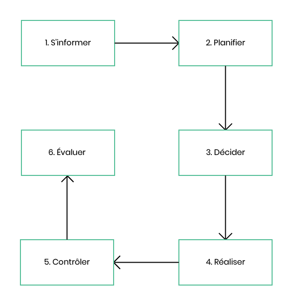
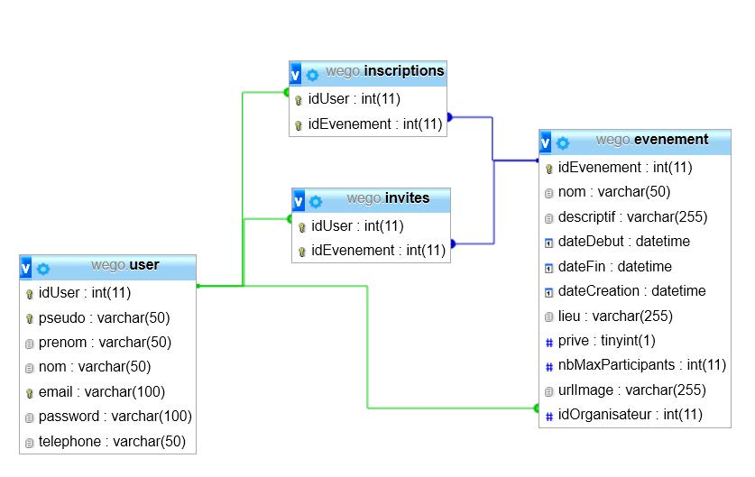

# WE GO

### Rapport TPI et documentation technique

## Table des matières
[Table des versions](#tables-des-versions)   . . . . . . . . . . . . . . . . . . . . . . . . . . . . . . . . . . . . . . . . . . . . . . . . . . . . . . . . . . . . . . . . . . . . . . . . . . . . . . . . . . . . . . . . . . . . . . . . . . . 2
[Introduction](#introduction)  . . . . . . . . . . . . . . . . . . . . . . . . . . . . . . . . . . . . . . . . . . . . . . . . . . . . . . . . . . . . . . . . . . . . . . . . . . . . . . . . . . . . . . . . . . . . . . . . . . . . . . . . . . . 2
[Rappel de l'énoncé (basé sur le Cahier des charges)](#rappel-de-l-enonce)  . . . . . . . . . . . . . . . . . . . . . . . . . . . . . . . . . . . . . . . . . . . . . . . . . . . . . . . . . . . . 2
	[Organisation](#organisation)  . . . . . . . . . . . . . . . . . . . . . . . . . . . . . . . . . . . . . . . . . . . . . . . . . . . . . . . . . . . . . . . . . . . . . . . . . . . . . . . . . . . . . . . . . . . . . . . . . . . . . . . . 2
	[Livrables](#livrables)  . . . . . . . . . . . . . . . . . . . . . . . . . . . . . . . . . . . . . . . . . . . . . . . . . . . . . . . . . . . . . . . . . . . . . . . . . . . . . . . . . . . . . . . . . . . . . . . . . . . . . . . . . . . . . 2
	[Matériels et logiciels nécessaires](#materiels-et-logiciels-necessaires)   . . . . . . . . . . . . . . . . . . . . . . . . . . . . . . . . . . . . . . . . . . . . . . . . . . . . . . . . . . . . . . . . . . . . . . . . . . . . . . . . 2
	[Description de l'application](#description-de-l'application)  . . . . . . . . . . . . . . . . . . . . . . . . . . . . . . . . . . . . . . . . . . . . . . . . . . . . . . . . . . . . . . . . . . . . . . . . . . . . . . . . . . . . . . . 2
[Gestion de projet](#gestion-de-projet) . . . . . . . . . . . . . . . . . . . . . . . . . . . . . . . . . . . . . . . . . . . . . . . . . . . . . . . . . . . . . . . . . . . . . . . . . . . . . . . . . . . . . . . . . . . . . . . . . . . . . . 3
  [Méthodologie](#méthodologie) . . . . . . . . . . . . . . . . . . . . . . . . . . . . . . . . . . . . . . . . . . . . . . . . . . . . . . . . . . . . . . . . . . . . . . . . . . . . . . . . . . . . . . . . . . . . . . . . . . . . . . . . . 3
  [Backlog](#backlog) . . . . . . . . . . . . . . . . . . . . . . . . . . . . . . . . . . . . . . . . . . . . . . . . . . . . . . . . . . . . . . . . . . . . . . . . . . . . . . . . . . . . . . . . . . . . . . . . . . . . . . . . . . . . . . . . 4
[Planification](#planification) . . . . . . . . . . . . . . . . . . . . . . . . . . . . . . . . . . . . . . . . . . . . . . . . . . . . . . . . . . . . . . . . . . . . . . . . . . . . . . . . . . . . . . . . . . . . . . . . . . . . . . . . . . . . 5
	[Planning prévisionnel](#planning-prévisionnel) . . . . . . . . . . . . . . . . . . . . . . . . . . . . . . . . . . . . . . . . . . . . . . . . . . . . . . . . . . . . . . . . . . . . . . . . . . . . . . . . . . . . . . . . . . . . . . . 5
	[Planning effectif](#planning-effectif) . . . . . . . . . . . . . . . . . . . . . . . . . . . . . . . . . . . . . . . . . . . . . . . . . . . . . . . . . . . . . . . . . . . . . . . . . . . . . . . . . . . . . . . . . . . . . . . . . . . . . 5
[Généralités concernant l'implémentation](#généralités-concernant-l'implémentation)  . . . . . . . . . . . . . . . . . . . . . . . . . . . . . . . . . . . . . . . . . . . . . . . . . . . . . . . . . . . . . . . . . . . . . . . . . 6
	[Base de données](#base-de-données) . . . . . . . . . . . . . . . . . . . . . . . . . . . . . . . . . . . . . . . . . . . . . . . . . . . . . . . . . . . . . . . . . . . . . . . . . . . . . . . . . . . . . . . . . . . . . . . . . . . . 6
		Informations techniques
		MCD
		MLD
		Dictionnaire de données 
    [Structure](#structure)  . . . . . . . . . . . . . . . . . . . . . . . . . . . . . . . . . . . . . . . . . . . . . . . . . . . . . . . . . . . . . . .  . . . . . . . . . . . . . . . . . . . . . . . . . . . . . . . . . . . . . . . . . . . . . 6
	[Classes](#classes) (ou fichiers de code) . . . . . . . . . . . . . . . . . . . . . . . . . . . . . . . . . . . . . . . . . . . . . . . . . . . . . . . . . . . . . . . . . . . . . . . . . . . . . . . . . . . . . . 6
	[Environnement](#environnement) (local et/ou distant) . . . . . . . . . . . . . . . . . . . . . . . . . . . . . . . . . . . . . . . . . . . . . . . . . . . . . . . . . . . . . . . . . . . . . . . . . . . . . . 6
[Librairies et outils externes](#librairies-et-outils-externes) . . . . . . . . . . . . . . . . . . . . . . . . . . . . . . . . . . . . . . . . . . . . . . . . . . . . . . . . . . . . . . . . . . . . . . . . . . . . . . . . . . . . . . . . . . . 7
	[Font Awesome](#font-awesome)  . . . . . . . . . . . . . . . . . . . . . . . . . . . . . . . . . . . . . . . . . . . . . . . . . . . . . . . . . . . . . . . . . . . . . . . . . . . . . . . . . . . . . . . . . . . . . . . . . . . . . . 7
	[Google Fonts](#google-fonts)  . . . . . . . . . . . . . . . . . . . . . . . . . . . . . . . . . . . . . . . . . . . . . . . . . . . . . . . . . . . . . . . . . . . . . . . . . . . . . . . . . . . . . . . . . . . . . . . . . . . . . . . . 7
	[JQuery](#jquery) . . . . . . . . . . . . . . . . . . . . . . . . . . . . . . . . . . . . . . . . . . . . . . . . . . . . . . . . . . . . . . . . . . . . . . . . . . . . . . . . . . . . . . . . . . . . . . . . . . . . . . . . . . . . . . . . 7
	[Ajax](#ajax)  . . . . . . . . . . . . . . . . . . . . . . . . . . . . . . . . . . . . . . . . . . . . . . . . . . . . . . . . . . . . . . . . . . . . . . . . . . . . . . . . . . . . . . . . . . . . . . . . . . . . . . . . . . . . . . . . . . . 7
	[SweetAlert2](#sweetalert2)  . . . . . . . . . . . . . . . . . . . . . . . . . . . . . . . . . . . . . . . . . . . . . . . . . . . . . . . . . . . . . . . . . . . . . . . . . . . . . . . . . . . . . . . . . . . . . . . . . . . . . . . . . . 7
	[unDraw](#undraw)  . . . . . . . . . . . . . . . . . . . . . . . . . . . . . . . . . . . . . . . . . . . . . . . . . . . . . . . . . . . . . . . . . . . . . . . . . . . . . . . . . . . . . . . . . . . . . . . . . . . . . . . . . . . . . . . 7
	[Katalon](#katalon)  . . . . . . . . . . . . . . . . . . . . . . . . . . . . . . . . . . . . . . . . . . . . . . . . . . . . . . . . . . . . . . . . . . . . . . . . . . . . . . . . . . . . . . . . . . . . . . . . . . . . . . . . . . . . . . . 7
	[Adobe Illustrator](#adobe-illustrator) . . . . . . . . . . . . . . . . . . . . . . . . . . . . . . . . . . . . . . . . . . . . . . . . . . . . . . . . . . . . . . . . . . . . . . . . . . . . . . . . . . . . . . . . . . . . . . . . . . . . . 7
	[Composer](#Composer) . . . . . . . . . . . . . . . . . . . . . . . . . . . . . . . . . . . . . . . . . . . . . . . . . . . . . . . . . . . . . . . . . . . . . . . . . . . . . . . . . . . . . . . . . . . . . . . . . . . . . . . . . . . . 7
	[Git](#git)   . . . . . . . . . . . . . . . . . . . . . . . . . . . . . . . . . . . . . . . . . . . . . . . . . . . . . . . . . . . . . . . . . . . . . . . . . . . . . . . . . . . . . . . . . . . . . . . . . . . . . . . . . . . . . . . . . . . . 7
[Analyse des fonctionnalités majeures](#analyse-des-fonctionnalités-majeures) . . . . . . . . . . . . . . . . . . . . . . . . . . . . . . . . . . . . . . . . . . . . . . . . . . . . . . . . . . . . . . . . . . . . . . . . . . . . . . 8
	(Critères et fonctionnalités de CdC)
[Plan de test et tests](#plan-de-tests-et-tests) . . . . . . . . . . . . . . . . . . . . . . . . . . . . . . . . . . . . . . . . . . . . . . . . . . . . . . . . . . . . . . . . . . . . . . . . . . . . . . . . . . . . . . . . . . . . . . . . . . . . 9
	[Périmètre des tests](#périmètre-des-tests) . . . . . . . . . . . . . . . . . . . . . . . . . . . . . . . . . . . . . . . . . . . . . . . . . . . . . . . . . . . . . . . . . . . . . . . . . . . . . . . . . . . . . . . . . . . . . . . . . . 8
	[Environnement](#environnement)  . . . . . . . . . . . . . . . . . . . . . . . . . . . . . . . . . . . . . . . . . . . . . . . . . . . . . . . . . . . . . . . . . . . . . . . . . . . . . . . . . . . . . . . . . . . . . . . . . . . . . . 8
	[Scénarios](#scénarios) . . . . . . . . . . . . . . . . . . . . . . . . . . . . . . . . . . . . . . . . . . . . . . . . . . . . . . . . . . . . . . . . . . . . . . . . . . . . . . . . . . . . . . . . . . . . . . . . . . . . . . . . . . . . . 8
  [Suivis journaliers des tests](#suivis-journaliers-des-tests) . . . . . . . . . . . . . . . . . . . . . . . . . . . . . . . . . . . . . . . . . . . . . . . . . . . . . . . . . . . . . . . . . . . . . . . . . . . . . . . . . . . . . . . . . . . 9
[Conclusion](#conclusion)  . . . . . . . . . . . . . . . . . . . . . . . . . . . . . . . . . . . . . . . . . . . . . . . . . . . . . . . . . . . . . . . . . . . . . . . . . . . . . . . . . . . . . . . . . . . . . . . . . . . . . . . . . . . . . 11
	Difficultés rencontrées
	Variantes de solutions et choix
	Améliorations possibles
	Bilan personnel
	Remerciements
[Annexes](#annexes) . . . . . . . . . . . . . . . . . . . . . . . . . . . . . . . . . . . . . . . . . . . . . . . . . . . . . . . . . . . . . . . . . . . . . . . . . . . . . . . . . . . . . . . . . . . . . . . . . . . . . . . . . . . . . . . . . 12
	[Glossaire](#glossaire)  . . . . . . . . . . . . . . . . . . . . . . . . . . . . . . . . . . . . . . . . . . . . . . . . . . . . . . . . . . . . . . . . . . . . . . . . . . . . . . . . . . . . . . . . . . . . . . . . . . . . . . . . . . . . . 12
  [Résumé TPI](#resume-TPI)  . . . . . . . . . . . . . . . . . . . . . . . . . . . . . . . . . . . . . . . . . . . . . . . . . . . . . . . . . . . . . . . . . . . . . . . . . . . . . . . . . . . . . . . . . . . . . . . . . . . . . . . . . . . . 12
    (Résumé conceptuel du travail effectué. Selon la structure du résumé TPI
    - situation de départ (paragraphe 1),
        - mise en œuvre (paragraphe 2),
        - et résultat (paragraphe 3).)
        [Manuel utilisateur](#manuel-utilisateur)  . . . . . . . . . . . . . . . . . . . . . . . . . . . . . . . . . . . . . . . . . . . . . . . . . . . . . . . . . . . . . . . . . . . . . . . . . . . . . . . . . . . . . . . . . . . . . . . . . . . 12
        [Énoncé](#enonce) . . . . . . . . . . . . . . . . . . . . . . . . . . . . . . . . . . . . . . . . . . . . . . . . . . . . . . . . . . . . . . . . . . . . . . . . . . . . . . . . . . . . . . . . . . . . . . . . . . . . . . . . . . . . . . . . 12
        [Journal de bord](#journal-de-bord) . . . . . . . . . . . . . . . . . . . . . . . . . . . . . . . . . . . . . . . . . . . . . . . . . . . . . . . . . . . . . . . . . . . . . . . . . . . . . . . . . . . . . . . . . . . . . . . . . . . . . . 12
        [Code source](#code-source)  . . . . . . . . . . . . . . . . . . . . . . . . . . . . . . . . . . . . . . . . . . . . . . . . . . . . . . . . . . . . . . . . . . . . . . . . . . . . . . . . . . . . . . . . . . . . . . . . . . . . . . . . . 12

## Tables des versions

| Version | Date       | Auteur                                   | Changement apporté   |
| ------- | ---------- | ---------------------------------------- | -------------------- |
| 1.0     | 25.05.2020 | Hoarau Nicolas  <nicolas.hr@eduge.ch> | Création du document |

## Introduction

Ce document a pour but d'expliquer le fonctionnement du projet ainsi que le déroulement de sa conception. Ce projet a été réalisé dans le cadre du _Travail Pratique Individuel_ lors de la session de mai/juin 2020 afin de valider ma formation d'informaticien. __WE GO__ est une application WEB qui permet aux utilisateurs enregistrés de créer et de s’inscrire à des événements ouverts ou privés.

#### Organisation

| Élève                                     | Maître d'apprentissage                                   | Experts                                                      |
| ----------------------------------------- | -------------------------------------------------------- | ------------------------------------------------------------ |
| Nicolas Hoarau   <nicolas.hr@eduge.ch> | Katia Mota Stroppolo   <katia.motastroppolo@edu.ge.ch> | Olivier Maillefer   <olivier.maillefer@ville-ge.ch>   Gilles Mouchet   <gilles.mouchet@ville-ge.ch> |

#### Livrables

Pour les experts et la formatrice :
* La documentation technique du projet avec le code source à l'intérieur
* La documentation utilisateur
* Le journal de bord

Pour la formatrice :
* L'accès au git

#### Matériels et logiciels nécessaires

* Ordinateur personnel avec Windows 10
* Un serveur WEB avec un système de gestion de base de données
  * Apache 2.4.41 (Win64)
  * PHP 7.4.0
  * MySQL 8.0.18
  * MySQL Workbench 8.0
* Visual Studio Code 1.45.1

#### Description de l'application

## Gestion de projet

#### Méthodologie

Afin de planifier mon TPI, j'ai choisi d'utiliser la __méthode en 6 étapes__ que j'ai vu lors des cours de ma formation.

__1. S'informer__
C'est lors de cette étape que l'on prend connaissance de notre projet et que l'on analyse le cahier des charges afin de bien comprendre chaque fonctionnalité.

__2. Planifier__
Durant cette étape, un planning est créé afin d'avoir un ordre pour effectuer les tâches à faire. Pour ce projet, les tâches ont été rédigées sous le format d'_user stories_. Les _user stories_ se rédige sous le point de vue de l'utilisateur final.

Pour chaque _story_ du projet, la méthode MoSCoW a été utilisé afin de définir un ordre de priorité afin d'aider à identifier les tâches importantes. Les niveaux de priorités sont ❗❗ __Must :__ Indispensable, ❗ __Should :__ Critique.

_Exemple de story :_
> | Nom             | S.1 Inscription                                                     |
> | --------------- | ------------------------------------------------------------------- |
> | __Description__ | __En tant qu'utilisateur__ non inscrit, je peux m'inscrire au site. |
> | __Test(s)__     | Les tests 1.1 à 1.3                                                 |
> | __Priorité__    | ❗❗: Indispensable                                                   |

Toutes les _stories_ ont été gardées dans un _product backlog_. Cette manière de procéder est inspirée de la méthodologie _Scrum_.

Un _diagramme de Gantt_ a été créé afin de visualiser plus facilement l'avancée du projet et permet de voir la différence entre le planning prévisionnel et le planning effectif.

__3. Décider__
C'est lors de cette étape que les choix pour l'application sont faits. Durant cette étape, le pour et le contre sur le fait d'utiliser une technologie sont pesés.

__4. Réaliser__
C'est à cette étape que l'implémentation des fonctionnalités et la documentation sont faites.

__5. Contrôler__
Après avoir développé une nouvelle fonctionnalité, celle-ci était testée plusieurs fois et de différentes manières afin d'être sûr que dans aucun cas on puisse faire de manipulation imprévue par le système. Chaque test a été documenté dans un rapport de test. Aussi à chaque fonctionnalité ajoutée, les anciennes fonctionnalités ont aussi été testées afin d'être sûr de ne pas avoir régressé dans le projet. Une fois le projet terminé toutes les fonctionnalités de l'application ont été testées à nouveau.

__6. Évaluer__
C'est lors de cette dernière étape que le bilan de la journée ou celui l'élaboration du projet est effectuée. Dans cette étape, on cherche aussi ce que l'on pourrait améliorer dans l'application.

### Backlog

| Nom             | S.1 Inscription (A15)                                        |
| --------------- | ------------------------------------------------------------ |
| __Description__ | __En tant qu'utilisateur__ anonyme, je peux m'inscrire au site. Pour m'inscrire je dois entrer les informations suivantes :   * un pseudo (obligatoire, unique)  * un prénom (obligatoire)   * un nom (pas obligatoire)   * une adresse email (obligatoire, unique)  * un mot de passe (obligatoire)  * un numéro de téléphone (pas obligatoire) |
| __Test(s)__     | Les tests 1.1 à 1.6                                          |
| __Priorité__    | ❗❗: Indispensable                                            |

| Nom             | S.2 Connexion (A15)                                               |
| --------------- | ----------------------------------------------------------------- |
| __Description__ | __En tant qu'utilisateur__ inscrit, je peux me connecter au site. |
| __Test(s)__     | Les tests 2.1 à 2.3                                               |
| __Priorité__    | ❗❗: Indispensable                                                 |

| Nom             | S.3 Création d'un événement (A17+A18)                        |
| --------------- | ------------------------------------------------------------ |
| __Description__ | __En tant qu'utilisateur__ connecté, je peux créer un événement qui contient :   * un nom (obligatoire)  * une description (obligatoire)  * un lieu (obligatoire)  * un nombre maximal de participants (obligatoire)  * une image (non obligatoire)   * une date de début (obligatoire)  * une date de fin (obligatoire)  * la date de création * choisir si l'événement public ou privé (obligatoire) |
| __Test(s)__     | Les tests 3.1 à 3.6                                          |
| __Priorité__    | ❗❗: Indispensable                                            |

| Nom             | S.4 Création de la liste des invités pour un événement privé (A18) |
| --------------- | ------------------------------------------------------------ |
| __Description__ | __En tant qu'utilisateur__ connecté, je peux créer une liste de participants pour mon événement privé. |
| __Test(s)__     | Les tests 4.1 à 4.3                                          |
| __Priorité__    | ❗❗: Indispensable                                            |

| Nom             | S.5 Inscription à un événement ouvert (A19)                  |
| --------------- | ------------------------------------------------------------ |
| __Description__ | __En tant qu'utilisateur__ connecté, je peux m'Inscrire à un événement ouvert pour autant qu'il reste des places. |
| __Test(s)__     | Les tests 5.1 à 5.3                                          |
| __Priorité__    | ❗❗: Indispensable                                            |

| Nom             | S.6 Inscription à un événement privé (A19)                   |
| --------------- | ------------------------------------------------------------ |
| __Description__ | __En tant qu'utilisateur__ connecté, je peux m'inscrire à un événement privé pour autant que je sois invité. |
| __Test(s)__     | Les tests 6.1 à 6.3                                          |
| __Priorité__    | ❗❗: Indispensable                                            |

| Nom             | S.7 Validation participation à un événement (A19)            |
| --------------- | ------------------------------------------------------------ |
| __Description__ | __En tant qu'utilisateur__ connecté et participant à un événement ouvert ou privé, je reçois un mail de confirmation pour ma participation. |
| __Test(s)__     | Les tests 7.1                                                |
| __Priorité__    | ❗❗: Indispensable                                            |

| Nom             | S.8 Rappel participation à un événement (A19)                |
| --------------- | ------------------------------------------------------------ |
| __Description__ | __En tant qu'utilisateur__ connecté et participant à un événement, je reçois un mail de rappel la veille de l'événement auquel je participe. |
| __Test(s)__     | Les tests 8.1                                                |
| __Priorité__    | ❗❗: Indispensable                                            |

| Nom             | S.9 Invitation à un événement privé (A20)                    |
| --------------- | ------------------------------------------------------------ |
| __Description__ | __En tant qu'utilisateur__ connecté et invité à un événement privé, je vois l'événement dans la zone contenant tous les événements privés à venir auxquels je suis invité. |
| __Test(s)__     | Les tests 9.1 à 9.2                                          |
| __Priorité__    | ❗❗: Indispensable                                            |

| Nom             | S.10 Modification d'un événement                             |
| --------------- | ------------------------------------------------------------ |
| __Description__ | __En tant qu'utilisateur__ connecté, je peux modifier un événement que j'ai créé :   * son nom   * sa description   * son lieu   * son nombre maximal de participants   * son image (non obligatoire)   * sa date de début   * sa  date de fin |
| __Test(s)__     | Les tests 10.1 à 10.3                                        |
| __Priorité__    | ❗: Critique                                                  |

| Nom             | S.11 Suppression d'un événement                              |
| --------------- | ------------------------------------------------------------ |
| __Description__ | __En tant qu'utilisateur__ connecté, je peux supprimer les événements que j'ai créés s'il n'y a aucun participant. |
| __Test(s)__     | Les tests 11.1                                               |
| __Priorité__    | ❗: Critique                                                  |

| Nom             | S.12 Affichage des événements                                |
| --------------- | ------------------------------------------------------------ |
| __Description__ | __En tant qu'utilisateur__ connecté, je peux voir sur la page d'accueil tous les événements qui ont été créés. |
| __Test(s)__     | Le test 12.1                                                 |
| __Priorité__    | ❗: Critique                                                  |

| Nom             | S.13 À propos de l'événement                                 |
| --------------- | ------------------------------------------------------------ |
| __Description__ | __En tant qu'utilisateur__ connecté, je peux voir le nom, le pseudo du créateur, le lieu et la date de début ainsi que celle de fin de l'événement. |
| __Test(s)__     | Le test 13.1                                                 |
| __Priorité__    | ❗: Critique                                                  |

| Nom             | S.14 Affichage de la page profil                             |
| --------------- | ------------------------------------------------------------ |
| __Description__ | __En tant qu'utilisateur__ connecté, je peux avoir accès à ma page profil avec les informations de mon compte. |
| __Test(s)__     | Le test 14.1                                                 |
| __Priorité__    | ❗: Critique                                                  |

| Nom             | S.15 Modification de la page profil (A16)                    |
| --------------- | ------------------------------------------------------------ |
| __Description__ | __En tant qu'utilisateur__ connecté, je peux modifier :   * mon pseudo   * mon prénom   * mon nom   * mon adresse email   * mon mot de passe   * mon numéro de téléphone   de ma page profile. |
| __Test(s)__     | Les tests 15.1 à 15.6                                        |
| __Priorité__    | ❗❗: Indispensable                                            |

| Nom             | S.16 Suppression du profil (A16)                             |
| --------------- | ------------------------------------------------------------ |
| __Description__ | __En tant qu'utilisateur__ connecté, je peux supprimer mon profil que s'il n'y a aucun participant aux événements que j'ai créé. |
| __Test(s)__     | Les tests 16.1 à 16.6                                        |
| __Priorité__    | ❗❗: Indispensable                                            |

| Nom             | S.17 Gestion des événements                                  |
| --------------- | ------------------------------------------------------------ |
| __Description__ | __En tant qu'utilisateur__ connecté, j'ai accès à une page sur laquelle je peux voir les événements ouverts à venir et les événements privés auxquels je suis invité __afin__ de pouvoir m'y inscrire. __Et__ je peux aussi voir les événements auxquels je participe, __afin__ de me désinscrire. |
| __Test(s)__     | Le test 17.1                                                 |
| __Priorité__    | ❗: Critique                                                  |

| Nom             | S.18 Gestion des accès (A14)                                 |
| --------------- | ------------------------------------------------------------ |
| __Description__ | __En tant qu'utilisateur__ non connecté, je peux voir que les événements publics et la navbar m'affiche que les liens pour aller à l'accueil, voir le descriptif du site, me connecter et m'inscrire. |
| __Test(s)__     | Le test 18.1                                                 |
| __Priorité__    | ❗❗: Indispensable                                            |

| Nom                       | S.19 Création du dépôt Git                                   |
| ------------------------- | ------------------------------------------------------------ |
| __Description__           | __En tant que développeur__, je peux utiliser Git sur le code source du projet. Je peux également accéder au dépôt sur GitHub. |
| __Critère de validation__ | Un dépôt Git est configuré dans le dossier du projet. Le code source est disponible depuis le site <https://github.com> à l'adresse indiquée dans la documentation. |
| __Priorité__              | ❗❗: Indispensable                                            |

| Nom                       | S.20 Implémentation de la base de données                    |
| ------------------------- | ------------------------------------------------------------ |
| __Description__           | __En tant que développeur__, je peux utiliser une base de données MySQL qui respecte le schéma donné dans l'énoncé. |
| __Critère de validation__ | La base de données WEGO a été créé et contient les tables user, inscription, invites, evenement et sont utilisables. |
| __Priorité__              | ❗❗: Indispensable                                            |

| Nom                       | S.21 Utilisation de Composer                                 |
| ------------------------- | ------------------------------------------------------------ |
| __Description__           | __En tant que développeur__, je peux utiliser Composer afin d'installer des dépendances PHP au projet. |
| __Critère de validation__ | Le projet contient un fichier `composer.json` qui permet à Composer de fonctionner. |
| __Priorité__              | ❗❗: Indispensable                                            |

## Planification

La couleur #3993fa a été utilisé afin de marquer les jalons du projet.
* Le premier jalon est pour la fin de l'implémentation de la base de données.
* Le deuxième jalon est pour la fin du développement en lien avec les événements.
* Le troisième jalon est pour la fin de la phase d'implémentation.
* Le quatrième jalon est pour la fin du projet.

#### Planning prévisionnel

<table>
  <tr style="text-align: center;">
    <th>Jour</th>
    <th colspan="2">J1
25.05.2020
</th>
    <th colspan="2">J2
26.05.2020
</th>
    <th colspan="2">J3
27.05.2020
</th>
    <th colspan="2">J4
28.05.2020
</th>
    <th colspan="2">J5
29.05.2020
</th>
    <th colspan="2">J6
02.06.2020
</th>
    <th colspan="2">J7
03.06.2020
</th>
    <th colspan="2">J8
04.06.2020
</th>
    <th colspan="2">J9
05.06.2020
</th>
    <th colspan="2">J10
08.06.2020
</th>
    <th colspan="2">J11
09.06.2020
</th>
  </tr>
  <tr>
    <td>Lecture de l'énoncé</td>
    <td style="background-color: #ffde7a;"></td>
    <td></td>
    <td></td>
    <td></td>
    <td></td>
    <td></td>
    <td></td>
    <td></td>
    <td></td>
    <td></td>
    <td></td>
    <td></td>
    <td></td>
    <td></td>
    <td></td>
    <td></td>
    <td></td>
    <td></td>
    <td></td>
    <td></td>
    <td></td>
    <td></td>
  </tr>
  <tr>
    <td>Rédaction du backlog</td>
    <td style="background-color: #ffde7a;"></td>
    <td></td>
    <td></td>
    <td></td>
    <td></td>
    <td></td>
    <td></td>
    <td></td>
    <td></td>
    <td></td>
    <td></td>
    <td></td>
    <td></td>
    <td></td>
    <td></td>
    <td></td>
    <td></td>
    <td></td>
    <td></td>
    <td></td>
    <td></td>
    <td></td>
  </tr>
  <tr>
    <td>Rédaction des scénarios</td>
    <td></td>
    <td style="background-color: #ffde7a;"></td>
    <td></td>
    <td></td>
    <td></td>
    <td></td>
    <td></td>
    <td></td>
    <td></td>
    <td></td>
    <td></td>
    <td></td>
    <td></td>
    <td></td>
    <td></td>
    <td></td>
    <td></td>
    <td></td>
    <td></td>
    <td></td>
    <td></td>
    <td></td>
  </tr>
  <tr>
    <td>Planification des tâches</td>
    <td></td>
    <td style="background-color: #ffde7a;"></td>
    <td></td>
    <td></td>
    <td></td>
    <td></td>
    <td></td>
    <td></td>
    <td></td>
    <td></td>
    <td></td>
    <td></td>
    <td></td>
    <td></td>
    <td></td>
    <td></td>
    <td></td>
    <td></td>
    <td></td>
    <td></td>
    <td></td>
    <td></td>
  </tr>
  <tr>
    <td><b>S.19</b> Création du dépôt Git</td>
    <td></td>
    <td></td>
    <td style="background-color: #ffde7a;"></td>
    <td></td>
    <td></td>
    <td></td>
    <td></td>
    <td></td>
    <td></td>
    <td></td>
    <td></td>
    <td></td>
    <td></td>
    <td></td>
    <td></td>
    <td></td>
    <td></td>
    <td></td>
    <td></td>
    <td></td>
    <td></td>
    <td></td>
  </tr>
  <tr>
    <td><b>S.21</b> Utilisation de Composer</td>
    <td></td>
    <td></td>
    <td style="background-color: #ffde7a;"></td>
    <td></td>
    <td></td>
    <td></td>
    <td></td>
    <td></td>
    <td></td>
    <td></td>
    <td></td>
    <td></td>
    <td></td>
    <td></td>
    <td></td>
    <td></td>
    <td></td>
    <td></td>
    <td></td>
    <td></td>
    <td></td>
    <td></td>
  </tr>
  <tr>
    <td><b>S.20</b> Mise en place de la base de données</td>
    <td></td>
    <td></td>
    <td style="background-color: #3993fa;"></td>
    <td></td>
    <td></td>
    <td></td>
    <td></td>
    <td></td>
    <td></td>
    <td></td>
    <td></td>
    <td></td>
    <td></td>
    <td></td>
    <td></td>
    <td></td>
    <td></td>
    <td></td>
    <td></td>
    <td></td>
    <td></td>
    <td></td>
  </tr>
  <tr>
  <td><b>S.18</b> Gestion des accès</td>
  <td></td>
  <td></td>
  <td></td>
    <td style="background-color: #ffde7a;"></td>
  <td></td>
  <td></td>
  <td></td>
  <td></td>
  <td></td>
  <td></td>
  <td></td>
  <td></td>
  <td></td>
  <td></td>
  <td></td>
  <td></td>
  <td></td>
  <td></td>
  <td></td>
  <td></td>
  <td></td>
  <td></td>
  </tr>
  <tr>
    <td><b>S1.</b> Inscription</td>
    <td></td>
    <td></td>
    <td></td>
    <td style="background-color: #ffde7a;"></td>
    <td></td>
    <td></td>
    <td></td>
    <td></td>
    <td></td>
    <td></td>
    <td></td>
    <td></td>
    <td></td>
    <td></td>
    <td></td>
    <td></td>
    <td></td>
    <td></td>
    <td></td>
    <td></td>
    <td></td>
    <td></td>
  </tr>
  <tr>
    <td><b>S.2</b> Connexion</td>
    <td></td>
    <td></td>
    <td></td>
    <td style="background-color: #ffde7a;"></td>
    <td></td>
    <td></td>
    <td></td>
    <td></td>
    <td></td>
    <td></td>
    <td></td>
    <td></td>
    <td></td>
    <td></td>
    <td></td>
    <td></td>
    <td></td>
    <td></td>
    <td></td>
    <td></td>
    <td></td>
    <td></td>
  </tr>
  <tr>
    <td><b>S.3</b> Création d'un événement</td>
    <td></td>
    <td></td>
    <td></td>
    <td></td>
    <td style="background-color: #ffde7a;"></td>
    <td></td>
    <td></td>
    <td></td>
    <td></td>
    <td></td>
    <td></td>
    <td></td>
    <td></td>
    <td></td>
    <td></td>
    <td></td>
    <td></td>
    <td></td>
    <td></td>
    <td></td>
    <td></td>
    <td></td>
  </tr>
  <tr>
  <td><b>S.4</b> Création de la liste des invités pour un événement privé</td>
  <td></td>
  <td></td>
  <td></td>
  <td></td>
    <td style="background-color: #ffde7a;"></td>
  <td></td>
  <td></td>
  <td></td>
  <td></td>
  <td></td>
  <td></td>
  <td></td>
  <td></td>
  <td></td>
  <td></td>
  <td></td>
  <td></td>
  <td></td>
  <td></td>
  <td></td>
  <td></td>
  <td></td>
  </tr>
      <tr>
    <td><b>S.12</b> Affichage des événements</td>
    <td></td>
    <td></td>
    <td></td>
    <td></td>
    <td></td>
    <td style="background-color: #ffde7a;"></td>
    <td></td>
    <td></td>
    <td></td>
    <td></td>
    <td></td>
    <td></td>
    <td></td>
    <td></td>
    <td></td>
    <td></td>
    <td></td>
    <td></td>
    <td></td>
    <td></td>
    <td></td>
    <td></td>
  </tr>
</table>

<table>
    <tr style="text-align: center;">
    <th>Jour</th>
    <th colspan="2">J1
25.05.2020
</th>
    <th colspan="2">J2
26.05.2020
</th>
    <th colspan="2">J3
27.05.2020
</th>
    <th colspan="2">J4
28.05.2020
</th>
    <th colspan="2">J5
29.05.2020
</th>
    <th colspan="2">J6
02.06.2020
</th>
    <th colspan="2">J7
03.06.2020
</th>
    <th colspan="2">J8
04.06.2020
</th>
    <th colspan="2">J9
05.06.2020
</th>
    <th colspan="2">J10
08.06.2020
</th>
    <th colspan="2">J11
09.06.2020
</th>
  </tr>
  <tr>
  <td><b>S.13</b> À propos de l'événement</td>
  <td></td>
  <td></td>
  <td></td>
  <td></td>
  <td></td>
    <td style="background-color: #ffde7a;"></td>
  <td></td>
  <td></td>
  <td></td>
  <td></td>
  <td></td>
  <td></td>
  <td></td>
  <td></td>
  <td></td>
  <td></td>
  <td></td>
  <td></td>
  <td></td>
  <td></td>
  <td></td>
  <td></td>
  </tr>
    <tr>
    <td><b>S.5</b> Inscription à un événement ouvert</td>
    <td></td>
    <td></td>
    <td></td>
    <td></td>
    <td></td>
    <td></td>
    <td style="background-color: #ffde7a;"></td>
    <td></td>
    <td></td>
    <td></td>
    <td></td>
    <td></td>
    <td></td>
    <td></td>
    <td></td>
    <td></td>
    <td></td>
    <td></td>
    <td></td>
    <td></td>
    <td></td>
    <td></td>
  </tr>
  <tr>
  <td><b>S.6</b> Inscription à un événement privé</td>
  <td></td>
  <td></td>
  <td></td>
  <td></td>
  <td></td>
  <td></td>
    <td style="background-color: #ffde7a;"></td>
  <td></td>
  <td></td>
  <td></td>
  <td></td>
  <td></td>
  <td></td>
  <td></td>
  <td></td>
  <td></td>
  <td></td>
  <td></td>
  <td></td>
  <td></td>
  <td></td>
  <td></td>
  </tr>
  <tr>
    <td><b>S.7</b> Validation participation à un événement</td>
    <td></td>
    <td></td>
    <td></td>
    <td></td>
    <td></td>
    <td></td>
    <td></td>
    <td style="background-color: #ffde7a;"></td>
    <td></td>
    <td></td>
    <td></td>
    <td></td>
    <td></td>
    <td></td>
    <td></td>
    <td></td>
    <td></td>
    <td></td>
    <td></td>
    <td></td>
    <td></td>
    <td></td>
  </tr>
    <tr>
    <td><b>S.8</b> Rapppel participation à un événement</td>
    <td></td>
    <td></td>
    <td></td>
    <td></td>
    <td></td>
    <td></td>
    <td></td>
    <td style="background-color: #ffde7a;"></td>
    <td></td>
    <td></td>
    <td></td>
    <td></td>
    <td></td>
    <td></td>
    <td></td>
    <td></td>
    <td></td>
    <td></td>
    <td></td>
    <td></td>
    <td></td>
    <td></td>
  </tr>
  <tr>
  <td><b>S.11</b> Suppression d'un événement</td>
  <td></td>
  <td></td>
  <td></td>
  <td></td>
  <td></td>
  <td></td>
  <td></td>
  <td></td>
    <td style="background-color: #ffde7a;"></td>
  <td></td>
  <td></td>
  <td></td>
  <td></td>
  <td></td>
  <td></td>
  <td></td>
  <td></td>
  <td></td>
  <td></td>
  <td></td>
  <td></td>
  <td></td>
  </tr>
  <tr>
  <td><b>S.10</b> Modification d'un événement</td>
  <td></td>
  <td></td>
  <td></td>
  <td></td>
  <td></td>
  <td></td>
  <td></td>
  <td></td>
  <td></td>
  <td style="background-color: #3993fa;"></td>
  <td></td>
  <td></td>
  <td></td>
  <td></td>
  <td></td>
  <td></td>
  <td></td>
  <td></td>
  <td></td>
  <td></td>
  <td></td>
  <td></td>
  </tr>
  <tr>
    <td><b>S.14</b> Affichage de la page de profil</td>
    <td></td>
    <td></td>
    <td></td>
    <td></td>
    <td></td>
    <td></td>
    <td></td>
    <td></td>
    <td></td>
    <td style="background-color: #ffde7a;"></td>
    <td></td>
    <td></td>
    <td></td>
    <td></td>
    <td></td>
    <td></td>
    <td></td>
    <td></td>
    <td></td>
    <td></td>
    <td></td>
    <td></td>
  </tr>
  <tr>
    <td><b>S.16</b> Suppression du profil</td>
    <td></td>
    <td></td>
    <td></td>
    <td></td>
    <td></td>
    <td></td>
    <td></td>
    <td></td>
    <td></td>
    <td></td>
    <td style="background-color: #ffde7a;"></td>
    <td></td>
    <td></td>
    <td></td>
    <td></td>
    <td></td>
    <td></td>
    <td></td>
    <td></td>
    <td></td>
    <td></td>
    <td></td>
  </tr>
  <tr>
  <td><b>S.15</b> Modification de la page profil</td>
  <td></td>
  <td></td>
  <td></td>
  <td></td>
  <td></td>
  <td></td>
  <td></td>
  <td></td>
  <td></td>
  <td></td>
  <td></td>
    <td style="background-color: #ffde7a;"></td>
  <td></td>
  <td></td>
  <td></td>
  <td></td>
  <td></td>
  <td></td>
  <td></td>
  <td></td>
  <td></td>
  <td></td>
  </tr>
  <tr>
  <td><b>S.17</b> Gestion des événements</td>
  <td></td>
  <td></td>
  <td></td>
  <td></td>
  <td></td>
  <td></td>
  <td></td>
  <td></td>
  <td></td>
  <td></td>
  <td></td>
    <td style="background-color: #ffde7a;"></td>
  <td></td>
  <td></td>
  <td></td>
  <td></td>
  <td></td>
  <td></td>
  <td></td>
  <td></td>
  <td></td>
  <td></td>
  </tr>
  <tr>
  <td><b>S.9</b> Invitation à un évévnement privé</td>
  <td></td>
  <td></td>
  <td></td>
  <td></td>
  <td></td>
  <td></td>
  <td></td>
  <td></td>
  <td></td>
  <td></td>
  <td></td>
  <td></td>
    <td style="background-color: #3993fa;"></td>
  <td></td>
  <td></td>
  <td></td>
  <td></td>
  <td></td>
  <td></td>
  <td></td>
  <td></td>
  <td></td>
  </tr>
  <tr>
    <td>Tests de toute l'application et correction des bugs</td>
    <td></td>
    <td></td>
    <td></td>
    <td></td>
    <td></td>
    <td></td>
    <td></td>
    <td></td>
    <td></td>
    <td></td>
    <td></td>
    <td></td>
    <td></td>
    <td style="background-color: #ffde7a;"></td>
    <td style="background-color: #ffde7a;"></td>
    <td style="background-color: #ffde7a;"></td>
    <td style="background-color: #ffde7a;"></td>
    <td style="background-color: #ffde7a;"></td>
    <td style="background-color: #ffde7a;"></td>
    <td style="background-color: #ffde7a;"></td>
    <td style="background-color: #ffde7a;"></td>
    <td style="background-color: #3993fa;"></td>
  </tr>
  <tr>
    <td>Rédaction de la documentation</td>
    <td style="background-color: #ffde7a;"></td>
    <td style="background-color: #ffde7a;"></td>
    <td style="background-color: #ffde7a;"></td>
    <td style="background-color: #ffde7a;"></td>
    <td style="background-color: #ffde7a;"></td>
    <td style="background-color: #ffde7a;"></td>
    <td style="background-color: #ffde7a;"></td>
    <td style="background-color: #ffde7a;"></td>
    <td style="background-color: #ffde7a;"></td>
    <td style="background-color: #ffde7a;"></td>
    <td style="background-color: #ffde7a;"></td>
    <td style="background-color: #ffde7a;"></td>
    <td style="background-color: #ffde7a;"></td>
    <td style="background-color: #ffde7a;"></td>
    <td style="background-color: #ffde7a;"></td>
    <td style="background-color: #ffde7a;"></td>
    <td style="background-color: #ffde7a;"></td>
    <td style="background-color: #ffde7a;"></td>
    <td style="background-color: #ffde7a;"></td>
    <td style="background-color: #ffde7a;"></td>
    <td style="background-color: #ffde7a;"></td>
    <td style="background-color: #3993fa;"></td>
  </tr>
  <tr>
    <td>Rédaction du journal de bord</td>
    <td style="background-color: #ffde7a;"></td>
    <td style="background-color: #ffde7a;"></td>
    <td style="background-color: #ffde7a;"></td>
    <td style="background-color: #ffde7a;"></td>
    <td style="background-color: #ffde7a;"></td>
    <td style="background-color: #ffde7a;"></td>
    <td style="background-color: #ffde7a;"></td>
    <td style="background-color: #ffde7a;"></td>
    <td style="background-color: #ffde7a;"></td>
    <td style="background-color: #ffde7a;"></td>
    <td style="background-color: #ffde7a;"></td>
    <td style="background-color: #ffde7a;"></td>
    <td style="background-color: #ffde7a;"></td>
    <td style="background-color: #ffde7a;"></td>
    <td style="background-color: #ffde7a;"></td>
    <td style="background-color: #ffde7a;"></td>
    <td style="background-color: #ffde7a;"></td>
    <td style="background-color: #ffde7a;"></td>
    <td style="background-color: #ffde7a;"></td>
    <td style="background-color: #ffde7a;"></td>
    <td style="background-color: #ffde7a;"></td>
    <td style="background-color: #3993fa;"></td>
  </tr>
</table>

#### Planning effectif

<table>
  <tr style="text-align: center;">
    <th>Jour</th>
    <th colspan="2">J1
25.05.2020
</th>
    <th colspan="2">J2
26.05.2020
</th>
    <th colspan="2">J3
27.05.2020
</th>
    <th colspan="2">J4
28.05.2020
</th>
    <th colspan="2">J5
29.05.2020
</th>
    <th colspan="2">J6
02.06.2020
</th>
    <th colspan="2">J7
03.06.2020
</th>
    <th colspan="2">J8
04.06.2020
</th>
    <th colspan="2">J9
05.06.2020
</th>
    <th colspan="2">J10
08.06.2020
</th>
    <th colspan="2">J11
09.06.2020
</th>
  </tr>
  <tr>
    <td>Lecture de l'énoncé</td>
    <td style="background-color: #85db53;"></td>
    <td></td>
    <td></td>
    <td></td>
    <td></td>
    <td></td>
    <td></td>
    <td></td>
    <td></td>
    <td></td>
    <td></td>
    <td></td>
    <td></td>
    <td></td>
    <td></td>
    <td></td>
    <td></td>
    <td></td>
    <td></td>
    <td></td>
    <td></td>
    <td></td>
  </tr>
  <tr>
    <td>Rédaction du backlog</td>
    <td style="background-color: #85db53;"></td>
    <td style="background-color: #85db53;"></td>
    <td></td>
    <td></td>
    <td></td>
    <td></td>
    <td></td>
    <td></td>
    <td></td>
    <td></td>
    <td></td>
    <td></td>
    <td></td>
    <td></td>
    <td></td>
    <td></td>
    <td></td>
    <td></td>
    <td></td>
    <td></td>
    <td></td>
    <td></td>
  </tr>
  <tr>
    <td>Rédaction des scénarios</td>
    <td></td>
    <td style="background-color: #85db53;"></td>
    <td style="background-color: #85db53;"></td>
    <td style="background-color: #85db53;"></td>
    <td></td>
    <td></td>
    <td></td>
    <td></td>
    <td></td>
    <td></td>
    <td></td>
    <td></td>
    <td></td>
    <td></td>
    <td></td>
    <td></td>
    <td></td>
    <td></td>
    <td></td>
    <td></td>
    <td></td>
    <td></td>
  </tr>
  <tr>
    <td>Planification des tâches</td>
    <td style="background-color: #85db53;"></td>
    <td style="background-color: #85db53;"></td>
    <td></td>
    <td></td>
    <td></td>
    <td></td>
    <td></td>
    <td></td>
    <td></td>
    <td></td>
    <td></td>
    <td></td>
    <td></td>
    <td></td>
    <td></td>
    <td></td>
    <td></td>
    <td></td>
    <td></td>
    <td></td>
    <td></td>
    <td></td>
  </tr>
  <tr>
    <td><b>S.19</b> Création du dépôt Git</td>
    <td></td>
    <td></td>
    <td style="background-color: #85db53;"></td>
    <td style="background-color: #85db53;"></td>
    <td></td>
    <td></td>
    <td></td>
    <td></td>
    <td></td>
    <td></td>
    <td></td>
    <td></td>
    <td></td>
    <td></td>
    <td></td>
    <td></td>
    <td></td>
    <td></td>
    <td></td>
    <td></td>
    <td></td>
    <td></td>
  </tr>
  <tr>
    <td><b>S.21</b> Utilisation de Composer</td>
    <td></td>
    <td></td>
    <td style="background-color: #85db53;"></td>
    <td></td>
    <td></td>
    <td></td>
    <td></td>
    <td></td>
    <td></td>
    <td></td>
    <td></td>
    <td></td>
    <td></td>
    <td></td>
    <td></td>
    <td></td>
    <td></td>
    <td></td>
    <td></td>
    <td></td>
    <td></td>
    <td></td>
  </tr>
  <tr>
    <td><b>S.20</b> Mise en place de la base de données</td>
    <td></td>
    <td></td>
    <td style="background-color: #85db53;"></td>
    <td></td>
    <td></td>
    <td></td>
    <td></td>
    <td></td>
    <td></td>
    <td></td>
    <td></td>
    <td></td>
    <td></td>
    <td></td>
    <td></td>
    <td></td>
    <td></td>
    <td></td>
    <td></td>
    <td></td>
    <td></td>
    <td></td>
  </tr>
  <tr>
  <td><b>S.18</b> Affichage de la landing page</td>
  <td></td>
  <td></td>
  <td></td>
  <td></td>
  <td></td>
  <td></td>
  <td></td>
  <td></td>
  <td></td>
  <td></td>
  <td></td>
  <td></td>
  <td></td>
  <td></td>
  <td></td>
  <td></td>
  <td></td>
  <td></td>
  <td></td>
  <td></td>
  <td></td>
  <td></td>
  </tr>
  <tr>
    <td><b>S1.</b> Inscription</td>
    <td></td>
    <td></td>
    <td></td>
    <td style="background-color: #85db53;"></td>
    <td></td>
    <td></td>
    <td></td>
    <td></td>
    <td></td>
    <td></td>
    <td></td>
    <td></td>
    <td></td>
    <td></td>
    <td></td>
    <td></td>
    <td></td>
    <td></td>
    <td></td>
    <td></td>
    <td></td>
    <td></td>
  </tr>
  <tr>
    <td><b>S.2</b> Connexion</td>
    <td></td>
    <td></td>
    <td></td>
    <td style="background-color: #85db53;"></td>
    <td></td>
    <td></td>
    <td></td>
    <td></td>
    <td></td>
    <td></td>
    <td></td>
    <td></td>
    <td></td>
    <td></td>
    <td></td>
    <td></td>
    <td></td>
    <td></td>
    <td></td>
    <td></td>
    <td></td>
    <td></td>
  </tr>
  <tr>
    <td><b>S.3</b> Création d'un événement</td>
    <td></td>
    <td></td>
    <td></td>
    <td></td>
    <td></td>
    <td></td>
    <td></td>
    <td></td>
    <td></td>
    <td></td>
    <td></td>
    <td></td>
    <td></td>
    <td></td>
    <td></td>
    <td></td>
    <td></td>
    <td></td>
    <td></td>
    <td></td>
    <td></td>
    <td></td>
  </tr>
  <tr>
  <td><b>S.4</b> Création de la liste des invités pour un événement privé</td>
  <td></td>
  <td></td>
  <td></td>
  <td></td>
  <td></td>
  <td></td>
  <td></td>
  <td></td>
  <td></td>
  <td></td>
  <td></td>
  <td></td>
  <td></td>
  <td></td>
  <td></td>
  <td></td>
  <td></td>
  <td></td>
  <td></td>
  <td></td>
  <td></td>
  <td></td>
  </tr>
  <tr>
    <td><b>S.12</b> Affichage des événements</td>
    <td></td>
    <td></td>
    <td></td>
    <td></td>
    <td></td>
    <td></td>
    <td></td>
    <td></td>
    <td></td>
    <td></td>
    <td></td>
    <td></td>
    <td></td>
    <td></td>
    <td></td>
    <td></td>
    <td></td>
    <td></td>
    <td></td>
    <td></td>
    <td></td>
    <td></td>
  </tr>
  <tr>
  <td><b>S.13</b> À propos de l'événement</td>
  <td></td>
  <td></td>
  <td></td>
  <td></td>
  <td></td>
  <td></td>
  <td></td>
  <td></td>
  <td></td>
  <td></td>
  <td></td>
  <td></td>
  <td></td>
  <td></td>
  <td></td>
  <td></td>
  <td></td>
  <td></td>
  <td></td>
  <td></td>
  <td></td>
  <td></td>
  </tr>
  <tr>
    <td><b>S.5</b> Inscription à un événement ouvert</td>
    <td></td>
    <td></td>
    <td></td>
    <td></td>
    <td></td>
    <td></td>
    <td></td>
    <td></td>
    <td></td>
    <td></td>
    <td></td>
    <td></td>
    <td></td>
    <td></td>
    <td></td>
    <td></td>
    <td></td>
    <td></td>
    <td></td>
    <td></td>
    <td></td>
    <td></td>
  </tr>
</table>

<table>
  <tr style="text-align: center;">
    <th>Jour</th>
    <th colspan="2">J1
25.05.2020
</th>
    <th colspan="2">J2
26.05.2020
</th>
    <th colspan="2">J3
27.05.2020
</th>
    <th colspan="2">J4
28.05.2020
</th>
    <th colspan="2">J5
29.05.2020
</th>
    <th colspan="2">J6
02.06.2020
</th>
    <th colspan="2">J7
03.06.2020
</th>
    <th colspan="2">J8
04.06.2020
</th>
    <th colspan="2">J9
05.06.2020
</th>
    <th colspan="2">J10
08.06.2020
</th>
    <th colspan="2">J11
09.06.2020
</th>
  <tr>
  <td><b>S.6</b> Inscription à un événement privé</td>
  <td></td>
  <td></td>
  <td></td>
  <td></td>
  <td></td>
  <td></td>
  <td></td>
  <td></td>
  <td></td>
  <td></td>
  <td></td>
  <td></td>
  <td></td>
  <td></td>
  <td></td>
  <td></td>
  <td></td>
  <td></td>
  <td></td>
  <td></td>
  <td></td>
  <td></td>
  </tr>
  </tr>
  <tr>
    <td><b>S.7</b> Validation participation à un événement</td>
    <td></td>
    <td></td>
    <td></td>
    <td></td>
    <td></td>
    <td></td>
    <td></td>
    <td></td>
    <td></td>
    <td></td>
    <td></td>
    <td></td>
    <td></td>
    <td></td>
    <td></td>
    <td></td>
    <td></td>
    <td></td>
    <td></td>
    <td></td>
    <td></td>
    <td></td>
  </tr>
    <tr>
    <td><b>S.8</b> Rapppel participation à un événement</td>
    <td></td>
    <td></td>
    <td></td>
    <td></td>
    <td></td>
    <td></td>
    <td></td>
    <td></td>
    <td></td>
    <td></td>
    <td></td>
    <td></td>
    <td></td>
    <td></td>
    <td></td>
    <td></td>
    <td></td>
    <td></td>
    <td></td>
    <td></td>
    <td></td>
    <td></td>
  </tr>
  <tr>
  <td><b>S.11</b> Suppression d'un événement</td>
  <td></td>
  <td></td>
  <td></td>
  <td></td>
  <td></td>
  <td></td>
  <td></td>
  <td></td>
  <td></td>
  <td></td>
  <td></td>
  <td></td>
  <td></td>
  <td></td>
  <td></td>
  <td></td>
  <td></td>
  <td></td>
  <td></td>
  <td></td>
  <td></td>
  <td></td>
  </tr>
  <tr>
  <td><b>S.10</b> Modification d'un événement</td>
  <td></td>
  <td></td>
  <td></td>
  <td></td>
  <td></td>
  <td></td>
  <td></td>
  <td></td>
    <td></td>
  <td></td>
  <td></td>
  <td></td>
  <td></td>
  <td></td>
  <td></td>
  <td></td>
  <td></td>
  <td></td>
  <td></td>
  <td></td>
  <td></td>
  <td></td>
  </tr>
  <tr>
    <td><b>S.14</b> Affichage de la page de profil</td>
    <td></td>
    <td></td>
    <td></td>
    <td></td>
    <td></td>
    <td></td>
    <td></td>
    <td></td>
    <td></td>
    <td></td>
    <td></td>
    <td></td>
    <td></td>
    <td></td>
    <td></td>
    <td></td>
    <td></td>
    <td></td>
    <td></td>
    <td></td>
    <td></td>
    <td></td>
  </tr>
  <tr>
    <td><b>S.16</b> Suppression du profil</td>
    <td></td>
    <td></td>
    <td></td>
    <td></td>
    <td></td>
    <td></td>
    <td></td>
    <td></td>
    <td></td>
    <td></td>
    <td></td>
    <td></td>
    <td></td>
    <td></td>
    <td></td>
    <td></td>
    <td></td>
    <td></td>
    <td></td>
    <td></td>
    <td></td>
    <td></td>
  </tr>
  <tr>
  <td><b>S.15</b> Modification de la page profil</td>
  <td></td>
  <td></td>
  <td></td>
  <td></td>
  <td></td>
  <td></td>
  <td></td>
  <td></td>
  <td></td>
  <td></td>
  <td></td>
  <td></td>
  <td></td>
  <td></td>
  <td></td>
  <td></td>
  <td></td>
  <td></td>
  <td></td>
  <td></td>
  <td></td>
  <td></td>
  </tr>
  <tr>
    <td><b>S.17</b> Gestion des événements</td>
    <td></td>
    <td></td>
    <td></td>
    <td></td>
    <td></td>
    <td></td>
    <td></td>
    <td></td>
    <td></td>
    <td></td>
    <td></td>
    <td></td>
    <td></td>
    <td></td>
    <td></td>
    <td></td>
    <td></td>
    <td></td>
    <td></td>
    <td></td>
    <td></td>
    <td></td>
  </tr>
  <tr>
    <td><b>S.9</b> Invitation à un évévnement privé</td>
    <td></td>
    <td></td>
    <td></td>
    <td></td>
    <td></td>
    <td></td>
    <td></td>
    <td></td>
    <td></td>
    <td></td>
    <td></td>
    <td></td>
    <td></td>
    <td></td>
    <td></td>
    <td></td>
    <td></td>
    <td></td>
    <td></td>
    <td></td>
    <td></td>
    <td></td>
  </tr>
  <tr>
    <td>Tests de toute l'application et correction des bugs</td>
    <td></td>
    <td></td>
    <td></td>
    <td></td>
    <td></td>
    <td></td>
    <td></td>
    <td></td>
    <td></td>
    <td></td>
    <td></td>
    <td></td>
    <td></td>
    <td></td>
    <td></td>
    <td></td>
    <td></td>
    <td></td>
    <td></td>
    <td></td>
    <td></td>
    <td></td>
  </tr>
  <tr>
    <td>Rédaction de la documentation</td>
    <td style="background-color: #85db53;"></td>
    <td style="background-color: #85db53;"></td>
    <td style="background-color: #85db53;"></td>
    <td style="background-color: #85db53;"></td>
    <td></td>
    <td></td>
    <td></td>
    <td></td>
    <td></td>
    <td></td>
    <td></td>
    <td></td>
    <td></td>
    <td></td>
    <td></td>
    <td></td>
    <td></td>
    <td></td>
    <td></td>
    <td></td>
    <td></td>
    <td></td>
    </tr>
  <tr>
    <td>Rédaction du journal de bord</td>
    <td style="background-color: #85db53;"></td>
    <td style="background-color: #85db53;"></td>
    <td style="background-color: #85db53;"></td>
    <td style="background-color: #85db53;"></td>
    <td></td>
    <td></td>
    <td></td>
    <td></td>
    <td></td>
    <td></td>
    <td></td>
    <td></td>
    <td></td>
    <td></td>
    <td></td>
    <td></td>
    <td></td>
    <td></td>
    <td></td>
    <td></td>
    <td></td>
    <td></td>
  </tr>
</table>

## Généralités concernant l'implémentation

#### Base de données

WEGO utilise une base de données MySQL afin de stocker les utilisateurs ainsi que les événements, le événements auxquels ils participent ou sont invités. La version utilisé est MySQL 8.0.18. J'ai utilisé InnoDB comme moteur de stockage et _utf8_bin_ comme interclassement.

Le modèle de la base de données à été fournis dans l'énoncé.

  

  <em >Le modèle d ela base données fournis dans l'énoncé</em>

#### Dictionnaire de données

__user__

| Colonne   | Type         | Null | Défaut |
| --------- | ------------ | ---- | ------ |
| idUser    | int(11)      | Non  |        |
| pseudo    | varchar(50)  | Non  |        |
| prenom    | varchar(50)  | Non  |        |
| nom       | varchar(50)  | Oui  | NULL   |
| email     | varchar(100) | Non  |        |
| password  | varchar(100) | Non  |        |
| telephone | varchar(50)  | Oui  | NULL   |

__evenement__

| Colonne          | Type         | Null | Défaut |
| ---------------- | ------------ | ---- | ------ |
| idEvenement      | int(11)      | Non  |        |
| nom              | varchar(50)  | Non  |        |
| descriptif       | varchar(255) | Non  |        |
| dateDebut        | datetime     | Non  |        |
| dateFin          | datetime     | Non  |        |
| dateCreation     | datetime     | Non  |        |
| lieu             | varchar(255) | Non  |        |
| prive            | tinyint(1)   | Non  |        |
| nbMaxParticipant | int(11)      | Non  |        |
| urlImage         | varchar(255) | Non  |        |
| idOrganisateur   | int(11)      | Non  |        |

__inscriptions__

| Colonne     | Type    | Null | Défaut |
| ----------- | ------- | ---- | ------ |
| idUser      | int(11) | Non  |        |
| idEvenement | int(11) | Non  |        |

__invites__

| Colonne     | Type    | Null | Défaut |
| ----------- | ------- | ---- | ------ |
| idUser      | int(11) | Non  |        |
| idEvenement | int(11) | Non  |        |

#### Structure

#### Classes

__WE GO\public\php\DatabaseController__
Cette classe me permet de déclarer ma base de données _MySQL_ en _Singleton_.

#### Environnement

## Librairies et outils externes

#### Font Awesome

FontAwesome est un outil d'icônes et une police d'écriture qui est basé sur le CSS, SASS et LESS. Ceci a été créé par Dave Grandy afin de l'utiliser avec Bootstrap. FontAwesome détient 38% des parts du marché des sites qui utilisent des scripts de polices tiers sur leur plateforme [1](https://www.wappalyzer.com/technologies/font-scripts). Cet outil a été utilisé pour les icônes.

#### Google Fonts

Google Fonts est une librairie de police libre de droits. La première version a été lancée en 2010 par le groupe Google. Google Fonts détient 57% des parts du marché des sites qui utilisent des scripts de polices tiers, ce qui les met en première place devant FonteAwesome [1](https://www.wappalyzer.com/technologies/font-scripts). Cette librairie a été utilisée pour les polices qu'elle me met à disposition.

#### JQuery

JQuery est une librairie JavaScript qui facilite l'écriture du script. La première version de la librairie date de 2006 par _John Resig_. Cette librairie a été créée afin d'utiliser Ajax et d'alléger le JavaScript.

#### Ajax

Ajax (_Asynchronous JavaScript and XML_) permet de faire des mises à jour de la page web sans que celle-ci se recharge. On peut l'utiliser grâce à la librairie JQuery. Cette technologie a été utilisée afin de ne pas avoir à rafraîchir la page WEB à chaque action effectuée.

#### SweetAlert2

SweetAlert2 est une librairie qui permet d'avoir un meilleur design pour les messages popup. Cette librairie est [Limon Monte](https://github.com/limonte/). Cette librairie a été utilisée afin d'avoir des alertes avec un joli design.

#### unDraw

UnDraw est une librairie illustration libre de droits, qui a été créée par Katerina Limpitsouni en 2017. Cette librairie est utilisée par de grands noms comme Google, Microsoft, Facebook, Harvard Business School. Cette librairie a été utilisée, car il y a une grande diversité d'illustration à disposition et de plus on peut choisir la couleur de notre illustration.

#### Katalon Recorder (Selenium IDE alternative)

Katalon Recorder est une extension qui permet de faire des tests d'automation qui a été développée par [Katalon.com](http://katalon.com). Cet outil a été utilisé afin de ne pas avoir à entrer les données des formulaires à chaque fois qu'il était testé.

#### Adobe Illustrator

Adobe Illustrator est un logiciel d'édition d'image vectoriel crée le 19 mars 1987 et développé par Adobe Inc. Ce logiciel a été utilisé afin de créer un schéma de la méthode en 6 étapes.

 

#### Composer

Composer est un gestionnaire de dépendances PHP qui a été développé par Nils Adermann et Jordi Boggiano le 1er mars 2012. Il permet d'utiliser des dépendances comme _PHPMailer_, ce qui nous permet de faciliter le développement et d'utiliser facilement des librairies externes à jours.

 

#### PHPMailer

PHPMailer est une API PHP qui permet d'envoyer des mails depuis du code PHP qui a été développé par Brent R. Matzelle en 2001.

#### PHP CodeSniffer

PHP CodeSniffer est un outil qui permet de vérifier automatiquement la syntaxe du code en se basant sur des règles définissant la syntaxe à utiliser.

#### Git

Git est un logiciel de gestion de versions que j'ai utilisé pendant toute l'élaboration mon TPI afin d'avoir un historique de mon projet.
Le code source de mon projet est disponible à l'adresse suivante : <https://github.com/Nicolas-hr/WEGO-CodeSource>.
La documentation de mon projet est disponible à l'adresse suivante : <https://github.com/Nicolas-hr/WEGO-Documentation>.

## Analyse des fonctionnalités majeures

## Plan de tests et tests

#### Périmètre des tests

Pour __WE GO__, j'ai mis en place un protocole de test afin qu'un utilisateur utilisant soit Google Chrome, Mozilla Firefox ou Microsoft Edge puisse naviguer convenablement sur le site. Afin d'effectuer mes tests, j'ai utilisé Katalon Recorder (Selenium IDE alternative).

#### Environnement

Lors des tests du projet, j'ai utilisé les navigateurs :
* Mozilla Firefox 76.0.1 (64bits) sur Windows 10 Éducation, Version 1909
* Google Chrome 81.0.4044.128 (64bits) sur Windows 10 Éducation, Version 1909
* Microsoft Edge 81.0.416.72 (64bits) sur Windows 10 Éducation, Version 1909

Extension sur Google Chrome et Mozilla Firefox:
* Katalon Recorder (Selenium tests generator) 5.1.0

#### Scénarios

Les scénarios des tests sont détaillés afin que n'importe quelle personne puisse les exécuter. Pour rédiger mes scénarios, j'ai utilisé la __syntaxe de Gherkin__.

|         Nom         | 1.1 Création d'un nouveau compte (toutes les données, données valides) |
| :-----------------: | ------------------------------------------------------------ |
|   __User Story__    | S.1 Inscription                                              |
|    __Situation__    | __Étant donné que__ je suis un utilisateur anonyme _et_ que je ne possède pas de compte __quand__ j'arrive sur la page d'accueil du site _et_ que j'ouvre la page d'inscription _et_ que je rentre mon pseudo `Nicolas.hr` _et_ que je rentre mon prénom `Nicolas` _et_ que je rentre mon nom `Hoarau` _et_ que je rentre mon email `nicolas.hr@eduge.ch` _et_ que je rentre mon mot de passe `Super2012` _et_ que je rentre la confirmation de mon mot de passe `Super2012` _et_ je rentre mon numéro de téléphone `123 456 78 90` _et_ que je clique sur le bouton `INSCRIPTION` __alors__ je suis redirigé vers la page `Connexion`. |
| __Résultat obtenu__ | Je clique sur le bouton `INSCRITPION` _et_ un message de confirmation apparaît au centre de la page avec le texte `Le compte a bien été crée.` _et_ je suis redirigé sur la page `Connexion`. |
|     __Statut__      | ✅ OK                                                         |

|         Nom         | 1.2 Création d'un nouveau compte (données obligatoire, données valides) |
| :-----------------: | ------------------------------------------------------------ |
|   __User Story__    | S.1 Inscription                                              |
|    __Situation__    | __Étant donné que__ je suis un utilisateur anonyme _et_ que je ne possède pas de compte __quand__ j'arrive sur la page d'accueil du site _et_ que j'ouvre la page d'inscription _et_ que je rentre mon pseudo `Nicolas.hr` _et_ que je rentre mon prénom `Nicolas` _et_ que je rentre mon email `nicolas.hr@eduge.ch` _et_ que je rentre mon mot de passe `Super2012` _et_ que je rentre la confirmation de mon mot de passe `Super2012` _et_ que je clique sur le bouton `INSCRIPTION` __alors__ je suis redirigé vers la page `Connexion`. |
| __Résultat obtenu__ | Je clique sur le bouton `INSCRITPION` _et_ un message de confirmation apparaît au centre de la page avec le texte `Le compte a bien été crée.` _et_ je suis redirigé sur la page `Connexion`. |
|     __Statut__      | ✅ OK                                                         |

|         Nom         | 1.3 Création d'un nouveau compte (mots de passes différents, données invalides) |
| :-----------------: | ------------------------------------------------------------ |
|   __User Story__    | S.1 Inscription                                              |
|    __Situation__    | __Étant donné que__ je suis un utilisateur anonyme _et_ que je ne possède pas de compte __quand__ j'arrive sur la page d'accueil du site _et_ que j'ouvre la page d'inscription _et_ que je rentre mon pseudo `Nicolas.hr` _et_ que je rentre mon prénom `Nicolas` _et_ que je rentre mon email `nicolas.hr@eduge.ch` _et_ que je rentre mon mot de passe `Super2012` _et_ que je rentre la confirmation de mon mot de passe `test` _et_ que je clique sur le bouton `INSCRIPTION` __alors__ je reste sur la page `Inscription` |
| __Résultat obtenu__ | Je clique sur le bouton `INSCRITPION` _et_ un message erreur apparaît au centre de la page avec le texte `Les deux mots de passe donnés ne sont pas les mêmes.` _et_ je reste sur la page `Inscription`. |
|     __Statut__      | ✅ OK                                                         |

|         Nom         | 1.4 Création d'un nouveau compte (mots de passes ne correspondant pas à la règle, données invalides) |
| :-----------------: | ------------------------------------------------------------ |
|   __User Story__    | S.1 Inscription                                              |
|    __Situation__    | __Étant donné que__ je suis un utilisateur anonyme _et_ que je ne possède pas de compte __quand__ j'arrive sur la page d'accueil du site _et_ que j'ouvre la page d'inscription _et_ que je rentre mon pseudo `Nicolas.hr` _et_ que je rentre mon prénom `Nicolas` _et_ que je rentre mon email `nicolas.hr@eduge.ch` _et_ que je rentre mon mot de passe `test` _et_ que je rentre la confirmation de mon mot de passe `test` _et_ que je clique sur le bouton `INSCRIPTION` __alors__ je reste sur la page `Inscription` |
| __Résultat obtenu__ | Je clique sur le bouton `INSCRITPION` _et_ un message erreur apparaît au centre de la page avec le texte `Le mot de passe doit faire au moins 8 caractères et doit contenir au moins une majuscule et un chiffre.` _et_ je reste sur la page `Inscription`. |
|     __Statut__      | ✅ OK                                                         |

|         Nom         | 1.5 Création d'un nouveau compte (pseudo déjà utilisé, données invalides) |
| :-----------------: | ------------------------------------------------------------ |
|   __User Story__    | S.1 Inscription                                              |
|    __Situation__    | __Étant donné que__ je suis un utilisateur anonyme _et_ que je ne possède pas de compte __quand__ j'arrive sur la page d'accueil du site _et_ que j'ouvre la page d'inscription _et_ que je rentre mon pseudo `Nicolas.hr` alors qu'il est déjà utilisé sur le site _et_ que je rentre mon prénom `Nicolas` _et_ que je rentre mon email `nicolas@gmail.com` _et_ que je rentre mon mot de passe `Super2012` _et_ que je rentre la confirmation de mon mot de passe `Super2012` _et_ que je clique sur le bouton `INSCRIPTION` __alors__ je reste sur la page `Inscription` |
| __Résultat obtenu__ | Je clique sur le bouton `INSCRITPION` _et_ un message erreur apparaît au centre de la page avec le texte `Ce pseudo est déjà utilisé.` _et_ je reste sur la page `Inscription`. |
|     __Statut__      | ✅ OK                                                         |

|         Nom         | 1.6 Création d'un nouveau compte (email déjà utilisé, données invalides) |
| :-----------------: | ------------------------------------------------------------ |
|   __User Story__    | S.1 Inscription                                              |
|    __Situation__    | __Étant donné que__ je suis un utilisateur anonyme _et_ que je ne possède pas de compte __quand__ j'arrive sur la page d'accueil du site _et_ que j'ouvre la page d'inscription _et_ que je rentre mon pseudo `Nicolas.hr` _et_ que je rentre mon prénom `Nicolas` _et_ que je rentre mon email `nicolas.hr@eduge.ch` alors que cette adresse est déjà utilisée sur le site _et_ que je rentre mon mot de passe `Super2012` _et_ que je rentre la confirmation de mon mot de passe `Super2012` _et_ que je clique sur le bouton `INSCRIPTION` __alors__ je reste sur la page `Inscription` |
| __Résultat obtenu__ | Je clique sur le bouton `INSCRITPION` _et_ un message erreur apparaît au centre de la page avec le texte `Cette adresse mail est déjà utilisé.` _et_ je reste sur la page `Inscription`. |
|     __Statut__      | ✅ OK                                                         |

|         Nom         | 2.1 Connexion à son compte (connexion avec adresse mail, données valides) |
| :-----------------: | ------------------------------------------------------------ |
|   __User Story__    | S.2 Connexion                                                |
|    __Situation__    | __Étant donné que__ je suis un utilisateur anonyme _et_ que je possède un compte __quand__ j'arrive sur la page d'accueil du site _et_ que j'ouvre la page de connexion _et_ que je rentre mon email `nicolas.hr@eduge.ch` _et_ que je rentre mon mot de passe `Super2012` _et_ que je clique sur le bouton `CONNEXION` __alors__ je suis redirigé sur la page `Accueil`. |
| __Résultat obtenu__ | Je clique sur le bouton `CONNEXION` _et_ un message de confirmation apparaît au centre de la page avec le texte `Connexion réussi.` _et_ je suis redirigé sur la page `Accueil`. |
|     __Statut__      | ✅ OK                                                         |

|         Nom         | 2.2 Connexion à son compte (connexion avec pseudo, données valides) |
| :-----------------: | ------------------------------------------------------------ |
|   __User Story__    | S.2 Connexion                                                |
|    __Situation__    | __Étant donné que__ je suis un utilisateur anonyme _et_ que je possède un compte __quand__ j'arrive sur la page d'accueil du site _et_ que j'ouvre la page de connexion _et_ que je rentre mon pseudo `Nicolas.hr` _et_ que je rentre mon mot de passe `Super2012` _et_ que je clique sur le bouton `CONNEXION` __alors__ je suis redirigé sur la page `Accueil`. |
| __Résultat obtenu__ | Je clique sur le bouton `CONNEXION` _et_ un message de confirmation apparaît au centre de la page avec le texte `Connexion réussi.` _et_ je suis redirigé sur la page `Accueil`. |
|     __Statut__      | ✅ OK                                                         |

|         Nom         | 2.3 Connexion à son compte (connexion avec adresse mail ou pseudo, données invalides) |
| :-----------------: | ------------------------------------------------------------ |
|   __User Story__    | S.2 Connexion                                                |
|    __Situation__    | __Étant donné que__ je suis un utilisateur anonyme _et_ que je possède un compte __quand__ j'arrive sur la page d'accueil du site _et_ que j'ouvre la page de connexion _et_ que je rentre mon email `nicolas.hr@eduge.ch` ou mon pseudo `Nicolas.hr` _et_ que je rentre mon mot de passe `Spuer2012` au lieu de `Super2012` _et_ que je clique sur le bouton `CONNEXION` __alors__ je suis redirigé sur la page `Accueil`. |
| __Résultat obtenu__ | Je clique sur le bouton `CONNEXION` _et_ un message de confirmation apparaît au centre de la page avec le texte `L'identifiant de connexion ou le mot de passe est faux.` _et_ je reste sur la page `Connexion`. |
|     __Statut__      | ✅ OK                                                         |

|         Nom         | 3.1 Création d'un événement (événement public, données valides) |
| :-----------------: | ------------------------------------------------------------ |
|   __User Story__    | S.3 Création d'un événement                                  |
|    __Situation__    | __Etant donné que__ je suis un utilisateur connecté _et_ que l'événement que je veux crée n'existe pas encore __quand__ j'arrive sur la page de création d'événement _et_ que je rentre le nom de l'événement `Rentrée technicien` _et_ que je rentre un descriptif `C'est le jour de la rentrée pour les technicien ES 2020/2021.` _et_ que je rentre la localisation `10,Ch. Gérard de Ternier, 1213 Petit-Lancy` _et_ que je  rentre une date de début `24.08.2020` _et_ que je rentre une date de fin `24.08.2020` _et_ que je choisi de mettre l'événement en `public` _et_ que je choisis un maximum de `12` participants et que je choisis une image qu'il y a sur mon ordinateur _et_ que je clique sur le bouton `CRÉER UN ÉVÉNEMENT` __alors__ mon événement se créé avec les informations données _et_ je suis redirigé sur la page `Accueil`. |
| __Résultat obtenu__ | Je clique sur le bouton `CRÉER UN ÉVÉNEMENT` _et_ un message de confirmation apparaît au centre de la page avec le texte `L'événement "Rentrée technicien" a bien été créé.` _et_ je suis redirigé sur la page  sur la page `Accueil`. |
|     __Statut__      | ❌ KO                                                         |

|         Nom         | 3.2 Création d'un événement (événement public sans image, données valides) |
| :-----------------: | ------------------------------------------------------------ |
|   __User Story__    | S.3 Création d'un événement                                  |
|    __Situation__    | __Etant donné que__ je suis un utilisateur connecté _et_ que l'événement que je veux crée n'existe pas encore __quand__ j'arrive sur la page de création d'événement _et_ que je rentre le nom de l'événement `Rentrée technicien` _et_ que je rentre un descriptif `C'est le jour de la rentrée pour les technicien ES 2020/2021.` _et_ que je rentre la localisation `10,Ch. Gérard de Ternier, 1213 Petit-Lancy` _et_ que je  rentre une date de début `24.08.2020` _et_ que je rentre une date de fin `24.08.2020` _et_ que je choisi de mettre l'événement en `public` _et_ que je choisis un maximum de `12` invités _et_ que je ne choisis pas d'image _et_ que je clique sur le bouton `CRÉER UN ÉVÉNEMENT` __alors__ mon événement est créé avec une image par défaut _et_ je suis redirigé sur la page `Accueil`. |
| __Résultat obtenu__ | Je clique sur le bouton `CRÉER UN ÉVÉNEMENT` _et_ un message de confirmation apparaît au centre de la page avec le texte `L'événement "Rentrée technicien" a bien été créé.` _et_ je suis redirigé sur la page  sur la page `Accueil`. |
|     __Statut__      | ❌ KO                                                         |

|         Nom         | 3.3 Création d'un événement privé (données valides) |
| :-----------------: | ------------------------------------------------------------------------------------------- |
|   __User Story__    | S.3 Création d'un événement +S.4 Création de la liste des invités pour un événement privé   |
|    __Situation__    | __Etant donné que__ je suis un utilisateur connecté _et_ que l'événement que je veux créer n'existe pas encore __quand__ j'arrive sur la page de création d'événement _et_ que je rentre le nom de l'événement `Mon anniversaire` _et_ que je rentre un descriptif `C'est le groupe pour mon anniversaire.` _et_ que je rentre la localisation `Parc La Grange` _et_ que je  rentre une date de début `01.08.2020` _et_ que je rentre une date de fin `01.08.2020` _et_ que je choisi de mettre l'événement en `privé` _et_ que je choisis un maximum de `3` invités _et_ que je choisis une image _et_ que je clique sur le bouton `CRÉER UN ÉVÉNEMENT` _et_  une liste des utilisateurs apparaît et me permet de choisir les `3` invités de mon événement _et_ je choisis mes invités `Jean`, `Albert` et `John`  _et_ j'appuie sur le bouton `INVITER` __alors__ mon événement est créé avec l'image choisis _et_ je suis redirigé sur la page `Accueil`. |
| __Résultat obtenu__ | Je clique sur le bouton `CRÉER UN ÉVÉNEMENT` _et_ un message de confirmation apparaît au centre de la page avec le texte `L'événement "Mon anniversaire" a bien été créé.` _et_ je suis redirigé sur la page  sur la page `Accueil`. |
|     __Statut__      | ❌ KO                                                                                       |

|         Nom         | 3.4 Création d'un événement privé sans image (données valides) |
| :-----------------: | ------------------------------------------------------------ |
|   __User Story__    | S.3 Création d'un événement + S.4                            |
|    __Situation__    | __Etant donné que__ je suis un utilisateur connecté _et_ que l'événement que je veux créer n'existe pas encore __quand__ j'arrive sur la page de création d'événement _et_ que je rentre le nom de l'événement `Mon anniversaire` _et_ que je rentre un descriptif `C'est le groupe pour mon anniversaire.` _et_ que je rentre la localisation `Parc La Grange` _et_ que je  rentre une date de début `01.08.2020` _et_ que je rentre une date de fin `01.08.2020` _et_ que je choisi de mettre l'événement en `privé` _et_ que je choisis un maximum de `3` invités _et_ que je ne choisis pas d'image _et_ que je clique sur le bouton `CRÉER UN ÉVÉNEMENT` _et_  une liste des utilisateurs apparaît _et_ me permet de choisir les `3` invités de mon événement _et_ je choisis mes invités `Jean`, `Albert` et `John`  _et_ j'appuie sur le bouton `INVITER` __alors__ mon événement est créé avec une image par défaut _et_ je suis redirigé sur la page `Accueil`. |
| __Résultat obtenu__ | Je clique sur le bouton `CRÉER UN ÉVÉNEMENT` _et_ un message de confirmation apparaît au centre de la page avec le texte `L'événement "Mon anniversaire" a bien été créé.` _et_ je suis redirigé sur la page  sur la page `Accueil`. |
|     __Statut__      | ❌ KO                                                         |

|         Nom         | 3.5 Création d'un événement (date, données invalides) |
| :-----------------: | ------------------------------------------------------------ |
|   __User Story__    | S.3 Création d'un événement                                  |
|    __Situation__    | __Etant donné que__ je suis un utilisateur connecté _et_ que l'événement que je veux crée n'existe pas encore __quand__ j'arrive sur la page de création d'événement _et_ que je rentre le nom de l'événement `Rentrée technicien` _et_ que je rentre un descriptif `C'est le jour de la rentrée pour les technicien ES 2020/2021.` _et_ que je rentre la localisation `10,Ch. Gérard de Ternier, 1213 Petit-Lancy` _et_ que je  rentre une date de début `24.08.2020` _et_ que je rentre une date de fin `09.05.2020` _et_ que je choisi de mettre l'événement en `public` _et_ que je choisis un maximum de `12` participants _et_ que je ne choisis pas d'image _et_ que je clique sur le bouton `CRÉER UN ÉVÉNEMENT` __alors__ je reste sur la page de création d'événement. |
| __Résultat obtenu__ | Je clique sur le bouton `CRÉER UN ÉVÉNEMENT` _et_ un message d'erreur apparaît au centre de la page avec le texte `L'événement ne peut pas se terminer avant s'avoir commencé.` _et_ je reste sur la page `Créer un événement`. |
|     __Statut__      | ❌ KO                                                         |

|         Nom         | 3.6 Création d'un événement (date, données invalides) |
| :-----------------: | ------------------------------------------------------------ |
|   __User Story__    | S.3 Création d'un événement                                  |
|    __Situation__    | __Etant donné que__ je suis un utilisateur connecté _et_ que l'événement que je veux crée n'existe pas encore __quand__ j'arrive sur la page de création d'événement _et_ que je rentre le nom de l'événement `Rentrée technicien` _et_ que je rentre un descriptif `C'est le jour de la rentrée pour les technicien ES 2020/2021.` _et_ que je rentre la localisation `10,Ch. Gérard de Ternier, 1213 Petit-Lancy` _et_ que je  rentre une date de début `25.04.2020` _et_ que je rentre une date de fin `09.05.2020` _et_ que je choisi de mettre l'événement en `public` _et_ que je choisis un maximum de `12` participants _et_ que je ne choisis pas d'image _et_ que je clique sur le bouton `CRÉER UN ÉVÉNEMENT` __alors__ je reste sur la page de création d'événement. |
| __Résultat obtenu__ | Je clique sur le bouton `CRÉER UN ÉVÉNEMENT` _et_ un message d'erreur apparaît au centre de la page avec le texte `L'événement ne peut pas commencer avant aujourd'hui.` _et_ je reste sur la page `Créer un événement`. |
|     __Statut__      | ❌ KO                                                         |

|         Nom         | 4.1 Inscription à un événement ouvert (situation valides) |
| :-----------------: | ------------------------------------------------------------ |
|   __User Story__    | S.5 Inscription à un événement ouvert                        |
|    __Situation__    | __Etant donné que__ je suis un utilisateur connecté _et_ que l'événement `Rentrée technicien` m'intéresse _et_ n'est pas encore passé _et_ que je clique sur la bouton `Participer à l'événement` __alors__ je suis redirigé sur la page `Accueil`. |
| __Résultat obtenu__ | Je clique sur le bouton `Participer à l'événement` _et_ un message de confirmation apparaît au centre de la page avec le texte `Vous êtes bien inscrit à l'événement "Rentrée technicien"` _et_ je suis redirigé sur la page  sur la page `Accueil`. |
|     __Statut__      | ❌ KO                                                         |

|         Nom         | 4.2 Inscription à un événement ouvert (situation invalides) |
| :-----------------: | ------------------------------------------------------------ |
|   __User Story__    | S.5 Inscription à un événement ouvert                        |
|    __Situation__    | __Etant donné que__ je suis un utilisateur anonyme _et_ que l'événement `Rentrée technicien` m'intéresse _et_ n'est pas encore passé __quand__ j'arrive sur la page de l'événement `Rentrée technicien` il n'y a pas de boutton pour m'inscrire à l'événement __alors__ je ne peux pas m'inscrire à l'événement. |
| __Résultat obtenu__ | Un message d'information apparaît en haut à droite avec le texte `Vous ne pouvez pas participer à l'événement sans être connecté` _et_ je reste sur la page de l'événement. |
|     __Statut__      | ❌ KO                                                         |

|         Nom         | 5.1 Inscription à un événement privé (situation valides) |
| :-----------------: | ------------------------------------------------------------ |
|   __User Story__    | S.5 Inscription à un événement privé                         |
|    __Situation__    | __Etant donné que__ je suis un utilisateur anonyme _et_ que l'événement `Mon anniversaire` m'intéresse _et_ n'est pas encore passé _et_ je suis invité à l'événement _et_ que je clique sur la bouton `Participer à l'événement` __alors__ je suis redirigé sur la page `Accueil`.. |
| __Résultat obtenu__ | Un message d'information apparaît en haut à droite avec le texte `Vous ne pouvez pas participer à l'événement sans être connecté` _et_ je reste sur la page de l'événement. |
|     __Statut__      | ❌ KO                                                        |

#### Suivis journaliers des tests

| Numéro de test | J0 
25.05.2020
 | J1 
26.05.2020
 | J2 
27.05.2020
 | J3 
28.05.2020
 | J4 
29.05.2020
 | J5 
02.06.2020
 | J6 
03.06.2020
 | J7 
04.06.2020
 | J8 
05.06.2020
 | J9 
08.06.2020
 | J10 
09.06.2020
 |
| -------------- | ---------------------------------------------------- | ---------------------------------------------------- | ---------------------------------------------------- | ---------------------------------------------------- | ---------------------------------------------------- | ---------------------------------------------------- | ---------------------------------------------------- | ---------------------------------------------------- | ---------------------------------------------------- | ---------------------------------------------------- | ----------------------------------------------------- |
| 1.1            | ❌                                                    | ✅                                                    | ❌                                                    | ❌                                                    | ❌                                                    | ❌                                                    | ❌                                                    | ❌                                                    | ❌                                                    | ❌                                                    | ❌                                                     |
| 1.2            | ❌                                                    | ✅                                                    | ❌                                                    | ❌                                                    | ❌                                                    | ❌                                                    | ❌                                                    | ❌                                                    | ❌                                                    | ❌                                                    | ❌                                                     |
| 1.3            | ❌                                                    | ✅                                                    | ❌                                                    | ❌                                                    | ❌                                                    | ❌                                                    | ❌                                                    | ❌                                                    | ❌                                                    | ❌                                                    | ❌                                                     |
| 1.4            | ❌                                                    | ✅                                                    | ❌                                                    | ❌                                                    | ❌                                                    | ❌                                                    | ❌                                                    | ❌                                                    | ❌                                                    | ❌                                                    | ❌                                                     |
| 1.5            | ❌                                                    | ✅                                                    | ❌                                                    | ❌                                                    | ❌                                                    | ❌                                                    | ❌                                                    | ❌                                                    | ❌                                                    | ❌                                                    | ❌                                                     |
| 1.6            | ❌                                                    | ✅                                                    | ❌                                                    | ❌                                                    | ❌                                                    | ❌                                                    | ❌                                                    | ❌                                                    | ❌                                                    | ❌                                                    | ❌                                                     |
| 2.1            | ❌                                                    | ✅                                                    | ❌                                                    | ❌                                                    | ❌                                                    | ❌                                                    | ❌                                                    | ❌                                                    | ❌                                                    | ❌                                                    | ❌                                                     |
| 2.2            | ❌                                                    | ✅                                                    | ❌                                                    | ❌                                                    | ❌                                                    | ❌                                                    | ❌                                                    | ❌                                                    | ❌                                                    | ❌                                                    | ❌                                                     |
| 2.3            | ❌                                                    | ✅                                                    | ❌                                                    | ❌                                                    | ❌                                                    | ❌                                                    | ❌                                                    | ❌                                                    | ❌                                                    | ❌                                                    | ❌                                                     |
| 3.1            | ❌                                                    | ❌                                                    | ❌                                                    | ❌                                                    | ❌                                                    | ❌                                                    | ❌                                                    | ❌                                                    | ❌                                                    | ❌                                                    | ❌                                                     |
| 3.2            | ❌                                                    | ❌                                                    | ❌                                                    | ❌                                                    | ❌                                                    | ❌                                                    | ❌                                                    | ❌                                                    | ❌                                                    | ❌                                                    | ❌                                                     |
| 3.3            | ❌                                                    | ❌                                                    | ❌                                                    | ❌                                                    | ❌                                                    | ❌                                                    | ❌                                                    | ❌                                                    | ❌                                                    | ❌                                                    | ❌                                                     |
| 3.4            | ❌                                                    | ❌                                                    | ❌                                                    | ❌                                                    | ❌                                                    | ❌                                                    | ❌                                                    | ❌                                                    | ❌                                                    | ❌                                                    | ❌                                                     |
| 3.5            | ❌                                                    | ❌                                                    | ❌                                                    | ❌                                                    | ❌                                                    | ❌                                                    | ❌                                                    | ❌                                                    | ❌                                                    | ❌                                                    | ❌                                                     |
| 3.6            | ❌                                                    | ❌                                                    | ❌                                                    | ❌                                                    | ❌                                                    | ❌                                                    | ❌                                                    | ❌                                                    | ❌                                                    | ❌                                                    | ❌                                                     |
| 4.1            | ❌                                                    | ❌                                                    | ❌                                                    | ❌                                                    | ❌                                                    | ❌                                                    | ❌                                                    | ❌                                                    | ❌                                                    | ❌                                                    | ❌                                                     |
| 4.2            | ❌                                                    | ❌                                                    | ❌                                                    | ❌                                                    | ❌                                                    | ❌                                                    | ❌                                                    | ❌                                                    | ❌                                                    | ❌                                                    | ❌                                                     |

## Conclusion

## Annexes

#### Glossaire

#### Manuel utilisateur

#### Énoncé

#### Journal de bord + todo_TPI.md

#### Code source