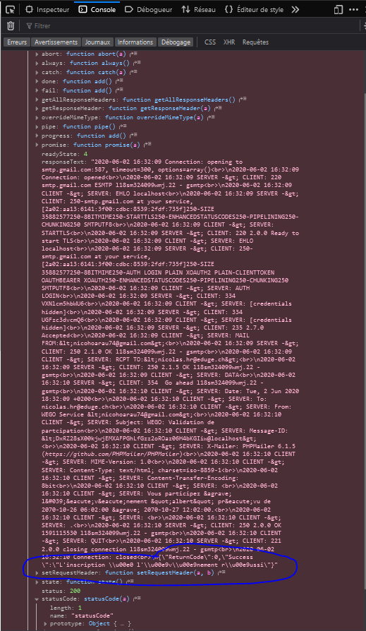

## Lundi 25 Mai 2020

### Objectifs

Les objectifs de la journée sont lire l'énoncé, rédiger le backlog ainsi que les scénarios et faire la planification.

### Déroulement

__08h00:__ Je commence ma journée en lisant l'énoncé (ce qui correspond à l'étape _S'informer_ de la méthode en 6 étapes).
J'ai compris presque la totalité de l'énoncé sauf pour le critère A19 15) qui dit: 
> Après l’inscription, l’utilisateur peut voir l’événement dans la zone.

Car je ne vois pas ce qu'est la zone.

Je me demande si les invités aux événements privés reçoivent un mail les prévenant qu'ils sont invités à l'événement.

Et aussi je me demande si les utilisateurs invités à un événement privé s'il reçoit un mail.

Donc j'ai décidé d'attendre ma formatrice qui passe à 11h30.

__08h20:__ Je finis de lire l'énoncé et je commence à rédiger le backlog.
Pour définir un ordre de priorité pour les _story_ du backlog, j'ai utilisé la méthode __MoSCoW__.

* ❗❗ L'équivalent de __Must:__ sera __Indispensable__
* ❗ L'équivalent de __Should:__ sera __Critique__

J'ai choisis de retirer le __Could__ et le __Won't__ car je ne dois pas déborder du cahier des charges lors de cet examen mais si j'avais pu déborder du cahier des charges j'aurai pu mettre en __Should__ le fait d'envoyer un mail aux personnes qui sont invités à un événement privé.

Chaque _user story_ est rédigé sous le format suivant:

> | Nom             | S.<n° de la story> _Nom de de la story_    |
> | --------------- | -------------------------------------------|
> | __Description__ | _Description de la story_                  |
> | __Test(s)__     | _Numéro des tests qui valide la story_     |
> | __Priorité__    | _Priorité de la story_                     |

__10h45:__ Je finis de rédiger le backlog et je commence à rédiger mon planning.
Pour le planning prévisionnel et le planning effectif, j'ai utilisé la couleur <span style="color:#3993fa">#3993fa</span> afin de marquer les jalons.

__11h30:__ J'ai un entretien avec Mme Mota afin de voir mon avancement. afin de voir si ma matinée s'est bien déroulée et j'ai pu lui demander pour le point A19.
Lors de l'entretien, on va vérifier si la syntaxe de mon backlog est correcte, répondre aux 2 questions que je me suis posé durant la matinée.

❔ Je ne comprend pas ce qu'est la "zone" cité dans le point A19 15, pourriez-vous m'aider comprendre ?
> Réponse: La zone est dans la page sur laquelle on peut gérer ses événements.

❔ Est-ce que je dois envoyer un mail aux utilisateurs afin de les prévenir qu'ils sont invités à un événement privé ?
> Réponse: Il ne faut  pas envoyer de mail à ce moment-là, c'est seulement lors de l'inscription d'un événement.

Après l'entretien, je vais devoir rajouter des tâches dans mon backlog, car je ne recouvre pas toutes les demandes du cahier des charges.

__12h35:__ Fin de l'entretien avec Mme Mota, on a fixé un nouvel entretien aujourd'hui à 16h.

__12h50:__ Je prends ma pause de midi.

__13h35:__ Je reprends mon travail sur le backlog.

__14h50:__ Je finis de rédiger le planning prévisionnel et je l'ai implémenté avec le backlog dans la documentation. Je commence à corriger les erreurs de grammaire de mon journal de bord et de la documentation.

__15h15:__ Je commence à rédiger les scénarios de tests sous le format suivant :

> |         Nom         | <n° du test>.<n° du cas de test> _Nom du test_ (<span style="color:#27c229">données valides</span> / <span style="color: #e00d13">données invalides</span>) |
> | :-----------------: | ------------------------------------------------------------ |
> |   __User Story__    | S.<n° de la story>                                           |
> |    __Situation__    | _Description de tout le test_                                |
> | __Résultat obtenu__ | _Résultat du test_                                           |
> |     __Statut__      | ❌ KO / ✔ OK                                                |

__16h00:__ Entretien avec Mme Mota.

__17h35:__ Je finis mon entretien avec Mme Mota. Normalement ma journée devrait se terminer à __17h00__, mais aujourd'hui je continue à travailler.

__18h10:__ Je finis ma journée.

### Bilan

Ma première journée de TPI s'est terminée, j'avais prévu de faire trop de tâches aujourd'hui alors j'ai commencé à prendre du retard sur mon planning donc demain je vais finir de rédiger les scénarios. Durant la journée, j'ai rencontré des problèmes de compréhension avec l'énoncé, mais j'ai pu répondre à mes interrogations grâce aux deux entretiens faits avec Mme Mota.

---

## Mardi 26 Mai 2020

### Objectifs

Les objectifs de la journée sont finir de rédiger les scénarios, créer le dépôt Git, l'implémentation de la base de données, la configuration de Composer, de développer l'inscription, la connexion et la gestion des accès au site .

### Déroulement

__08h00:__ Je commence ma journée en continuant la rédaction des scénarios.

__8h30:__ Je vois que la rédaction me prend beaucoup de temps donc j'ai décidé d'arrêter pour les scénarios et de mettre en place la base données car étant un jalon je me dois de la faire en priorités.

__8h40:__ Je commence la création de la base de données.

__9h00:__ J'ai finis de créer la base de données et de la mettre dans le serveur local. Je continue ma matinée en mettant la base de données dans la documentation.

__9h45:__ Je finis de mettre les informations en lien avec la base de données dans la documentation. Ensuite je créer le dépôt Git.

__9h55:__ Je finis initialisation du dépôt Git. Et je commence à mettre en place Composer et ses dépendances.

__10h00:__ Je finis d'installer Composer et ses dépendances et je reprends mon travail sur les scénarios.

__11h00:__ J'ai un entretien avec Mme Mota afin de voir mon avancement..

Durant cet entretien j'ai demandé à Mme Mota :

❔ Faut-il ajouter directement tous les utilisateurs d'un événements privé ou on peut en les ajouter en ajouter une partie et ajouter la suite après avoir créer l'événement ?

> Réponse: Il faut ajouter tous les invités lors de la création de l'événement.

J'ai aussi pris le choix avec Mme Mota de ne pas rédiger tous les scénarios de tests d'un coup mais les rédiger au début de la journée et à la fin de la journée.

__12h10:__ Fin de l'entretien avec Mme Mota et j'ai complété mon journal de bord.

__12h30:__ Correction des scénarios rédigé.

__12h40:__ Je prends ma pause du midi.

__13h25:__ Je finis ma pause midi et je  créer un deuxième dépôt Git afin d'en avoir un spécialement pour la documentation et un autre spécialement pour le code source.

__13h40:__ Je finis de mettre en place les deux dépôts Git et je commence à développer l'inscription.

__16h10:__ Je finis de développer et de tester l'inscription et je commence à développer la connexion au site.

__17h00:__ Fin de journée.

### Bilan

Aujourd'hui j'ai pu faire une grande partie de ce que je souhaitais, malheureusement je n'ai pas eu le temps faire la gestion des accès. J'ai fais le choix de ne pas faire tous les scénarios de tests d'un coup mais quelque scénario le matin et en fin de journée.

---

## Mercredi 27 Mai 2020

### Objectifs

Les objectifs de la journée sont faire la gestion des accès, la création d'événement la création de la liste d'invités pour un événement privé, l'affichage des événements et la page qui contient les informations d'un événement.

### Déroulement

__08h00:__ Je commence ma journée en rédigeant les scénarios pour la gestion des accès, pour l'affichage des événements et pour la page qui contient les informations d'un événement.

__08h30:__ Je finis de rédiger les scénarios prévus et je commence développer la gestion des accès 

__9h00:__ Je finis de développer la gestion des accès et je commence à développer la création d'événement.

__11h30:__ J'ai un entretien avec Mme Mota afin de voir mon avancement..

Mme Mota est revenue sur la question :
❔ Faut-il ajouter directement tous les utilisateurs d'un événements privé ou on peut en les ajouter en ajouter une partie et ajouter la suite après avoir créer l'événement ?

En me disant qu'il faudrait gérer le nombre maximal de personnes invités à l'événement privé de la même manière que les événements publiques c'est-à-dire qu'on est pas obligé d'inviter toutes les personnes dès la création de l'événement.

__11h55:__ Fin de l'entretien avec Mme Mota.

__12h10:__ Je prends ma pause midi.

__13h00:__ Je fini ma pause midi.

__14h50:__ Je mets en pause le développement de la création d'événement pour ajouter une colonne pour le _salt_ dans la modifier la base de données afin d'avoir une meilleure sécurité dans le site.

__15h00:__ Je finis d'ajouter la colonne dans la base de données. Je vais l'implémenter dans l'inscription et pour la connexion.

__15h20:__ Je finis d'implémenter le _salt_ pour l'inscription et la connexion et je reprend la création d'événement.

__15h50:__ Je finis de développer et de tester la création d'événement publique.

__16h00:__ Je commence à développer la création de la liste des invités pour un événements privés.

__18h00:__ Je finis ma journée.

### Bilan

Aujourd'hui j'ai pu faire que la moitié de ce que je souhaitais car le style du site m'a pris beaucoup plus de temps que ce que j'avais prévu. Je n'ai pas pu finir la création de la liste des invités à un événement privé car lorsque ma modal pour ajouter des invités apparaît, les données se sont déjà envoyées. Je n'ai pas pu faire l'affichage des événements non plus donc je vais finir ces 2 tâches pour demain. 

---

## Jeudi 28 Mai 2020

### Objectifs

Les objectifs de la journée sont finir la création de la liste pour des invités à un événement privé, faire l'affichage des événements, faire la page qui contient les informations de l'événement et l'inscription à un événement ouvert.

### Déroulement

__08h00:__ Je commence ma journée en travaillant sur la création de la liste des invités pour un événements privé.

__9h00:__ J'ai un entretien avec mes experts afin de voir si mon TPI se déroulait sans encombre.

__09h10:__ Fin de entretien avec mes experts.

__10h20:__ Je finis la création de la liste d'invités et je commence l'affichage des événements.

__11h00:__ J'ai un entretien avec Mme Mota afin de voir mon avancement.

__11h20:__ Fin de l'entretien avec Mme Mota et je reprends l'affichage des événements.

__12h35:__ Je finis l'affichage des événements et en parallèle j'ai finis l'affichage des information de l'événement.

__12h40:__ Je prends ma pause midi.

__14h05:__ Fin de ma pause midi et je reprend mon travail sur inscription à un événement ouvert.

__15h35:__ Je finis la logique de l'inscription à un événement ouvert.

__17h25:__ Je finis ma journée.

### Bilan

Aujourd'hui j'ai presque fait tout ce que j'avais prévu.

Avec Tanguy Cavagna (un camarde de classe) on a réussis à résoudre le problème avec la liste d'invités en utilisant un _fetch()_

``` javascript
return fetch("url", {
  method: '',
  headers: {
    'Accept': '',
    'Content-Type': ''
  }
}).then(response => response.json());
```

Au lieu d'un appel _ajax_

``` javascript
$.ajax({
  type: "method",
  url: "url",
  data: "data",
  dataType: "dataType",
  success: function (response) {}
});
```

Car avec un appel ajax on ne peut pas mettre le _success:_ en asynchrone alors qu'avec un _fetch_ on peut le mettre en asynchrone.

Mais je n'ai pas pu finir à 100% l'inscription à un événement publique, j'ai réussi à faire toutes la logique mais j'ai pas réussi à faire un style qui fonctionne une fois qu'on c'est inscrit à plusieurs événements, donc je vais finir cette tâche demain.

---

## Vendredi 29 Mai 2020

### Objectifs

Les objectifs de la journée sont de finir inscription à un événement publique et commencer à faire la page pour la gestion des événements.

### Déroulement

__08h00:__ Je commence ma journée en reprenant le travail sur inscription à un événement publique.

__8h25:__ Je finis l'inscription à un événement privé. Et je commence l'affichage de la page de gestion des événements.

__11h00:__ J'ai un entretien avec Mme Mota afin de voir mon avancement.
Durant cet entretien Mme Mota m'a demandé de faire un logo afin d'avoir une identité visuel pour mon site.

__11h40:__ Fin de l'entretien avec Mme Mota et je reprends mon travail sur la page gestion des événements.

__12h25:__ Je prends ma pause midi.

__13h20:__ Fin de ma pause midi et je me remets à travailler sur la page de gestion des événements.

__15h00:__ Je pars pour mon rendez-vous chez le médecin.

__16h20:__ Retour de chez le médecin. Et me remets à travailler sur la page de gestion des événements.

__18h30:__ Je finis la page de gestion des événements ce qui finis ma journée, j'ai travaillé plus tard afin rattraper le fait que j'ai eu un rendez-vous chez le médecin.

### Bilan

Aujourd'hui j'ai pu faire tout ce que j'avais prévus, ce qui est une première depuis le début de mon TPI.

---

## Mardi 02 Juin 2020

### Objectifs

Les objectifs de la journée sont faire une page entière avec les informations de l'événements (actuellement il n'y a qu'une carte avec les informations), et faire la validation à un événement.

### Déroulement

__08h00:__ Je commence ma journée en travaillant sur la page qui contient les information de l'événement.

__11h00:__ J'ai un entretien avec Mme Mota afin de voir mon avancement et de me faire un retour sur la documentation intermédiaire rendu vendredi.

Lors de cette entretien on est revenu sur le rendu intermédiaire que j'ai rendu vendredi 29 mai.
Dans les points que je dois revoir dans ma documentation sont: 
* La catégorie _Structure du code_(page 5 de l'énoncé).
* Ajout un Rapport fichier rapport de bug pour documenter mes tests (fails)
* Faire en sorte les émoticônes du suivis journalier de tests soit plus visible
* Lister tous les acronymes + leurs signification cités dans le glossaire
* Mettre plus en évidences que j'utilise les outils la méthodologie agile (backlog, Gherkins, rédaction des scénarios de test avant d'implémenter dans l'app)
* Mieux documenter les difficultés
* Ajouter des légendes au tableau et aux images

__12h40:__ Fin de l'entretien avec Mme Mota et je reprends mon travail sur l'affichage des informations d'un événement.

__14h10:__ Je prends ma pause midi.

__14h45:__ Fin de ma pause midi et je me remets à travailler sur la page d'information d'un événement.

__15h20:__ Je finis la page d'informations d'un événement. Et je commence à rédiger le scénario de la validation de participation à un événement.

__15h40:__ Je finis de rédiger les scénarios et je commence à implémenter la fonctionnalité.

__17h30:__ J'ai finis d'implémenter les mails lors de l'inscription à un événement et de le tester. Et je finis ma journée.

### Bilan

Aujourd'hui j'ai pu faire toutes les tâches planifié, j'ai eu du mal avec l'envoie de mail car je n'ai beaucoup utilisé mail lors de ma formation mais grâce à la documentation de PHPMailer j'ai pu y arriver. J'ai eu un problème avec l'envoie de mail car une fois que le mail c'était envoyé le message de validation du call ajax n'apparaissais plus et il n'y avait l'actualisation de la page non plus.
Mais en recherchant sur stackoverflow j'ai pu trouver ou était mon problème.

``` php
  try {
    //Enable SMTP debugging. 
    $mail->SMTPDebug = 3;
```

De base la variable STMPDebug est initialisé à `3`, ce qui veut dire qu'un message de validation est envoyé côté client et côté serveur et ceci interférai avec:

``` php
  echo json_encode([
    'ReturnCode' => 0,
    'Success' => $successMessage
  ]);
  exit();
```
Dans ma console JavaScript il y avait ceci qui était affiché avec mon message de validation à la fin:



Mais du coup après être allé sur stackoverflow:

``` php
  try {
    //Enable SMTP debugging. 
    $mail->SMTPDebug = 0;
```

J'ai pu comprendre qu'en initialisant `STMPDebug` à 0 il n'y aurait plus de problème avec mon call ajax.

point qui ont bloqués:
compréhension _structure du code_ (page 5 de l'énoncé)

Aussi aujourd'hui lors de l'entrtien avec Mme Mota elle m'a fait un retour sur la documentation intermédiaire et je me suis rendu compte que j'avais mal compris la partie _Strucuture du code_ dans l'énoncé (page 5), Mme Mota a passé environ 30miutes à m'expliquer ce qui était attendu.

---